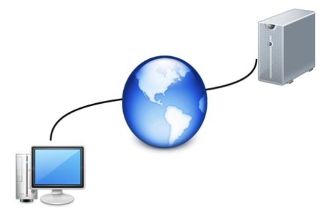

# UT1: Implantación de arquitecturas web <!-- omit in TOC -->

- [La arquitectura web y algunos modelos](#la-arquitectura-web-y-algunos-modelos)
- [Un modelo simple para el despliegue de aplicaciones web](#un-modelo-simple-para-el-despliegue-de-aplicaciones-web)
  - [¿Qué es una aplicación web?](#qué-es-una-aplicación-web)
  - [Fases de un proyecto de aplicación web](#fases-de-un-proyecto-de-aplicación-web)
- [Servidores web](#servidores-web)
  - [Servicios web](#servicios-web)
  - [Alternativas](#alternativas)
  - [¿Qué necesito para montar un servidor web?](#qué-necesito-para-montar-un-servidor-web)
- [Instalación y configuración básica de un servidor web](#instalación-y-configuración-básica-de-un-servidor-web)

## La arquitectura web y algunos modelos

Una aplicación web necesita de una estructura que permita su acceso desde diferentes lugares (máquinas). Esta estructura es lo que se denomina **Arquitectura Web** (realmente este nombre se da también al diseño de toda la estructura).



La gran mayoría de las arquitecturas web en la actualidad se basan en un modelo **cliente/servidor**: una comunicación asimétrica en la que uno de los extremos ofrece uno o más servicios y el otro hace uso de él. Éste es el modelo sobre el que centraremos el curso, pero no es el único que existe.

El término **servicio** es muy amplio y muchas veces confuso. Por ejemplo se puede considerar una web a la que acudimos a comprar productos un servicio en si misma, pero a la vez dicho servicio está compuesto de servicios de seguridad, de sesión, de transacciones, etcétera.

La estructura de una Arquitectura Web actual sigue el siguiente **modelo**:

| Capa                          | Cometido                                                                                                                                                                                                                                                                                                                                                                                                                                |
| ----------------------------- | --------------------------------------------------------------------------------------------------------------------------------------------------------------------------------------------------------------------------------------------------------------------------------------------------------------------------------------------------------------------------------------------------------------------------------------- |
| **Capa cliente**              | Es generalmente el navegador Web ejecutándose en el ordenador del usuario final. Existen otras opciones más básicas pero en la actualidad la potencia y diversidad de los navegadores existentes (así como su gratuidad) han relegado las demás opciones a la práctica desaparición.                                                                                                                                                    |
| **Capa de presentación**      | Se encarga de componer las páginas integrando la parte dinámica en la estática. Además también procesa las páginas que envía el cliente (por ejemplo datos en formularios)                                                                                                                                                                                                                                                              |
| **Capa de lógica de negocio** | Lleva a cabo operaciones más complejas. Se corresponde con la implantación de un servidor de aplicaciones. Realiza muchos tipos de operaciones entre los que destacan: a) Realizar todas las operaciones y validaciones. b) Gestionar el flujo de trabajo (workflow) incluyendo el control y gestión de las sesiones y los datos que se necesitan. c) Gestionar todas las operaciones de accesos a datos desde la capa de presentación. |
| **Capa de datos**             | Se compone de un sistema de almacenamiento acceso a datos que se utilizan para confeccionar la página Web. Generalmente es un gestor de bases de datos relacionales (SGDB) pero pueden ser ficheros de texto plano                                                                                                                                                                                                                      |


Algunos ejemplos de tecnologías asociadas a las capas en la arquitectura web:

| Capa              | Lenguajes                           | Manejadores                   |
| ----------------- | ----------------------------------- | ----------------------------- |
| Cliente           | http/https                          | Chrome, Firefox, Edge         |
| Presentación      | html                                | Nginx, Apache                 |
| Lógica de negocio | php, python, ruby, java, javascript | php-fpm, gunicorn, proxy_pass |
| Capa de datos     | sql                                 | PostgreSQL, MySQL             |

En el caso de estar usando **páginas web estáticas** (no cambian en función de diversas variables) no existiría la capa de datos ya que estos van incorporados en los propios archivos de marcas que serán las conforman las páginas web.

## Un modelo simple para el despliegue de aplicaciones web

En la actualidad la mayor parte de la información y lógica de un negocio debe ser accesible desde diferentes lugares. Aquí entran en juego las aplicaciones web.

Se puede imaginar inmediatamente que la **seguridad** es un aspecto clave en este tipo de aplicaciones, pero no el único. Muchas veces la **velocidad** y **estabilidad** de la comunicación y del servicio en sí pueden ser tanto o más críticas.

Cuando uno va a desarrollar e implantar una aplicación web debe tener en cuenta varios factores. Lo primero debe ser hacerse una **idea general de la aplicación** y de las **diferentes soluciones** que podemos utilizar. Se deben tener en cuenta las tres capas. Un error muy común es el uso de un único conjunto de tecnologías constantemente. Por supuesto conocer una tecnología es un punto a favor de su uso, pero muchas veces vamos a llevar a cabo una solución manifiestamente mejor únicamente por no haber considerado usar otras y afrontar su aprendizaje.

El siguiente aspecto a considerar sería el **coste**. Cuánto nos va a costar y qué presupuesto tenemos.

Estos factores hay que considerarlos **antes de firmar** ningún contrato e incluso antes de dar un presupuesto aunque sea orientativo.

Por ejemplo una compañía de venta de vehículos industriales quiere una aplicación web para publicar sus datos de ventas y que los comerciales puedan acceder a ella remotamente. Necesitaremos una base de datos en la que se almacenen los diferentes vehículos y sus ventas. También hará falta una lógica que mantenga todo el sistema actualizado y permita modificaciones. Además necesitaremos una capa de cliente con autenticación para que los diferentes vendedores puedan acceder al sistema, consultar y actualizar los datos.

Después de la evaluación se puede decidir no afrontar el proyecto por muchos motivos. Además de los costes ya mencionados podría darse el caso de que no tengamos los conocimientos o la infraestructura para llevar a cabo el proyecto.

### ¿Qué es una aplicación web?

Es una aplicación que se va a ejecutar a través de internet. Constará de, al menos, dos partes: una en el **lado servidor** y otra que se ejecutará en la **máquina del cliente** en un navegador web. Las aplicaciones web se engloban en el concepto superior de _aplicaciones distribuidas_. El servidor pone a disposición del cliente diferentes recursos. Ejemplos de aplicaciones web son el correo electrónico web, las tiendas online, las redes sociales, etc.

### Fases de un proyecto de aplicación web

Se pueden considerar cuatro fases en el proyecto:

| Fase                       | Descripción                                                                                                                                                                                                                                                                                                                                                                                                                                                                                                                                                                                           |
| -------------------------- | ----------------------------------------------------------------------------------------------------------------------------------------------------------------------------------------------------------------------------------------------------------------------------------------------------------------------------------------------------------------------------------------------------------------------------------------------------------------------------------------------------------------------------------------------------------------------------------------------------- |
| **Concepto**               | Durante esta fase se debe obtener una idea clara y concreta de qué quiere el cliente. Además hay que obtener una idea general de cómo se llevará a cabo y de si es viable o no. Hay que determinar las limitaciones reales con que nos podemos encontrar. Por ejemplo la conexión a internet existente en la zona puede no ser suficiente para obtener los resultados previstos. Otro ejemplo de problema puede ser que la tecnología necesaria sea demasiado cara. Es vital que al terminar esta fase se tenga una documentación que defina claramente los límites y objetivos del proyecto.         |
| **Diseño**                 | Esta fase se centra en responder a cómo haremos la aplicación. Hay que concretar las tecnologías (tanto software como hardware) que usaremos y cómo se van a comunicar entre ellas. También hay que determinar los distintos módulos que usaremos y sus interfaces. Es muy importante realizar un plan de proyecto realista en el que se dividan las tareas y responsabilidades y se calculen los tiempos para cada elemento así como su secuencia y dependencias. También hay que obtener una especificación funcional en la que se detallen tanto el funcionamiento como el flujo de la aplicación. |
| **Desarrollo**             | En esta fase se debe desarrollar el proyecto en sí. Es muy importante llevar a cabo pruebas tanto unitarias como de integración así como gestionar una documentación del desarrollo y un control de versiones.                                                                                                                                                                                                                                                                                                                                                                                        |
| **Pruebas e implantación** | Cuando el proyecto está totalmente terminado es necesario probarlo intensivamente antes de ponerlo en producción. Es necesario tener en cuenta tanto nuestra aplicación como su comunicación con otros sistemas informáticos. Cuanto más se parezca el sistema de pruebas al real mejor. El último paso es la instalación y puesta en carcha del sistema. Es un momento crítico.                                                                                                                                                                                                                      |

Una fase común a todos los proyectos informáticos y que no se incluye aquí es el **mantenimiento**. Este concepto incluye dos partes. El mantenimiento del servicio y corrección de errores y las mejoras. La primera consiste en asegurarse de que todo sigue funcionando y solucionar los posibles errores y "caídas" del servicio. La segunda consiste en ampliar el proyecto. Ambos casos suelen considerarse contratos a parte y por ello no se incluyen en el ciclo.

El orden correcto para el desarrollo es empezar de abajo a arriba (**enfoque bottom-up**). Es decir, primero la capa de datos, luego la de negocio y por último la presentación al cliente. Muchas veces se tiene la tentación de hacerlo al revés. Esto es debido a que no se han identificado bien las necesidades y objetivos de proyecto o no se ha realizado un diseño concreto. Es un error que nos conducirá a muchas más modificaciones y errores en nuestra aplicación.

## Servidores web

Un **servidor web** es un programa o conjunto de ellos que proporciona un servicio a través de una red. La comunicación con un servidor web suele hacerse mediante el protocolo _http (hypertext transfer protocol)_ que está englobado en la **capa de aplicación** del [modelo OSI](https://es.wikipedia.org/wiki/Modelo_OSI).

Una brevísima descripción de las distintas capas del **modelo OSI**:

| Número | Nombre          | Responsabilidad                                                                                   |
| ------ | --------------- | ------------------------------------------------------------------------------------------------- |
| Capa 7 | **Aplicación**  | Responsable de los servicios de red para las aplicaciones                                         |
| Capa 6 | Presentación    | Transforma el formato de los datos y proporciona una interfaz estándar para la capa de aplicación |
| Capa 5 | Sesión          | Establece, administra y finaliza las conexiones entre las aplicaciones locales y las remotas      |
| Capa 4 | Transporte      | Proporciona transporte confiable y control del flujo a través de la red                           |
| Capa 3 | Red             | Responsable del direccionamiento lógico y el dominio del enrutamiento                             |
| Capa 2 | Enlace de datos | Proporciona direccionamiento físico y procedimientos de acceso a medios                           |
| Capa 1 | Física          | Define todas las especificaciones eléctricas y físicas de los dispositivos                        |

Muchas veces servidor web se usa como referencia también al **hardware** que lo aloja, pero esto es inexacto porque el mismo hardware puede albergar muchas otras funcionalidades o puede darse el caso de que un mismo hardware contenga varios servidores web (a veces simulados).

El objetivo de un servidor web es proporcionar los medios para permitir la comunicación entre dos o más programas o grupos de software sin importar la tecnología usada para crear y operar cada uno de ellos.

En la actualidad el [servidor web más extendido]() es **Nginx**. Por ello será en el que centraremos este curso. Existen otros servidores web. Una forma fácil de consultar la lista y ver una [comparativa muy general](https://en.wikipedia.org/wiki/Comparison_of_web_server_software) es visitando la Wikipedia.

Los servidores web se engloban en un conjunto de sistemas más general que se denomina **modelo distribuido** porque el sistema no es unitario, está repartido entre diferentes máquinas o conjuntos de hardware. Este modelo tiene que afrontar algunos problemas que hay que tener siempre en cuenta:

1. La latencia y poca fiabilidad del transporte (por ejemplo la red).
2. La falta de memoria compartida entre las partes.
3. Los problemas derivados de fallos parciales.
4. La gestión del acceso concurrente a recursos remotos.
5. Problemas derivados de actualizaciones de alguna/s de las partes.

### Servicios web

Un **servicio web** es un concepto abstracto que debe implementarse mediante un **agente**: un artefacto software que envía, recibe y procesa mensajes mientras que el servicio es el concepto de qué hace. El agente solo debe ajustarse a la definición de una interfaz (dos realmente, una hacia dentro (pila OSI) y otra hacia fuera) y puede modificarse o incluso rehacerse en otro lenguaje de programación sin ningún problema. El diseño se realiza siguiendo normas de modularidad para permitir estas modificaciones.

Es de vital importancia que el servicio web esté bien definido para posibilitar la comunicación entre ambos extremos. Por ello hay muchos estándares sobre servicios web que permiten la comunicación de un cliente genérico (por ejemplo un navegador web) con diversos servicios.

Generalmente la definición de un servicio se realiza en una [API](https://es.wikipedia.org/wiki/Interfaz_de_programaci%C3%B3n_de_aplicaciones) (Application Programming Interface) que especifica cómo comunicarse con el servicio.

El proceso para usar el servicio es como sigue:

1. El cliente y el servidor deben ser conscientes de la existencia del otro. En el caso más habitual es el cliente el que informa al servidor de su intención de usar el servicio pero también puede ser el servidor el que inicie el contacto. Si es el cliente el que comienza, puede hacerlo o bien conociendo previamente cómo localizar el servidor o usando el servicio para descubrir servicios (Web Service Discovery).
2. Ambas partes deben ponerse de acuerdo sobre los parámetros que regirán la comunicación. Esto no significa que discutan, solo que las normas y protocolos deben ser las mismas en ambas partes.
3. Los agentes de ambos lados empiezan a intercambiar mensajes. El servidor web necesita componer las páginas en caso de que lleven elementos multimedia e incluso necesitará realizar otras acciones si la página se crea dinámicamente.

### Alternativas

Antes de decidirse a instalar nuestro propio servidor web, debemos tener en cuenta que no siempre es la mejor opción. Lo primero que debemos saber es qué quiere el cliente. Dependiendo del tamaño del servicio que vayamos a proporcionar y de la importancia de poder controlar todos los aspectos del servidor, podemos decidir usar otras posibilidades.

Por otro lado la máquina que necesitamos podría requerir mucha RAM y capacidad de almacenamiento además de soportar grandes cargas de trabajo. La conexión a internet también deberá ser potente y necesitaremos contratar una dirección IP estática.

#### Hosting <!-- omit in TOC -->

Lo primero que se debe tener en cuenta es si nos interesa tener **nuestro propio servidor** o contratar un **servicio de hosting**. Realmente el término "Web Hosting" incluye el tener un servidor propio, pero en la actualidad se utiliza para denominar el alquilar espacio y recursos en un servidor de otra compañía. Generalmente esta compañía está dedicada a ello específicamente. Las ventajas de este caso son las obvias: no tenemos que preocuparnos de adquirir ni mantener ni el hardware ni el software necesario. Además la fiabilidad del servicio de una empresa especializada suele ser muy alta.

Los términos que se suelen manejar en este contexto son:

- **On-premise** para infraestructuras montadas en la propia organización.
- **Cloud** para infraestructuras alojadas en empresas de terceros.

#### Wordpress <!-- omit in TOC -->

Existen casos en los que incluso hay tecnologías más específicas para nuestras necesidades. Cada vez es más habitual la existencia de sitios web en los que la apariencia no cambia pero el contenido es actualizado constantemente. Para estos casos se puede usar un **gestor de contenidos**. Con ellos se permite al usuario actualizar la información del sitio sin necesidad de que tenga conocimientos web concretos. Existen muchos gestores web, algunos comerciales y otros de gratuitos y de código abierto. En este último apartado destaca por encima de todos [Wordpress](https://es.wordpress.org/), que empezó siendo una plataforma para alojar blogs pero hoy en día ya es un servicio de propósito general (webs, blogs, aplicaciones).

### ¿Qué necesito para montar un servidor web?

Lo primero que necesitas es una **máquina** (on-premise o cloud) con una potencia suficiente para atender las peticiones que se vayan a procesar. Los servidores web tipo Nginx son capaces de manejar una gran cantidad de peticiones por segundo.

Este punto de dimensionar los recursos necesarios es crítico y difícil de gestionar porque no sabemos cuál será la demanda y muchas veces es complejo estimar la carga de trabajo que se soportará. Es muy recomendable que sea una máquina dedicada o que cumpla otras funciones relacionadas con intercambio de información en internet.

También es vital que el **sistema operativo** que elijamos sea estable. No tiene ningún sentido elegir un sistema operativo que deje de estar funcional con facilidad. Es conveniente que lleve cierta seguridad y control de permisos integrado. Los sistemas más habituales son **Linux** (en sus distintas distribuciones) ya que proporcionan robustez, disponibilidad y alto nivel de personalización.

> Se estima que alrededor de un 80% de los servidores que hay funcionando en internet corren sobre Linux.

Lo siguiente que tendrás que conseguir es una **dirección IP estática**. Por supuesto debe ser una dirección de internet a no ser que tu objetivo sea montar una intranet. Nuestra máquina debe ser accesible desde redes remotas.

Los nombres y direcciones de internet que conocemos se basan en un sistema llamado **DNS** que lo que hace es convertir esas direcciones legibles para nosotros en direcciones IP y viceversa. Si nuestra dirección IP cambia frecuentemente cuando alguien fuera a acceder a nuestra página esta le aparecería como no disponible a pesar de que todo el resto del sistema estuviera trabajando.

Existe la posibilidad de funcionar con una **dirección IP dinámica** mediante sistemas como DDNS (Dynamic DNS) que mantienen siempre actualizada nuestra dirección. Un servicio gratuito de DDNS es [Duck DNS](https://www.duckdns.org/).

## Instalación y configuración básica de un servidor web


Vamos a optar por instalar un servidor web **Nginx** en un sistema operativo **Linux**. Es una de las opciones más extendidas y la posibilidad de obtener este software de manera gratuita disminuye mucho los costes, aunque no es la única razón.

Nginx destaca sobre otros servidores porque:

- Tiene un diseño modular y altamente configurable.
- Ofrece un alto rendimiento.
- Es de código abierto por lo que existen muchas extensiones y herramientas de terceros.
- Forma parte de muchos "stacks" tecnológicos modernos.
- Existen versiones para muchos sistemas operativos incluyendo Windows, Linux y MacOS.

Lo más "habitual" sería instalar Nginx en un sistema operativo de tipo servidor pero por motivos didácticos, vamos a instalarlo en una versión estándar con interfaz gráfica. Es menos seguro por lo que en un sistema en producción deberíamos optar por la otra opción. A pesar de usar un Linux con interfaz gráfica vamos a instalar todo desde la ventana de terminal, por lo que los pasos se podrán aplicar a un servidor.

Lo primero será actualizar el listado de paquetes:

```console
sdelquin@lemon:~$ sudo apt update
Des:1 http://security.debian.org/debian-security bullseye-security InRelease [48,4 kB]
Obj:2 http://deb.debian.org/debian bullseye InRelease
Des:3 http://deb.debian.org/debian bullseye-updates InRelease [44,1 kB]
Des:4 http://security.debian.org/debian-security bullseye-security/main Sources [152 kB]
Des:5 http://packages.microsoft.com/repos/code stable InRelease [10,4 kB]
Des:6 http://security.debian.org/debian-security bullseye-security/main arm64 Packages [181 kB]
Des:7 http://security.debian.org/debian-security bullseye-security/main Translation-en [115 kB]
Des:8 http://packages.microsoft.com/repos/code stable/main arm64 Packages [109 kB]
Des:9 http://packages.microsoft.com/repos/code stable/main armhf Packages [109 kB]
Des:10 http://packages.microsoft.com/repos/code stable/main amd64 Packages [108 kB]
Descargados 878 kB en 1s (1.324 kB/s)
Leyendo lista de paquetes... Hecho
Creando árbol de dependencias... Hecho
Leyendo la información de estado... Hecho
Todos los paquetes están actualizados.
```
