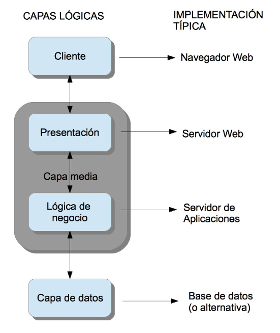

# La arquitectura web y algunos modelos

Una aplicación web necesita de una estructura que permita su acceso desde diferentes lugares (máquinas). Esta estructura es lo que se denomina **Arquitectura Web** (realmente este nombre se da también al diseño de toda la estructura).

La gran mayoría de las arquitecturas web en la actualidad se basan en un modelo **cliente/servidor**: una comunicación asimétrica en la que uno de los extremos ofrece uno o más servicios y el otro hace uso de él. Éste es el modelo sobre el que centraremos el curso, pero no es el único que existe.

El término **servicio** es muy amplio y muchas veces confuso. Por ejemplo se puede considerar una web a la que acudimos a comprar productos un servicio en si misma, pero a la vez dicho servicio está compuesto de servicios de seguridad, de sesión, de transacciones, etcétera.

La estructura de una Arquitectura Web actual sigue el siguiente **modelo**:

| Capa                          | Cometido                                                                                                                                                                                                                                                                                                                                                                                                                                |
| ----------------------------- | --------------------------------------------------------------------------------------------------------------------------------------------------------------------------------------------------------------------------------------------------------------------------------------------------------------------------------------------------------------------------------------------------------------------------------------- |
| **Capa cliente**              | Es generalmente el navegador Web ejecutándose en el ordenador del usuario final. Existen otras opciones más básicas pero en la actualidad la potencia y diversidad de los navegadores existentes (así como su gratuidad) han relegado las demás opciones a la práctica desaparición.                                                                                                                                                    |
| **Capa de presentación**      | Se encarga de componer las páginas integrando la parte dinámica en la estática. Además también procesa las páginas que envía el cliente (por ejemplo datos en formularios)                                                                                                                                                                                                                                                              |
| **Capa de lógica de negocio** | Lleva a cabo operaciones más complejas. Se corresponde con la implantación de un servidor de aplicaciones. Realiza muchos tipos de operaciones entre los que destacan: a) Realizar todas las operaciones y validaciones. b) Gestionar el flujo de trabajo (workflow) incluyendo el control y gestión de las sesiones y los datos que se necesitan. c) Gestionar todas las operaciones de accesos a datos desde la capa de presentación. |
| **Capa de datos**             | Se compone de un sistema de almacenamiento acceso a datos que se utilizan para confeccionar la página Web. Generalmente es un gestor de bases de datos relacionales (SGDB) pero pueden ser ficheros de texto plano                                                                                                                                                                                                                      |

Algunos ejemplos de tecnologías asociadas a las capas en la arquitectura web:

| Capa              | Lenguajes                           | Manejadores                   |
| ----------------- | ----------------------------------- | ----------------------------- |
| Cliente           | http/https                          | Chrome, Firefox, Edge         |
| Presentación      | html                                | Nginx, Apache                 |
| Lógica de negocio | php, python, ruby, java, javascript | php-fpm, gunicorn, proxy_pass |
| Capa de datos     | sql                                 | PostgreSQL, MySQL             |

En el caso de estar usando **páginas web estáticas** (no cambian en función de diversas variables) no existiría la capa de datos ya que estos van incorporados en los propios archivos de marcas que serán las conforman las páginas web.

## Un modelo simple para el despliegue de aplicaciones web

En la actualidad la mayor parte de la información y lógica de un negocio debe ser accesible desde diferentes lugares. Aquí entran en juego las aplicaciones web.

Se puede imaginar inmediatamente que la **seguridad** es un aspecto clave en este tipo de aplicaciones, pero no el único. Muchas veces la **velocidad** y **estabilidad** de la comunicación y del servicio en sí pueden ser tanto o más críticas.

Cuando uno va a desarrollar e implantar una aplicación web debe tener en cuenta varios factores. Lo primero debe ser hacerse una **idea general de la aplicación** y de las **diferentes soluciones** que podemos utilizar. Se deben tener en cuenta las tres capas. Un error muy común es el uso de un único conjunto de tecnologías constantemente. Por supuesto conocer una tecnología es un punto a favor de su uso, pero muchas veces vamos a llevar a cabo una solución manifiestamente mejor únicamente por no haber considerado usar otras y afrontar su aprendizaje.

El siguiente aspecto a considerar sería el **coste**. Cuánto nos va a costar y qué presupuesto tenemos.

Estos factores hay que considerarlos **antes de firmar** ningún contrato e incluso antes de dar un presupuesto aunque sea orientativo.

Por ejemplo una compañía de venta de vehículos industriales quiere una aplicación web para publicar sus datos de ventas y que los comerciales puedan acceder a ella remotamente. Necesitaremos una base de datos en la que se almacenen los diferentes vehículos y sus ventas. También hará falta una lógica que mantenga todo el sistema actualizado y permita modificaciones. Además necesitaremos una capa de cliente con autenticación para que los diferentes vendedores puedan acceder al sistema, consultar y actualizar los datos.

Después de la evaluación se puede decidir no afrontar el proyecto por muchos motivos. Además de los costes ya mencionados podría darse el caso de que no tengamos los conocimientos o la infraestructura para llevar a cabo el proyecto.

## ¿Qué es una aplicación web?

Es una aplicación que se va a ejecutar a través de internet. Constará de, al menos, dos partes: una en el **lado servidor** y otra que se ejecutará en la **máquina del cliente** en un navegador web. Las aplicaciones web se engloban en el concepto superior de _aplicaciones distribuidas_. El servidor pone a disposición del cliente diferentes recursos. Ejemplos de aplicaciones web son el correo electrónico web, las tiendas online, las redes sociales, etc.

## Fases de un proyecto de aplicación web

Se pueden considerar cuatro fases en el proyecto:

| Fase                       | Descripción                                                                                                                                                                                                                                                                                                                                                                                                                                                                                                                                                                                           |
| -------------------------- | ----------------------------------------------------------------------------------------------------------------------------------------------------------------------------------------------------------------------------------------------------------------------------------------------------------------------------------------------------------------------------------------------------------------------------------------------------------------------------------------------------------------------------------------------------------------------------------------------------- |
| **Concepto**               | Durante esta fase se debe obtener una idea clara y concreta de qué quiere el cliente. Además hay que obtener una idea general de cómo se llevará a cabo y de si es viable o no. Hay que determinar las limitaciones reales con que nos podemos encontrar. Por ejemplo la conexión a internet existente en la zona puede no ser suficiente para obtener los resultados previstos. Otro ejemplo de problema puede ser que la tecnología necesaria sea demasiado cara. Es vital que al terminar esta fase se tenga una documentación que defina claramente los límites y objetivos del proyecto.         |
| **Diseño**                 | Esta fase se centra en responder a cómo haremos la aplicación. Hay que concretar las tecnologías (tanto software como hardware) que usaremos y cómo se van a comunicar entre ellas. También hay que determinar los distintos módulos que usaremos y sus interfaces. Es muy importante realizar un plan de proyecto realista en el que se dividan las tareas y responsabilidades y se calculen los tiempos para cada elemento así como su secuencia y dependencias. También hay que obtener una especificación funcional en la que se detallen tanto el funcionamiento como el flujo de la aplicación. |
| **Desarrollo**             | En esta fase se debe desarrollar el proyecto en sí. Es muy importante llevar a cabo pruebas tanto unitarias como de integración así como gestionar una documentación del desarrollo y un control de versiones.                                                                                                                                                                                                                                                                                                                                                                                        |
| **Pruebas e implantación** | Cuando el proyecto está totalmente terminado es necesario probarlo intensivamente antes de ponerlo en producción. Es necesario tener en cuenta tanto nuestra aplicación como su comunicación con otros sistemas informáticos. Cuanto más se parezca el sistema de pruebas al real mejor. El último paso es la instalación y puesta en carcha del sistema. Es un momento crítico.                                                                                                                                                                                                                      |

Una fase común a todos los proyectos informáticos y que no se incluye aquí es el **mantenimiento**. Este concepto incluye dos partes. El mantenimiento del servicio y corrección de errores y las mejoras. La primera consiste en asegurarse de que todo sigue funcionando y solucionar los posibles errores y "caídas" del servicio. La segunda consiste en ampliar el proyecto. Ambos casos suelen considerarse contratos a parte y por ello no se incluyen en el ciclo.

El orden correcto para el desarrollo es empezar de abajo a arriba (**enfoque bottom-up**). Es decir, primero la capa de datos, luego la de negocio y por último la presentación al cliente. Muchas veces se tiene la tentación de hacerlo al revés. Esto es debido a que no se han identificado bien las necesidades y objetivos de proyecto o no se ha realizado un diseño concreto. Es un error que nos conducirá a muchas más modificaciones y errores en nuestra aplicación.
