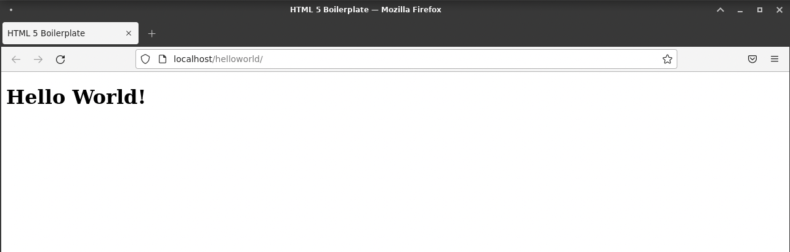
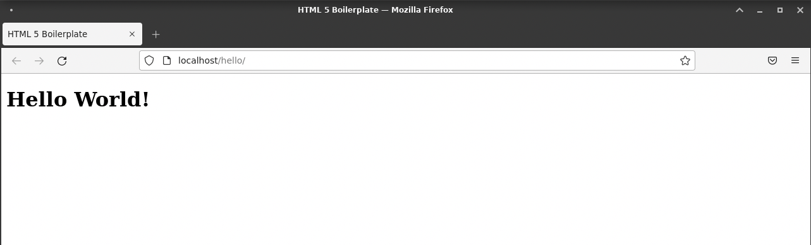
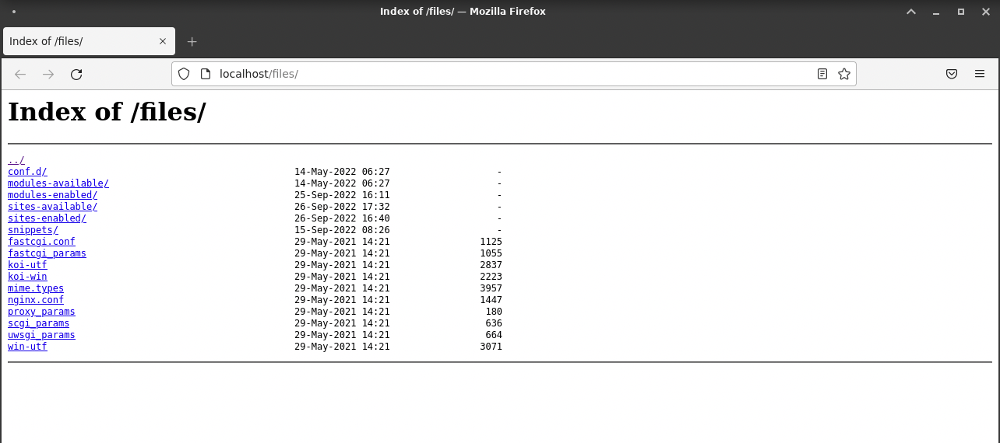
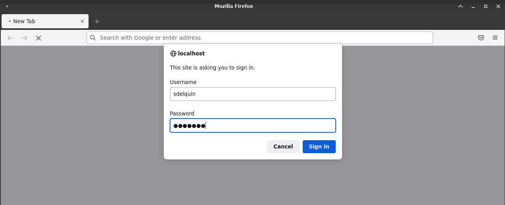
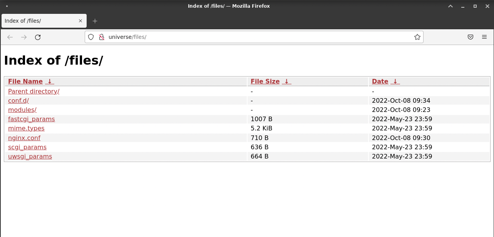

# UT3: Administración de servidores web <!-- omit in TOC -->

Ya hemos visto la instalación de Nginx. En esta unidad de trabajo nos vamos a dedicar a explorar todas sus opciones de configuración y administración.

- [Configuración del servidor web](#configuración-del-servidor-web)
	- [Número de conexiones](#número-de-conexiones)
	- [Usuario de trabajo](#usuario-de-trabajo)
	- [Carpeta raíz](#carpeta-raíz)
- [Hosts virtuales](#hosts-virtuales)
	- [Sitio por defecto](#sitio-por-defecto)
	- [Creación de un host virtual](#creación-de-un-host-virtual)
- [Directivas Nginx](#directivas-nginx)
	- [Ubicaciones](#ubicaciones)
	- [Alias](#alias)
	- [Listado de directorios](#listado-de-directorios)
	- [Acceso protegido](#acceso-protegido)
- [Módulos](#módulos)
	- [Instalación de un módulo](#instalación-de-un-módulo)

## Configuración del servidor web

En Nginx, la configuración del servicio está en el archivo `/etc/nginx/nginx.conf` con el siguiente contenido:

```nginx
user www-data;
worker_processes auto;
pid /run/nginx.pid;
include /etc/nginx/modules-enabled/*.conf;

events {
	worker_connections 768;
	# multi_accept on;
}

http {

	##
	# Basic Settings
	##

	sendfile on;
	tcp_nopush on;
	types_hash_max_size 2048;
	# server_tokens off;

	# server_names_hash_bucket_size 64;
	# server_name_in_redirect off;

	include /etc/nginx/mime.types;
	default_type application/octet-stream;

	##
	# SSL Settings
	##

	ssl_protocols TLSv1 TLSv1.1 TLSv1.2 TLSv1.3; # Dropping SSLv3, ref: POODLE
	ssl_prefer_server_ciphers on;

	##
	# Logging Settings
	##

	access_log /var/log/nginx/access.log;
	error_log /var/log/nginx/error.log;

	##
	# Gzip Settings
	##

	gzip on;

	# gzip_vary on;
	# gzip_proxied any;
	# gzip_comp_level 6;
	# gzip_buffers 16 8k;
	# gzip_http_version 1.1;
	# gzip_types text/plain text/css application/json application/javascript text/xml application/xml application/xml+rss text/javascript;

	##
	# Virtual Host Configs
	##

	include /etc/nginx/conf.d/*.conf;
	include /etc/nginx/sites-enabled/*;
}
```

### Número de conexiones

- [worker_processes](https://nginx.org/en/docs/ngx_core_module.html#worker_processes) establece el número de procesos que atienden peticiones. El valor por defecto "auto" indica que se usarán todos los _cores_ disponibles.
- [worker_connections](https://nginx.org/en/docs/ngx_core_module.html#worker_connections) establece el número simultáneo de conexiones que puede atender un _worker_. El valor por defecto es 768.

Por lo tanto, el número máximo de clientes viene dado por:

```
max_clients = worker_processes * worker_connections
```

Vamos a comprobar el estado de los _workers_ de Nginx:

```console
sdelquin@lemon:~$ sudo systemctl status nginx | grep nginx:
             ├─176437 nginx: master process /usr/sbin/nginx -g daemon on; master_process on;
             ├─176438 nginx: worker process
             └─176439 nginx: worker process
```

Se puede ver que hay un proceso _master_ y dos _workers_. Esto se visualiza aún mejor mostrando un árbol de procesos:

```console
sdelquin@lemon:~$ pstree -p 176437
nginx(176437)─┬─nginx(176438)
              └─nginx(176439)
```

El hecho de que hayan 2 _workers_ es debido a que la máquina dispone de 2 _cores_ tal y como se indica a continuación:

```console
sdelquin@lemon:~$ nproc
2
```

¿Cuál es el valor máximo que puedo establecer en Nginx para número de conexiones del _worker_? Para responder a esta pregunta basta con ejecutar el comando siguiente:

```console
sdelquin@lemon:~$ ulimit -n
1024
```

Desde la ayuda de la shell (`man bash`) podemos extraer información sobre el comando `ulimit` y sus parámetros:

```console
-n: The maximum number of open file descriptors (most systems do not allow this value to be set)
```

### Usuario de trabajo

El **usuario** con el que Nginx accede al sistema es `www-data`, tal y como se especifica en el fichero de configuración `nginx.conf`:

```console
sdelquin@lemon:/etc/nginx$ grep "www-data" nginx.conf
user www-data;
```

Esto se puede comprobar visualizando los detalles de los procesos _workers_:

```console
sdelquin@lemon:~$ ps aux | grep nginx | grep worker
www-data  176438  0.0  0.3  53028  6296 ?        S    12:30   0:00 nginx: worker process
www-data  176439  0.0  0.3  53028  6296 ?        S    12:30   0:00 nginx: worker process
```

> Es importante tenerlo en cuenta de cara a los permisos que asignar a ficheros y carpetas.

### Carpeta raíz

Un concepto fundamental en los servidores web es el de `root` que indica la carpeta raíz desde la que se sirven los archivos.

El valor por defecto que tiene `root` en Nginx es `/usr/share/nginx/www` y eso viene dado por el parámetro `--prefix` durante la fase de compilación:

```console
sdelquin@lemon:~$ sudo nginx -V
nginx version: nginx/1.18.0
built with OpenSSL 1.1.1n  15 Mar 2022
TLS SNI support enabled
configure arguments: (...) --prefix=/usr/share/nginx (...)
```

Sin embargo, este comportamiento se puede modificar si establecemos un valor distinto para `root` en el _virtual-host_.

## Hosts virtuales

Nginx se configura a través de bloques de servidor denominados _**virtual hosts**_. Cada uno de ellos nos permite montar un servicio diferente.

La definición de los _virtual host_ se lleva a cabo mediante un fichero presente en alguna de estas dos ubicaciones:

| Ubicación                   | Fichero  | Instalación      | Por defecto    |
| --------------------------- | -------- | ---------------- | -------------- |
| `/etc/nginx/conf.d/`        | `*.conf` | Docker/Compilado | `default.conf` |
| `/etc/nginx/sites-enabled/` | `*`      | Paquetería       | `default`      |

> Estas rutas vienen definidas mediante un `include` en el fichero de configuración `nginx.conf`

### Sitio por defecto

La propia instalación de Nginx ya configura un _virtual host_ **por defecto**. Destacamos algunas líneas de este fichero:

```nginx
server {
	listen 80;                    # Escuchando en el puerto 80
	server_name _;                # Sirve para cualquier nombre de servidor
	root /var/www/html;           # Ruta raíz por defecto
	index index.html index.html;  # Ficheros implícitos de índice
}
```

Por lo tanto, podemos concluir que colocando un fichero índice en la ruta raíz (de hecho siempre existe uno por defecto), deberíamos poder acceder a nuestro servidor web en el puerto 80 de la máquina.

Veamos el contenido del fichero de índice que está creado por defecto en Debian:

→ `/var/www/html/index.nginx-debian.html`

```html
<!DOCTYPE html>
<html>
  <head>
    <title>Welcome to nginx!</title>
    <style>
      body {
        width: 35em;
        margin: 0 auto;
        font-family: Tahoma, Verdana, Arial, sans-serif;
      }
    </style>
  </head>
  <body>
    <h1>Welcome to nginx!</h1>
    <p>
      If you see this page, the nginx web server is successfully installed and
      working. Further configuration is required.
    </p>

    <p>
      For online documentation and support please refer to
      <a href="http://nginx.org/">nginx.org</a>.<br />
      Commercial support is available at
      <a href="http://nginx.com/">nginx.com</a>.
    </p>

    <p><em>Thank you for using nginx.</em></p>
  </body>
</html>
```

Es por esto que cuando accedemos a http://localhost obtenemos esta página:


Podemos **deshabilitar el sitio por defecto** sin "destruir" su configuración. Basta con borrar el enlace simbólico:

```console
sdelquin@lemon:~$ sudo rm /etc/nginx/sites-enabled/default
sdelquin@lemon:~$ sudo systemctl reload nginx
```

> Tras una modificación de Nginx debemos recargar el servicio para que los cambios tengan efecto.

### Creación de un host virtual

Para crear un _virtual host_ debemos preparar un fichero de configuración:

```console
sdelquin@lemon:~$ sudo vi /etc/nginx/sites-available/helloworld
```

```nginx
server {
	server_name helloworld;
	root /home/sdelquin/www/helloworld;
}
```

Podemos comprobar que la sintaxis sea correcta:

```console
sdelquin@lemon:~$ sudo nginx -t
nginx: the configuration file /etc/nginx/nginx.conf syntax is ok
nginx: configuration file /etc/nginx/nginx.conf test is successful
```

A continuación tenemos que crear un fichero de índice en la carpeta raíz:

```console
sdelquin@lemon:~$ mkdir -p ~/www/helloworld
sdelquin@lemon:~$ vi ~/www/helloworld/index.html
```

```html
<!DOCTYPE html>
<html lang="en">
  <head>
    <meta charset="UTF-8" />
    <meta name="viewport" content="width=device-width, initial-scale=1.0" />
    <meta http-equiv="X-UA-Compatible" content="ie=edge" />
    <title>HTML 5 Boilerplate</title>
    <link rel="stylesheet" href="style.css" />
  </head>
  <body>
    <h1>Hello World!</h1>
    <script src="index.js"></script>
  </body>
</html>
```

Ahora habilitamos este nuevo _virtual host_ creando un enlace simbólico y recargando la configuración en Nginx:

```console
sdelquin@lemon:~$ sudo ln -s /etc/nginx/sites-available/helloworld /etc/nginx/sites-enabled/
sdelquin@lemon:~$ ls -l /etc/nginx/sites-enabled/
total 0
lrwxrwxrwx 1 root root 37 sep 26 10:25 helloworld -> /etc/nginx/sites-available/helloworld
sdelquin@lemon:~$ sudo systemctl reload nginx
```

Lo único que faltaría es simular un nombre de dominio a través de la configuración local:

```console
sdelquin@lemon:~$ sudo vi /etc/hosts
```

Añadir la línea:

```
127.0.0.1	helloworld
```

Esto hará que las peticiones a `hellworld` sean resueltas a la ip local `127.0.0.1`. Dado que el _virtual host_ está configurado para atender peticiones en ese dominio, pues todo debería funcionar:

```console
sdelquin@lemon:~$ firefox helloworld
```


## Directivas Nginx

Existen [multitud de directivas](https://nginx.org/en/docs/dirindex.html) para Nginx. En las próximas secciones veremos las que se consideran más relevantes para la puesta en funcionamiento de un servicio web.

### Ubicaciones

Los _virtual hosts_ permiten definir ubicaciones (**locations**) en su interior que serán gestionadas de forma independiente en función de su configuración.

A su vez, cada _location_ puede incluir las directivas correspondientes.

Supongamos que nuestro "Hello World" lo queremos montar sobre http://localhost/helloworld. Procedemos de la siguiente manera:

```console
sdelquin@lemon:~$ sudo vi /etc/nginx/sites-available/helloworld
```

```nginx
server {
	server_name localhost;

    location /helloworld {
        root /home/sdelquin/www;  # /home/sdelquin/www/helloworld
    }
}
```

> 💡 &nbsp;Tener en cuenta que lo que pongamos en `location` se añade a `root` para determinar la ruta raíz del servicio.

Recordar siempre recargar el servicio Nginx cuando hagamos cambios en la configuración:

```console
sdelquin@lemon:~$ sudo systemctl reload nginx
```

Ahora si accedemos a http://localhost/helloworld podremos visualizar la página correctamente:

```console
sdelquin@lemon:~$ firefox localhost/helloworld
```



### Alias

Los "alias" son directivas que funcionan junto a los _locations_ y permiten evitar que se añada la ruta de la url al _root_.

Siguiendo con nuestro "Hello World" vamos a configurar un _location_ (mediante alias) para acceder al recurso en la url http://localhost/hello:

```console
sdelquin@lemon:~$ sudo vi /etc/nginx/sites-available/helloworld
```

```nginx
server {
    server_name localhost;

    location /hello {
        alias /home/sdelquin/www/helloworld;
    }
}
```

Recargamos la configuración y accedemos en el navegador:



> 💡 &nbsp;Un alias también se puede hacer "apuntar" a un fichero, no únicamente a un directorio/carpeta.

### Listado de directorios

La directiva `autoindex` nos permite listar el contenido del directorio indicado, pudiendo implementar una especie de FTP (lectura) a través del navegador.

Vamos a ejemplificar este escenario listando el contenido de la carpeta `/etc/nginx` cuando accedamos a http://locahost/files.

Lo primero, para evitar "colisiones" en nombres de servidor, vamos a deshabilitar el _virtual host_ anterior:

```console
sdelquin@lemon:~$ sudo rm /etc/nginx/sites-enabled/helloworld
```

Ahora vamos a crear un nuevo _virtual host_ llamado "files":

```console
sdelquin@lemon:~$ sudo vi /etc/nginx/sites-available/files
```

```nginx
server {
    server_name localhost;

    location /files {
        alias /etc/nginx;
        autoindex on;
    }
}
```

Después de recargar, podemos acceder a la URL y ver que se muestra el listado de ficheros que hay en la ruta especificada:

```console
sdelquin@lemon:~$ firefox localhost/files
```



### Acceso protegido

En ciertos escenarios es posible que queramos añadir una validación de credenciales para acceder a un recurso web. En este caso podemos hacer uso de las **directivas de autenticación**.

Lo primero es crear un fichero de credenciales `.htpasswd` con formato `<usuario>:<contraseña>`. En este caso vamos a usar:

- Usuario: `sdelquin`
- Contraseña: `systemd`

```console
sdelquin@lemon:~$ sudo sh -c "echo -n 'sdelquin:' >> /etc/nginx/.htpasswd"
sdelquin@lemon:~$ sudo sh -c "openssl passwd -apr1 systemd >> /etc/nginx/.htpasswd"
```

> 💡 &nbsp;Estamos usando la herramienta de openssl para [computar hashes](https://www.openssl.org/docs/man1.1.1/man1/openssl-passwd.html).

Vamos a comprobar que el fichero se ha creado correctamente y que la contraseña no está en claro 😅:

```console
sdelquin@lemon:~$ sudo cat /etc/nginx/.htpasswd
sdelquin:$apr1$A.UE2T7J$qgt0pRnZ99ePuDukgi/oh/
```

Ahora debemos hacer una pequeña modificación a nuestro _virtual host_ para añadir la autenticación:

```console
sdelquin@lemon:~$ sudo vi /etc/nginx/sites-available/files
```

```nginx
server {
    server_name localhost;

    location /files {
        alias /etc/nginx;
        autoindex on;
        auth_basic "Restricted area";
        auth_basic_user_file /etc/nginx/.htpasswd;
    }
}
```

Hemos añadido las directivas `auth_basic` y `auth_basic_user_file`.

Tras recargar la configuración y acceder a http://localhost/files vemos que nos aparece el diálogo para autenticarnos:



Tras introducir nuestras credenciales ya podemos ver el listado de ficheros:


## Módulos

Cuando Nginx se compila (o se instala vía paquetería) se hace incluyendo una serie de módulos que le otorgan ciertas funcionalidades extra.

Podemos ver estos módulos con el siguiente comando:

```console
sdelquin@lemon:~$ sudo nginx -V 2>&1 | tr ' ' '\n' | grep module
--modules-path=/usr/lib/nginx/modules
--with-http_ssl_module
--with-http_stub_status_module
--with-http_realip_module
--with-http_auth_request_module
--with-http_v2_module
--with-http_dav_module
--with-http_slice_module
--with-http_addition_module
--with-http_gunzip_module
--with-http_gzip_static_module
--with-http_sub_module
```

Podemos inferir de la salida del comando anterior que los **módulos estáticos** incluidos en el proceso de compilación son los siguientes:

- https://nginx.org/en/docs/http/ngx_http_ssl_module.html
- https://nginx.org/en/docs/http/ngx_http_stub_status_module.html
- https://nginx.org/en/docs/mail/ngx_mail_realip_module.html
- https://nginx.org/en/docs/mail/ngx_mail_auth_http_module.html
- https://nginx.org/en/docs/http/ngx_http_v2_module.html
- https://nginx.org/en/docs/http/ngx_http_dav_module.html
- https://nginx.org/en/docs/http/ngx_http_slice_module.html
- https://nginx.org/en/docs/http/ngx_http_addition_module.html
- https://nginx.org/en/docs/http/ngx_http_gunzip_module.html
- https://nginx.org/en/docs/http/ngx_http_gzip_static_module.html
- https://nginx.org/en/docs/http/ngx_http_sub_module.html

Los **módulos dinámicos** son aquellos que se pueden cargar "a posteriori" de la instalación inicial. Por defecto se encuentran en la carpeta `/usr/lib/nginx/modules`:

```console
sdelquin@lemon:~$ ls -l /usr/lib/nginx/modules
total 360
-rw-r--r-- 1 root root  20064 may 14 07:27 ngx_http_geoip_module.so
-rw-r--r-- 1 root root  23352 may 14 07:27 ngx_http_image_filter_module.so
-rw-r--r-- 1 root root  23248 may 14 07:27 ngx_http_xslt_filter_module.so
-rw-r--r-- 1 root root 103096 may 14 07:27 ngx_mail_module.so
-rw-r--r-- 1 root root  15608 may 14 07:27 ngx_stream_geoip_module.so
-rw-r--r-- 1 root root 175408 may 14 07:27 ngx_stream_module.so
```

Pero realmente, la instalación de Nginx "descubre" los módulos dinámicos desde `/etc/nginx/modules-avaiable/*.conf`. Si nos fijamos en alguno de estos ficheros veremos que únicamente cargan el módulo desde su ubicación principal:

```console
sdelquin@lemon:~$ cat /etc/nginx/modules-enabled/50-mod-stream.conf
load_module modules/ngx_stream_module.so;
```

> [Librerías estáticas (`*.a`) vs Librerías dinámicas (`*.so`)](https://medium.com/swlh/linux-basics-static-libraries-vs-dynamic-libraries-a7bcf8157779)

Nginx se puede extender haciendo uso de módulos propios o módulos de la comunidad:

| Módulos CORE               | Módulos de terceros                           |
| -------------------------- | --------------------------------------------- |
| https://nginx.org/en/docs/ | https://www.nginx.com/resources/wiki/modules/ |

### Instalación de un módulo

Vamos a instalar un módulo de terceros para Nginx y cargarlo dinámicamente. En este caso hemos escogido [Fancy Index](https://www.nginx.com/resources/wiki/modules/fancy_index/) que permite visualizar de manera más "bonita" un listado de ficheros.

Lo primero sería instalar el paquete asociado:

```console
sdelquin@lemon:~$ sudo apt install libnginx-mod-http-fancyindex
```

Podemos comprobar los ficheros que se han instalado:

```console
sdelquin@lemon:~$ dpkg -L libnginx-mod-http-fancyindex
/.
/usr
/usr/lib
/usr/lib/nginx
/usr/lib/nginx/modules
/usr/lib/nginx/modules/ngx_http_fancyindex_module.so
/usr/share
/usr/share/doc
/usr/share/doc/libnginx-mod-http-fancyindex
/usr/share/doc/libnginx-mod-http-fancyindex/changelog.Debian.gz
/usr/share/doc/libnginx-mod-http-fancyindex/changelog.gz
/usr/share/doc/libnginx-mod-http-fancyindex/copyright
/usr/share/nginx
/usr/share/nginx/modules-available
/usr/share/nginx/modules-available/mod-http-fancyindex.conf
```

Un par de detalles interesantes:

1. La libería dinámica se encuentra en `/usr/lib/nginx/modules/ngx_http_fancyindex_module.so`.
2. Existe una configuración en `/usr/share/nginx/modules-available/mod-http-fancyindex.conf`

Ahora ya podemos añadir sus directivas a la configuración por defecto. Modificamos el archivo `/etc/nginx/sites-enabled/default` de la siguiente manera:

```nginx
...
root /etc/nginx;
...
location / {
  ...
  fancyindex on;              # Enable fancy indexes.
  fancyindex_exact_size off;  # Output human-readable file sizes.
}
...
```

Recargamos el servicio para que los cambios surtan efecto:

```console
sdelquin@lemon:~$ sudo systemctl reload nginx
```

Ahora, si accedemos a http://localhost veremos algo similar a lo siguiente:



En la fecha de escritura de este documento, los módulos Nginx disponibles en la paquetería de Debian son los siguientes:

- libnginx-mod-http-auth-pam
- libnginx-mod-http-cache-purge
- libnginx-mod-http-dav-ext
- libnginx-mod-http-echo
- libnginx-mod-http-fancyindex
- libnginx-mod-http-geoip
- libnginx-mod-http-geoip2
- libnginx-mod-http-headers-more-filter
- libnginx-mod-http-image-filter
- libnginx-mod-http-lua
- libnginx-mod-http-ndk
- libnginx-mod-http-perl
- libnginx-mod-http-subs-filter
- libnginx-mod-http-uploadprogress
- libnginx-mod-http-upstream-fair
- libnginx-mod-http-xslt-filter
- libnginx-mod-mail
- libnginx-mod-nchan
- libnginx-mod-rtmp
- libnginx-mod-stream
- libnginx-mod-stream-geoip
- libnginx-mod-stream-geoip2
