# UT1: Documentación y sistemas de control de versiones

[Documentación](#documentación)  
[Sistemas de control de versiones](#sistemas-de-control-de-versiones)

## Documentación

La documentación de un proyecto software se puede escribir en múltiples formatos. Pero se podría decir que existe un estándar _de facto_ para la documentación que es **Markdown**.

En esta sección haremos un repaso por las principales características de **Markdown "sabor" GitHub**, ya que podemos renderizar su contenido directamente en la plataforma web.

**El archivo "por excelencia"** donde solemos encontrar la documentación es `README.md`, pero podemos encontrar muchos otros escritos en Markdown.

[Sintaxis de escritura y formato básicos](https://docs.github.com/es/get-started/writing-on-github/getting-started-with-writing-and-formatting-on-github/basic-writing-and-formatting-syntax)  
[Trabajar con formato avanzado](https://docs.github.com/es/get-started/writing-on-github/working-with-advanced-formatting)

> 💡 Puede ser útil manejar [este plugin de VSCode](https://marketplace.visualstudio.com/items?itemName=bierner.markdown-preview-github-styles) que permite renderizar en tiempo real un documento Markdown en el formato GitHub.

## Sistemas de control de versiones

### Introducción al control de versiones

#### ¿Qué es el control de versiones?

El control de versiones nos permite dar solución a distintas problemáticas.

¿Quién no se ha encontrado con una gran cantidad de ficheros que vamos "versionando" con unos dígitos al final?

```console
~/work$ ls -l
procesa_datos_00.R
procesa_datos_01.R
procesa_datos_02.R
procesa_datos_03.R
procesa_datos_04.R
procesa_datos_05.R
procesa_datos_06.R
procesa_datos_07.R
procesa_datos_08.R
procesa_datos_09.R
procesa_datos_10.R
procesa_datos_11.R
procesa_datos_12.R
procesa_datos_13.R
procesa_datos_14.R
procesa_datos_15.R
procesa_datos_16.R
procesa_datos_17.R
procesa_datos_18.R
procesa_datos_19.R
procesa_datos_20.R
```

¿Quién no ha tenido una infinidad de carpetas con los ficheros "definitivos" de un proyecto?

```console
~/work$ tree
.
├── cambios
│   ├── arregla_error1
│   ├── arreglando_procesa
│   ├── mejora_funcionalidad
│   ├── nuevo_problema
│   └── soluciona_bug
├── definitivo
│   ├── lanzamiento
│   ├── version_final
│   └── version_mejorada
└── pruebas
    ├── pruebas_antes
    ├── pruebas_despues
    └── pruebas_final

14 directories, 0 files
```

Se llama **control de versiones** a la gestión de los diversos **cambios** que se realizan sobre los elementos de algún producto o una configuración del mismo. Una versión, revisión o edición de un producto, es el **estado** en el que se encuentra el mismo en un momento dado de su desarrollo o modificación.

#### Aclarando conceptos

El control de versiones se podría dividir en **3 capas** que trabajan de forma coordinada:

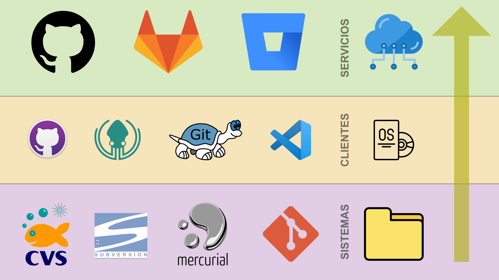

| Capa          | Descripción                                                                                                                                                                                     | Ejemplos                                                                                                                                                                                                            |
| ------------- | ----------------------------------------------------------------------------------------------------------------------------------------------------------------------------------------------- | ------------------------------------------------------------------------------------------------------------------------------------------------------------------------------------------------------------------- |
| **Sistemas**  | Esta capa incluye los distintos sistemas de control de versiones que existen.                                                                                                                   | [CVS](https://es.wikipedia.org/wiki/CVS)<br>[Subversion](<https://es.wikipedia.org/wiki/Subversion_(software)>)<br>[Mercurial](https://es.wikipedia.org/wiki/Mercurial)<br>[Git](https://es.wikipedia.org/wiki/Git) |
| **Clientes**  | Esta capa contiene las distintas herramientas cliente (gráficas) para trabajar con los sistemas de control de versiones. _(Cada sistema ya incluye su propia herramienta en línea de comandos)_ | [GitHub Desktop](https://desktop.github.com/)<br>[GitKraken](https://www.gitkraken.com/)<br>[TortoiseGit](https://tortoisegit.org/)<br>[Git para VSCode](https://code.visualstudio.com/docs/sourcecontrol/overview) |
| **Servicios** | Esta capa incluye aquellos servicios web que permiten sincronizar nuestro control de versiones local.                                                                                           | [GitHub](https://github.com/)<br>[GitLab](https://about.gitlab.com/)<br>[Bitbucket](https://bitbucket.org/)                                                                                                         |

Hay dos grandes modelos de control de versiones: **Modelo centralizado vs Modelo distribuido**. Veamos sus características:

| Modelo centralizado                        | Modelo distribuido                         |
| ------------------------------------------ | ------------------------------------------ |
| 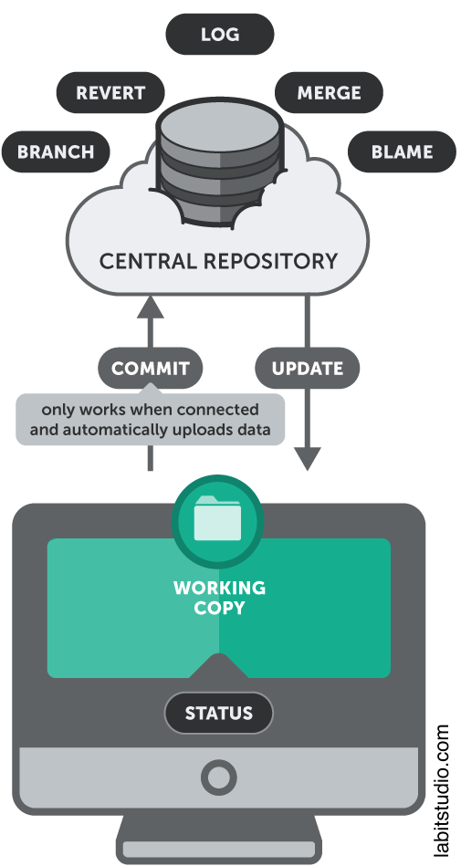 | 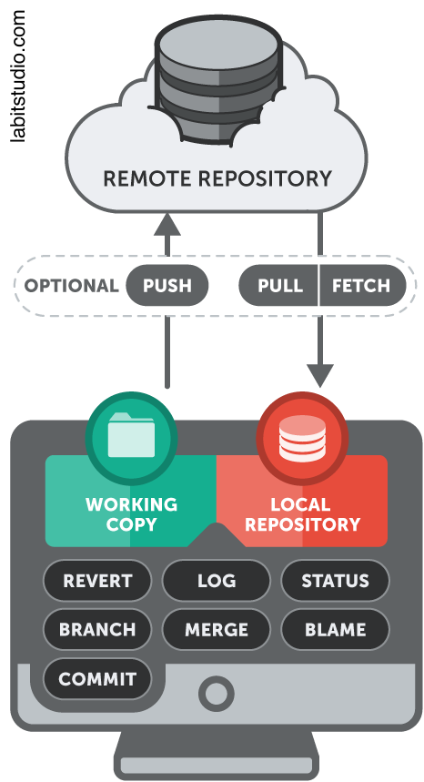 |
| Centralizado                               | Distribuido                                |
| Cliente/Servidor                           | Cliente+Servidor                           |
| Offline limitado                           | Offline completo                           |
| Más sencillo                               | Más complejo                               |
| Más antiguo                                | Más moderno                                |
| ≈ 23% mercado                              | ≈ 72% mercado                              |
| Ejemplo: `svn`                             | Ejemplo: `git`                             |

Es importante aclarar que un **repositorio** no es lo mismo que un **proyecto**.

El repositorio hace referencia única y exclusivamente a los ficheros que están el control de versiones, mientras que el proyecto es un concepto más amplio que puede incluir gestión de incidencias, control de acceso, cuestiones de seguridad, wikis, acciones desatendidas, etc.

> 💡 Es muy habitual referirse a un repositorio como **repo**.

#### ¿Por qué usar git?

[git](https://git-scm.com/) se ha convertido en un **estándar de facto** en el mundo de los sistemas de control de versiones.

Además de las ventajas que ya hemos visto para los sistemas de control de versiones distribuidos, también podemos añadir otras características que ofrece git:

- Mantiene un histórico permanente de cambios.
- Se puede usar a modo de copia de seguridad.
- Permite el trabajo en equipo.
- Sirve para la creación de ramas de trabajo y/o etiquetas.
- Añade un enfoque social al control de versiones.

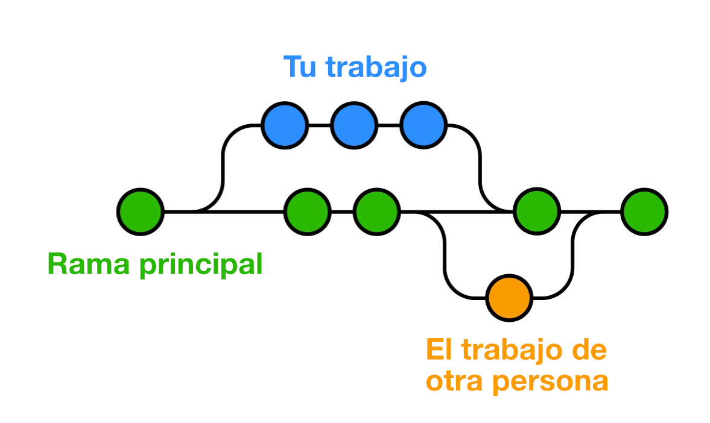

### Preparación del entorno de desarrollo

#### ¿Tengo git instalado?

Para responder a esta pregunta podemos abrir una terminal y ver la salida del siguiente comando:

```console
sdelquin@lemon:~$ git --version
git version 2.30.2
```

Si obtenemos algo del tipo `bash: git: orden no encontrada` debemos instalar el software [desde este enlace](https://git-scm.com/downloads).

#### Configuración básica

Lo primero que debemos hacer antes de empezar a trabajar con `git` es **configurar nuestras credenciales** (con las que nos identificaremos en cada operación de control de versiones que hagamos):

```console
sdelquin@lemon:~$ git config --global user.name "Sergio Delgado Quintero"
sdelquin@lemon:~$ git config --global user.email "sdelquin@gmail.com"
```

Los comandos anteriores se encargan de guardar esta información en un fichero de configuración de usuario ubicado en `~/.gitconfig` con el siguiente contenido:

```ini
[user]
	name = Sergio Delgado Quintero
	email = sdelquin@gmail.com
```

> 💡 No hay inconveniente en modificar este fichero "manualmente" (siempre que sepamos lo que estamos haciendo).

Asimismo es conveniente establecer la **rama por defecto** con la que vamos a trabajar en cada repo:

```console
sdelquin@lemon:~$ git config --global init.defaultBranch main
```

Podemos comprobar que el fichero de configuración `~/.gitconfig` se ha actualizado correctamente:

```ini
[user]
	name = Sergio Delgado Quintero
	email = sdelquin@gmail.com
[init]
	defaultBranch = main
```

Históricamente la rama por defecto en sistemas de control de versiones se ha llamado `master`. Por cuestiones éticas relacionadas con los términos maestro/esclavo (`master/slave`) [se decidió modificar esta convención](https://www.theserverside.com/feature/Why-GitHub-renamed-its-master-branch-to-main) y usar `main` como nombre de la rama principal de los repositorios.

Es también recomendable establecer la estrategia de "mezcla" (merge) por defecto para evitar tener que especificarla en cada ocasión. Para ello hacemos:

```console
sdelquin@lemon:~$ git config --global pull.rebase false
```

Con lo que el fichero de configuración `~/.gitconfig` queda tal que así:

```ini
[user]
	name = Sergio Delgado Quintero
	email = sdelquin@gmail.com
[init]
	defaultBranch = main
[pull]
	rebase = false
```

### `git init`

Sirve para inicializar un nuevo repositorio.

Para ello nos moveremos a la carpeta en cuestión y lanzaremos el siguiente comando:

```console
sdelquin@lemon:~/sandbox$ git init
Inicializado repositorio Git vacío en /home/sdelquin/sandbox/.git/
```

Lo "único" que ha ocurrido tras este comando es que se ha creado una carpeta `.git` con toda la estructura necesaria para poder llevar a cabo el control de versiones de nuestros ficheros:

```console
sdelquin@lemon:~/sandbox$ tree .git
.git
├── branches
├── config
├── description
├── HEAD
├── hooks
│   ├── applypatch-msg.sample
│   ├── commit-msg.sample
│   ├── fsmonitor-watchman.sample
│   ├── post-update.sample
│   ├── pre-applypatch.sample
│   ├── pre-commit.sample
│   ├── pre-merge-commit.sample
│   ├── prepare-commit-msg.sample
│   ├── pre-push.sample
│   ├── pre-rebase.sample
│   ├── pre-receive.sample
│   ├── push-to-checkout.sample
│   └── update.sample
├── info
│   └── exclude
├── objects
│   ├── info
│   └── pack
└── refs
    ├── heads
    └── tags

9 directories, 17 files
```

### `git clone`

Sirve para clonar un repositorio existente.

Existen dos vías para "descargar" el contenido:

1. Vía `ssh` utilizando **clave pública/privada**.
2. Vía `https` utilizando **usuario/token**.

#### Clonando mediante ssh

Si intentamos clonar un repositorio vía ssh obtendremos el siguiente error:

```console
sdelquin@lemon:~$ git clone git@github.com:sdelquin/sandbox.git
Clonando en 'sandbox'...
git@github.com: Permission denied (publickey).
fatal: No se pudo leer del repositorio remoto.

Por favor asegúrate que tienes los permisos de acceso correctos
y que el repositorio existe.
```

Hay un error de acceso ya que necesitamos establecer las claves adecuadas. Lo primero será generar un par de claves pública/privada (si es que ya no las hemos generado):

```console
sdelquin@lemon:~$ ssh-keygen -t rsa
Generating public/private rsa key pair.
Enter file in which to save the key (/home/sdelquin/.ssh/id_rsa):
Created directory '/home/sdelquin/.ssh'.
Enter passphrase (empty for no passphrase):
Enter same passphrase again:
Your identification has been saved in /home/sdelquin/.ssh/id_rsa
Your public key has been saved in /home/sdelquin/.ssh/id_rsa.pub
The key fingerprint is:
SHA256:NE+B9Q62B6KKqVivlXKB+vUvz/mOPoXKXGUWI1aEEEQ sdelquin@lemon
The key's randomart image is:
+---[RSA 3072]----+
|     oEo *=      |
|        = oo     |
|       .+.=o.    |
|   .   o *+=     |
|  . . . S=o o    |
| . o +  o ..     |
|. = *o o .       |
|.+ * .=..o       |
|o o.. .=B+o      |
+----[SHA256]-----+
```

Comprobamos la generación de las claves:

```console
sdelquin@lemon:~$ ls .ssh
id_rsa  id_rsa.pub
```

Ahora debemos copiar la **clave pública `id_rsa.pub`** en GitHub. Para ello debemos añadir una nueva "clave de despliegue" yendo a una url como esta: https://github.com/sdelquin/sandbox/settings/keys/new

> 💡 Sustituye `sdelquin` por tu usuario y `sandbox` por el nombre de tu proyecto.

En el campo **Title** estaría bien poner el nombre de la máquina y en el campo **Key** ponemos el contenido de la clave pública `id_rsa.pub` marcando el check de **Allow write access**.


Ahora ya podemos clonar el repositorio sin problemas:

```console
sdelquin@lemon:~$ git clone git@github.com:sdelquin/sandbox.git
Clonando en 'sandbox'...
warning: Pareces haber clonado un repositorio sin contenido.
```

Efectivamente el repositorio está vacío:

```console
sdelquin@lemon:~$ ls -l sandbox/
total 0
```

> 💡 Es posible añadir claves públicas a nivel de usuario GitHub y servirá para cualquier proyecto creado. Esto se hace desde la url https://github.com/settings/keys.

#### Clonando mediante https

Siempre y cuando el repositorio sea **público** no hay ningún problema para clonarlo a través de https:

```console
sdelquin@lemon:~$ git clone https://github.com/sdelquin/sandbox.git
Clonando en 'sandbox'...
warning: Pareces haber clonado un repositorio sin contenido.
```

Veamos qué ocurre si cambiamos los permisos al repositorio GitHub y lo ponemos **privado**:

```console
sdelquin@lemon:~$ git clone https://github.com/sdelquin/sandbox.git
Clonando en 'sandbox'...
Username for 'https://github.com': sdelquin
Password for 'https://sdelquin@github.com':
remote: Support for password authentication was removed on August 13, 2021.
remote: Please see https://docs.github.com/en/get-started/getting-started-with-git/about-remote-repositories#cloning-with-https-urls for information on currently recommended modes of authentication.
fatal: Autenticación falló para 'https://github.com/sdelquin/sandbox.git/'
```

Debemos [crear un "token" de acceso personal](https://docs.github.com/es/authentication/keeping-your-account-and-data-secure/creating-a-personal-access-token) en la siguiente url de GitHub: https://github.com/settings/tokens/new indicando:

| Campo         | Indicación                                                              |
| ------------- | ----------------------------------------------------------------------- |
| Note          | Explicación del uso del token                                           |
| Expiration    | Duración del token                                                      |
| Select scopes | Ámbitos de aplicación. Marcar al menos: `repo`, `workflow` y `read:org` |


Una vez que se genere el token **hay que copiarlo** porque no volverá a mostrarse.

Ahora sí que podremos clonar el repositorio privado sin ningún problema:

```console
sdelquin@lemon:~$ git clone https://github.com/sdelquin/sandbox.git
Clonando en 'sandbox'...
Username for 'https://github.com': sdelquin
Password for 'https://sdelquin@github.com':
warning: Pareces haber clonado un repositorio sin contenido.
```

> 💡 En el campo "password" introducimos el token creado previamente.

El "problema" de esta aproximación es que cada vez que hagamos una operación en el repositorio nos volverá a pedir el usuario y el token. Para solucionarlo podemos [almacenar las credenciales en la caché de git](https://docs.github.com/es/get-started/getting-started-with-git/caching-your-github-credentials-in-git).

En primer lugar la [herramienta cliente gh](https://github.com/cli/cli) para gestionar las operaciones con GitHub desde línea de comandos:

```console
sdelquin@lemon:~$ curl -fsSL https://cli.github.com/packages/githubcli-archive-keyring.gpg | sudo dd of=/usr/share/keyrings/githubcli-archive-keyring.gpg \
> && sudo chmod go+r /usr/share/keyrings/githubcli-archive-keyring.gpg \
> && echo "deb [arch=$(dpkg --print-architecture) signed-by=/usr/share/keyrings/githubcli-archive-keyring.gpg] https://cli.github.com/packages stable main" | sudo tee /etc/apt/sources.list.d/github-cli.list > /dev/null \
> && sudo apt update \
> && sudo apt install gh -y
```

Comprobamos que se ha instalado correctamente:

```console
sdelquin@lemon:~$ gh --version
gh version 2.23.0 (2023-02-08)
https://github.com/cli/cli/releases/tag/v2.23.0
```

Ahora ya podemos lanzar la herramienta `gh` para autenticarnos y almacenar credenciales:

```console
sdelquin@lemon:~$ gh auth login
? What account do you want to log into? GitHub.com
? What is your preferred protocol for Git operations? HTTPS
? Authenticate Git with your GitHub credentials? Yes
? How would you like to authenticate GitHub CLI? Paste an authentication token
Tip: you can generate a Personal Access Token here https://github.com/settings/tokens
The minimum required scopes are 'repo', 'read:org', 'workflow'.
? Paste your authentication token: ****************************************
- gh config set -h github.com git_protocol https
✓ Configured git protocol
✓ Logged in as sdelquin
```

El comando anterior añadió una serie de entradas al fichero de configuración `~/.gitconfig`:

```ini
[user]
	name = Sergio Delgado Quintero
	email = sdelquin@gmail.com
[init]
	defaultBranch = main
[pull]
	rebase = false
[credential "https://github.com"]
	helper =
	helper = !/usr/bin/gh auth git-credential
[credential "https://gist.github.com"]
	helper =
	helper = !/usr/bin/gh auth git-credential
```

A partir de ahora todas las operaciones que realizemos mediante `https` estarán autenticadas con las credenciales aportadas y no será necesario volver a indicarlas.

### `git status`

Sirve para comprobar el estado del repositorio.

Vamos a empezar con un repositorio vacío:

```console
sdelquin@lemon:~$ mkdir sandbox && cd sandbox
sdelquin@lemon:~/sandbox$ git init
Inicializado repositorio Git vacío en /home/sdelquin/sandbox/.git/
```

Comprobamos el estado del repositorio:

```console
sdelquin@lemon:~/sandbox$ git status
En la rama main

No hay commits todavía

no hay nada para confirmar (crea/copia archivos y usa "git add" para hacerles seguimiento)
```

Vamos a crear un nuevo fichero `README.md`:

```console
sdelquin@lemon:~/sandbox$ echo '# sandbox' > README.md
sdelquin@lemon:~/sandbox$ cat README.md
# sandbox
```

Veamos ahora el estado del repositorio:

```console
sdelquin@lemon:~/sandbox$ git status
En la rama main

No hay commits todavía

Archivos sin seguimiento:
  (usa "git add <archivo>..." para incluirlo a lo que se será confirmado)
	README.md

no hay nada agregado al commit pero hay archivos sin seguimiento presentes (usa "git add" para hacerles seguimiento)
```

Diagrama de los posibles estados de un archivo en `git`:

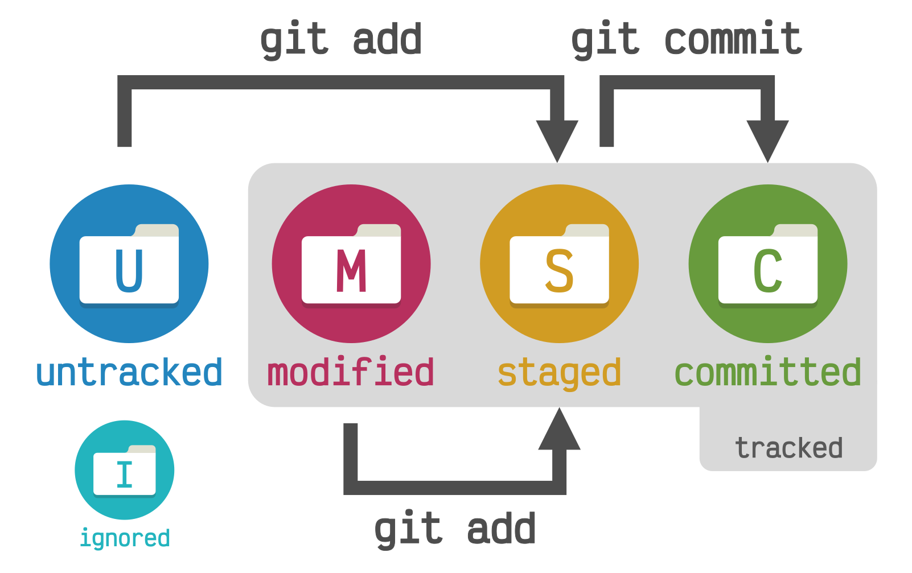

Etiquetas de los posibles estados de un archivo en `git`:

| Inglés    | Español         |
| --------- | --------------- |
| ignored   | ignorado        |
| tracked   | con seguimiento |
| untracked | sin seguimiento |
| modified  | modificado      |
| staged    | preparado       |
| committed | confirmado      |

### `git add`

Sirve para incluir los cambios y nuevos ficheros a lo que será confirmado.

Siguiendo con ejemplo que estamos viendo, supongamos que queremos incluir el nuevo fichero creado `README.md`:

```console
sdelquin@lemon:~/sandbox$ git status
En la rama main

No hay commits todavía

Archivos sin seguimiento:
  (usa "git add <archivo>..." para incluirlo a lo que se será confirmado)
	README.md

no hay nada agregado al commit pero hay archivos sin seguimiento presentes (usa "git add" para hacerles seguimiento)

sdelquin@lemon:~/sandbox$ git add README.md

sdelquin@lemon:~/sandbox$ git status
En la rama main

No hay commits todavía

Cambios a ser confirmados:
  (usa "git rm --cached <archivo>..." para sacar del área de stage)
	nuevo archivo:  README.md
```

Existe la posibilidad de **incluir todo** en un único comando:

```console
sdelquin@lemon:~/sandbox$ echo '# Unit 1' > units.md

sdelquin@lemon:~/sandbox$ git status
En la rama main

No hay commits todavía

Archivos sin seguimiento:
  (usa "git add <archivo>..." para incluirlo a lo que se será confirmado)
	README.md
	units.md

no hay nada agregado al commit pero hay archivos sin seguimiento presentes (usa "git add" para hacerles seguimiento)

sdelquin@lemon:~/sandbox$ git add .

sdelquin@lemon:~/sandbox$ git status
En la rama main

No hay commits todavía

Cambios a ser confirmados:
  (usa "git rm --cached <archivo>..." para sacar del área de stage)
	nuevo archivo:  README.md
	nuevo archivo:  units.md
```

### `git commit`

Sirve para confirmar los cambios ya incluidos.

Revisamos el estado del repositorio:

```console
sdelquin@lemon:~/sandbox$ git status
En la rama main

No hay commits todavía

Cambios a ser confirmados:
  (usa "git rm --cached <archivo>..." para sacar del área de stage)
	nuevo archivo:  README.md
```

Incluimos los cambios:

```console
sdelquin@lemon:~/sandbox$ git add README.md

sdelquin@lemon:~/sandbox$ git status
En la rama main

No hay commits todavía

Cambios a ser confirmados:
  (usa "git rm --cached <archivo>..." para sacar del área de stage)
	nuevo archivo:  README.md
```

Y ahora ya podemos confirmar los cambios incluidos:

```console
sdelquin@lemon:~/sandbox$ git commit -m "Add project heading"
[main (commit-raíz) 990ca01] Add project heading
 1 file changed, 1 insertion(+)
 create mode 100644 README.md
```

> 💡 Con la opción `-m` especificamos el mensaje de confirmación.

Podemos comprobar que el repositorio está "limpio":

```console
sdelquin@lemon:~/sandbox$ git status
En la rama main
nada para hacer commit, el árbol de trabajo está limpio
```

#### Incluyendo cambios y confirmando a la vez

En aquellos casos donde no incluimos ficheros nuevos para confirmar, sino sólo cambios en ficheros que ya están con seguimiento, podemos unir `git add` + `git commit` en un solo comando.

Supongamos que realizamos una modificación del fichero `README.md`:

```console
sdelquin@lemon:~/sandbox$ cat README.md
# sandbox

Proyecto para pruebas.
```

Miramos el estado del repositorio:

```console
sdelquin@lemon:~/sandbox$ git status
En la rama main
Cambios no rastreados para el commit:
  (usa "git add <archivo>..." para actualizar lo que será confirmado)
  (usa "git restore <archivo>..." para descartar los cambios en el directorio de trabajo)
	modificado:     README.md

sin cambios agregados al commit (usa "git add" y/o "git commit -a")
```

Ahora añadimos y confirmamos los cambios con el siguiente comando:

```console
sdelquin@lemon:~/sandbox$ git commit -am "Add brief description"
[main 8fb2b26] Add brief description
 1 file changed, 2 insertions(+)
```

Volvemos a comprobar el estado del repositorio:

```console
sdelquin@lemon:~/sandbox$ git status
En la rama main
nada para hacer commit, el árbol de trabajo está limpio
```

#### Confirmando cambios junto al último commit

Hay ocasiones en las que olvidamos "hacer algo" en el último commit y queremos incluir cambios. Eso tiene solución.

Supongamos que modificamos el fichero `README.md` con el siguiente contenido:

```markdown
# sandbox

Proyecto base para hacer pruebas.
```

Y queremos añadir estos cambios al último commit:

```console
sdelquin@lemon:~/sandbox$ git add README.md

sdelquin@lemon:~/sandbox$ git commit --amend --no-edit
[main 6477c90] Add brief description
 Date: Mon Feb 20 13:14:24 2023 +0000
 1 file changed, 2 insertions(+)

sdelquin@lemon:~/sandbox$ git status
En la rama main
nada para hacer commit, el árbol de trabajo está limpio
```

> 💡 Si quisiéramos modificar el mensaje de commit podríamos incluir la opción `-m`.

### `git restore`

Sirve para deshacer los cambios hechos desde el último commit.

Aquí podemos diferenciar dos escenarios:

1. Hemos modificado el fichero pero está aún no se ha agregado para confirmar.
2. Hemos modificado el fichero y ya está agregado para confirmar.

**Primer escenario:** Modificamos el fichero `README.md` y vemos el estado:

```console
sdelquin@lemon:~/sandbox$ git status
En la rama main
Cambios no rastreados para el commit:
  (usa "git add <archivo>..." para actualizar lo que será confirmado)
  (usa "git restore <archivo>..." para descartar los cambios en el directorio de trabajo)
	modificado:     README.md

sin cambios agregados al commit (usa "git add" y/o "git commit -a")
```

Podemos descartar los cambios de la siguiente manera:

```console
sdelquin@lemon:~/sandbox$ git restore README.md
sdelquin@lemon:~/sandbox$ git status
En la rama main
nada para hacer commit, el árbol de trabajo está limpio
```

**Segundo escenario:** Modificamos el fichero `README.md` (añadimos los cambios) y vemos el estado:

```console
sdelquin@lemon:~/sandbox$ git status
En la rama main
Cambios a ser confirmados:
  (usa "git restore --staged <archivo>..." para sacar del área de stage)
	modificado:     README.md
```

En este caso, primero tendremos que "sacar" el archivo del área de "stage":

```console
sdelquin@lemon:~/sandbox$ git restore --staged README.md
sdelquin@lemon:~/sandbox$ git status
En la rama main
Cambios no rastreados para el commit:
  (usa "git add <archivo>..." para actualizar lo que será confirmado)
  (usa "git restore <archivo>..." para descartar los cambios en el directorio de trabajo)
	modificado:     README.md

sin cambios agregados al commit (usa "git add" y/o "git commit -a")
```

Y luego, si es lo que queremos, descartar completamente los cambios:

```console
sdelquin@lemon:~/sandbox$ git restore README.md
sdelquin@lemon:~/sandbox$ git status
En la rama main
nada para hacer commit, el árbol de trabajo está limpio
```

> 💡 El comando `git restore .` sirve para descartar los cambios en **todos los ficheros**.

### `git branch`

Sirve para gestionar las ramas de un repositorio.

#### Listando las ramas

Podemos ver las **ramas locales** de nuestro repositorio:

```console
sdelquin@lemon:~/sandbox$ git branch
* main
```

Igualmente podemos ver las **ramas remotas** de nuestro repositorio. De momento no tenemos ninguna rama remota...

```console
sdelquin@lemon:~/sandbox$ git branch -r
```

Tenemos la posibilidad de listar todas las ramas:

```console
sdelquin@lemon:~/sandbox$ git branch -a
* main
```

En el caso de que queramos toda la información disponible podemos ejecutar el siguiente comando:

```console
sdelquin@lemon:~/sandbox$ git branch -avv
* main 6477c90 Add brief description
```

#### Creando y borrando ramas

Para **crear una rama** local, ejecutamos lo siguiente:

```console
sdelquin@lemon:~/sandbox$ git branch dev

sdelquin@lemon:~/sandbox$ git branch -avv
  dev  6477c90 Add brief description
* main 6477c90 Add brief description
```

Podemos **borrar una rama** utilizando el mismo comando:

```console
sdelquin@lemon:~/sandbox$ git branch -d dev
Eliminada la rama dev (era 6477c90)..

sdelquin@lemon:~/sandbox$ git branch -avv
* main 6477c90 Add brief description
```

### `git switch`

Sirve para cambiar de rama.

Veamos su funcionamiento:

```console
sdelquin@lemon:~/sandbox$ git branch
* main
sdelquin@lemon:~/sandbox$ git switch -c dev
Cambiado a nueva rama 'dev'
sdelquin@lemon:~/sandbox$ git branch
* dev
  main
sdelquin@lemon:~/sandbox$ git switch main
Cambiado a rama 'main'
sdelquin@lemon:~/sandbox$ git branch
  dev
* main
```

> 💡 El parámetro `-c` permite crear la rama y cambiar a ella.

Una forma muy sencilla de volver a la rama "anterior" es usar el modificador `-`:

```console
sdelquin@lemon:~/sandbox$ git branch
  dev
* main
sdelquin@lemon:~/sandbox$ git switch dev
Cambiado a rama 'dev'
sdelquin@lemon:~/sandbox$ git branch
* dev
  main
sdelquin@lemon:~/sandbox$ git switch -
Cambiado a rama 'main'
sdelquin@lemon:~/sandbox$ git branch
  dev
* main
sdelquin@lemon:~/sandbox$ git switch -
Cambiado a rama 'dev'
sdelquin@lemon:~/sandbox$ git branch
* dev
  main
```

### `git remote`

Sirve para gestionar las direcciones remotas.

A continuación se muestra un esquema de ramas (locales y remotas) tal y como funciona en `git`:

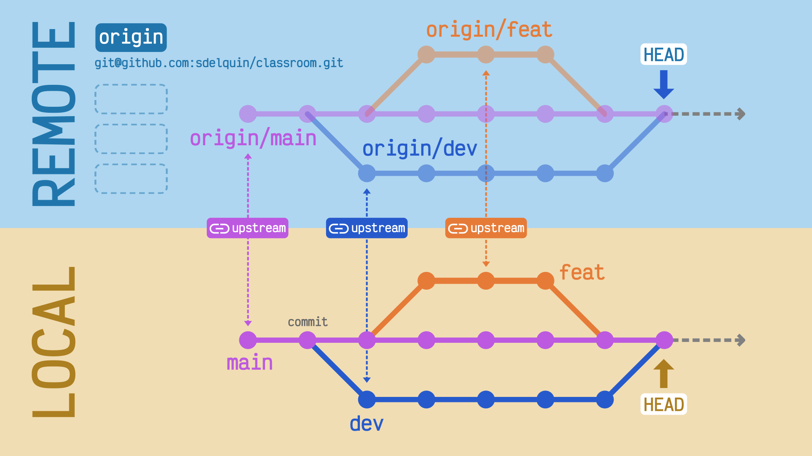

Veamos los remotos activos actualmente en nuestro repositorio:

```console
sdelquin@lemon:~/sandbox$ git remote -v
```

No hay ninguno. Eso se debe a que creamos este repositorio desde vacío y por tanto no hay ninguna vinculación con un posible servicio web.

Vamos a añadir un remoto:

```console
sdelquin@lemon:~/sandbox$ git remote add origin git@github.com:sdelquin/sandbox.git

sdelquin@lemon:~/sandbox$ git remote -v
origin	git@github.com:sdelquin/sandbox.git (fetch)
origin	git@github.com:sdelquin/sandbox.git (push)
```

> 💡 El nombre **origin** es simplemente una convención que se suele usar para indicar el remoto **original**.

Existe la posibilidad de borrar un remoto utilizando `git remote remove`.

#### `git push`

Sirve para subir los cambios a un remoto.

Veamos qué ocurre si lanzamos este comando directamente:

```console
sdelquin@lemon:~/sandbox$ git push
fatal: La rama actual main no tiene una rama upstream.
Para realizar un push de la rama actual y configurar el remoto como upstream, use

	git push --set-upstream origin main
```

Básicamente nos está diciendo que no existe "upstream", o lo que es lo mismo, no hay definido un vínculo entre la rama local y la rama remota. Para solucionarlo aplicamos el comando sugerido:

```console
sdelquin@lemon:~/sandbox$ git push -u origin main
Enumerando objetos: 6, listo.
Contando objetos: 100% (6/6), listo.
Compresión delta usando hasta 2 hilos
Comprimiendo objetos: 100% (2/2), listo.
Escribiendo objetos: 100% (6/6), 517 bytes | 517.00 KiB/s, listo.
Total 6 (delta 0), reusado 0 (delta 0), pack-reusado 0
To github.com:sdelquin/sandbox.git
 * [new branch]      main -> main
Rama 'main' configurada para hacer seguimiento a la rama remota 'main' de 'origin'.
```

> 💡 El parámetro `-u` es una abreviatura para `--set-upstream` y permite fijar el "upstream" para futuras llamadas.

Ahora podemos comprobar en GitHub que los dos commits están presentes en el historial https://github.com/sdelquin/sandbox/commits/main:

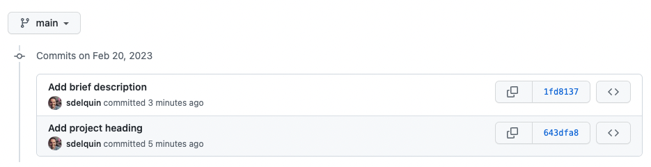

Si listamos las ramas actuales, ya podemos ver la rama remota:

```console
sdelquin@lemon:~/sandbox$ git branch -avv
* main                1fd8137 [origin/main] Add brief description
  remotes/origin/main 1fd8137 Add brief description
```

Es interesante resaltar que, cuando ya tenemos definido un "upstream" para nuestra rama de trabajo, y realizamos cualquier commit, nos va a aparecer un mensaje diciendo en qué situación se queda nuestra rama local con respecto a la rama remota:

```console
sdelquin@lemon:~/sandbox$ git status
En la rama main
Tu rama está adelantada a 'origin/main' por 1 commit.
  (usa "git push" para publicar tus commits locales)

nada para hacer commit, el árbol de trabajo está limpio
```

### `git merge`

Sirve para mezclar los cambios de una rama en otra rama.

#### Mezcla correcta

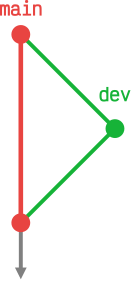

```console
sdelquin@lemon:~/sandbox$ git status
En la rama main
Tu rama está actualizada con 'origin/main'.

nada para hacer commit, el árbol de trabajo está limpio
sdelquin@lemon:~/sandbox$ git switch -c dev
Cambiado a nueva rama 'dev'
sdelquin@lemon:~/sandbox$ vi README.md
sdelquin@lemon:~/sandbox$ cat README.md
# sandbox

Proyecto base para hacer pruebas.

## Trabajando con git merge
sdelquin@lemon:~/sandbox$ git commit -am "Add new section"
[dev f2c4ec0] Add new section
 1 file changed, 2 insertions(+)
sdelquin@lemon:~/sandbox$ git switch main
Cambiado a rama 'main'
Tu rama está actualizada con 'origin/main'.
sdelquin@lemon:~/sandbox$ git merge dev --no-edit
Actualizando 1fd8137..f2c4ec0
Fast-forward
 README.md | 2 ++
 1 file changed, 2 insertions(+)
sdelquin@lemon:~/sandbox$ git status
En la rama main
Tu rama está adelantada a 'origin/main' por 1 commit.
  (usa "git push" para publicar tus commits locales)

nada para hacer commit, el árbol de trabajo está limpio
```

#### Mezcla con conflicto

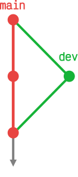

```console
sdelquin@lemon:~/sandbox$ git switch dev
Cambiado a rama 'dev'
sdelquin@lemon:~/sandbox$ vi README.md
sdelquin@lemon:~/sandbox$ cat -n README.md
     1	# sandbox
     2
     3	Proyecto base para hacer pruebas.
     4
     5	## Trabajando con git merge
     6
     7	Editar lo mismo en ramas distintas es peligroso.
sdelquin@lemon:~/sandbox$ git commit -am "Add info about merge conflicts"
[dev c010d6e] Add info about merge conflicts
 1 file changed, 2 insertions(+)
sdelquin@lemon:~/sandbox$ git switch main
Cambiado a rama 'main'
Tu rama está actualizada con 'origin/main'.
sdelquin@lemon:~/sandbox$ vi README.md
sdelquin@lemon:~/sandbox$ cat -n README.md
     1	# sandbox
     2
     3	Proyecto base para hacer pruebas.
     4
     5	## Trabajando con git merge
     6
     7	Editar lo mismo en ramas distintas es arriesgado.
sdelquin@lemon:~/sandbox$ git commit -am "Add new info about merge conflicts"
[main 6edb8ea] Add new info about merge conflicts
 1 file changed, 2 insertions(+)
sdelquin@lemon:~/sandbox$ git merge dev --no-edit
Auto-fusionando README.md
CONFLICTO (contenido): Conflicto de fusión en README.md
Fusión automática falló; arregle los conflictos y luego realice un commit con el resultado.
```

Aquí se ha generado un conflicto. Veamos el fichero `README.md`:

```
# sandbox

Proyecto base para hacer pruebas.

## Trabajando con git merge

<<<<<<< HEAD
Editar lo mismo en ramas distintas es arriesgado.
=======
Editar lo mismo en ramas distintas es peligroso.
>>>>>>> dev
```

| HEAD                             | dev                               |
| -------------------------------- | --------------------------------- |
| Cambios en la rama actual (main) | Cambios en la rama entrante (dev) |

Lo que debemos hacer es "arreglar" el conflicto directamente en el fichero `README.md` dejando el cambio que nos interese. Supongamos que queremos dejar el mensaje de la rama entrante `dev`:

```markdown
# sandbox

Proyecto base para hacer pruebas.

## Trabajando con git merge

Editar lo mismo en ramas distintas es peligroso.
```

Ahora incluimos estos cambios y los confirmamos:

```console
sdelquin@lemon:~/sandbox$ git status
En la rama main
Tu rama está adelantada a 'origin/main' por 1 commit.
  (usa "git push" para publicar tus commits locales)

Tienes rutas no fusionadas.
  (arregla los conflictos y corre "git commit"
  (usa "git merge --abort" para abortar la fusion)

Rutas no fusionadas:
  (usa "git add <archivo>..." para marcar una resolución)
	ambos modificados:     README.md

sin cambios agregados al commit (usa "git add" y/o "git commit -a")
sdelquin@lemon:~/sandbox$ git add README.md
sdelquin@lemon:~/sandbox$ git commit -m "Fix conflict"
[main bc5156e] Fix conflict
sdelquin@lemon:~/sandbox$ git status
En la rama main
Tu rama está adelantada a 'origin/main' por 3 commits.
  (usa "git push" para publicar tus commits locales)

nada para hacer commit, el árbol de trabajo está limpio
sdelquin@lemon:~/sandbox$ git push
Enumerando objetos: 9, listo.
Contando objetos: 100% (9/9), listo.
Compresión delta usando hasta 2 hilos
Comprimiendo objetos: 100% (5/5), listo.
Escribiendo objetos: 100% (7/7), 747 bytes | 747.00 KiB/s, listo.
Total 7 (delta 2), reusado 0 (delta 0), pack-reusado 0
remote: Resolving deltas: 100% (2/2), done.
To github.com:sdelquin/sandbox.git
   f2c4ec0..bc5156e  main -> main
```

### `git pull`

Sirve para actualizar ("traer") los cambios de la rama remota y mezclarlas en la rama local.

Vamos a plantear el siguiente escenario:

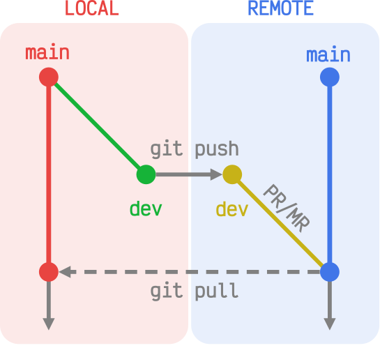

```console
sdelquin@lemon:~/sandbox$ git status
En la rama main
Tu rama está actualizada con 'origin/main'.

nada para hacer commit, el árbol de trabajo está limpio
sdelquin@lemon:~/sandbox$ git switch dev
Cambiado a rama 'dev'
sdelquin@lemon:~/sandbox$ vi README.md
sdelquin@lemon:~/sandbox$ cat -n README.md
     1	# sandbox
     2
     3	Proyecto base para hacer pruebas.
     4
     5	## Trabajando con git merge
     6
     7	Editar lo mismo en ramas distintas es peligroso.
     8
     9	## Usando git pull
sdelquin@lemon:~/sandbox$ git commit -am "Add new section for git pull"
[dev 2491a6d] Add new section for git pull
 1 file changed, 2 insertions(+)
sdelquin@lemon:~/sandbox$ git push -u origin dev
Enumerando objetos: 5, listo.
Contando objetos: 100% (5/5), listo.
Compresión delta usando hasta 2 hilos
Comprimiendo objetos: 100% (2/2), listo.
Escribiendo objetos: 100% (3/3), 314 bytes | 314.00 KiB/s, listo.
Total 3 (delta 1), reusado 0 (delta 0), pack-reusado 0
remote: Resolving deltas: 100% (1/1), completed with 1 local object.
remote:
remote: Create a pull request for 'dev' on GitHub by visiting:
remote:      https://github.com/sdelquin/sandbox/pull/new/dev
remote:
To github.com:sdelquin/sandbox.git
 * [new branch]      dev -> dev
Rama 'dev' configurada para hacer seguimiento a la rama remota 'dev' de 'origin'.
```

Al hacer `git push` ya nos está indicando que podemos hacer un **Pull Request** visitando https://github.com/sdelquin/sandbox/pull/new/dev. Vamos a ello:

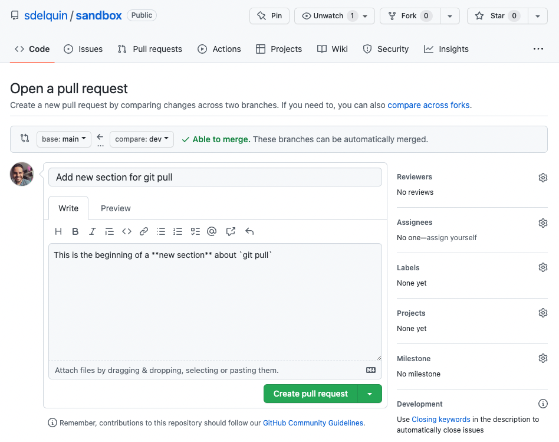

Aquí ya podemos pulsar en "Create pull request":

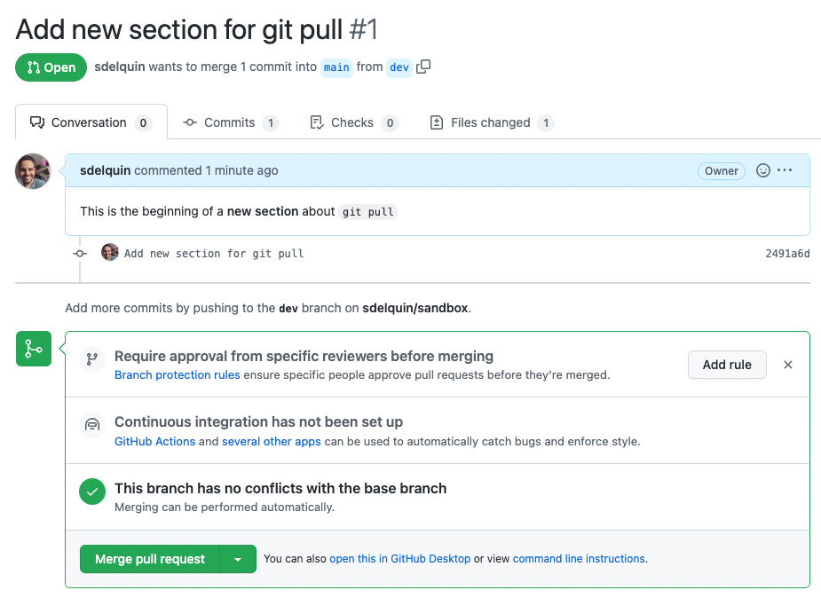

Y por último pulsamos en "Merge pull request" para mezclar los cambios de la rama `dev` en la rama `main`:

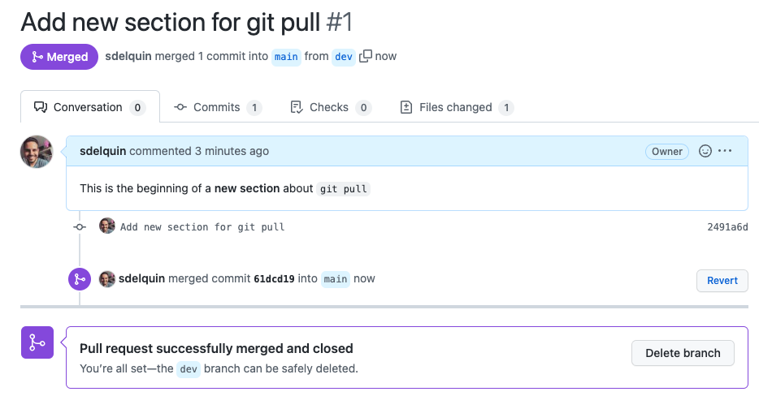

Lo que nos queda por hacer es traer los cambios del remoto a nuestra máquina local:

```console
sdelquin@lemon:~/sandbox$ git switch main
Cambiado a rama 'main'
Tu rama está actualizada con 'origin/main'.
sdelquin@lemon:~/sandbox$ git status
En la rama main
Tu rama está actualizada con 'origin/main'.

nada para hacer commit, el árbol de trabajo está limpio
sdelquin@lemon:~/sandbox$ git pull
remote: Enumerating objects: 1, done.
remote: Counting objects: 100% (1/1), done.
remote: Total 1 (delta 0), reused 0 (delta 0), pack-reused 0
Desempaquetando objetos: 100% (1/1), 631 bytes | 631.00 KiB/s, listo.
Desde github.com:sdelquin/sandbox
   bc5156e..61dcd19  main       -> origin/main
Actualizando bc5156e..61dcd19
Fast-forward
 README.md | 2 ++
 1 file changed, 2 insertions(+)
sdelquin@lemon:~/sandbox$ cat -n README.md
     1	# sandbox
     2
     3	Proyecto base para hacer pruebas.
     4
     5	## Trabajando con git merge
     6
     7	Editar lo mismo en ramas distintas es peligroso.
     8
     9	## Usando git pull
```

> 💡 Cuando tenemos un **equipo de trabajo** donde todos sus miembros tienen permisos de escritura sobre un determinado repositorio, también se puede seguir este esquema de aportaciones a base de ramas y "pull requests".

### Colaborando "open-source"

Vamos a plantear un escenario en el que otra persona `sdelquin-bis` quiere colaborar con nuestro proyecto `sandbox` siguiendo un modelo muy habitual en el mundo "open-source".

#### Bifurcar el proyecto

Dado que `sdelquin-bin` no tiene permisos de escritura sobre el proyecto `sandbox`, lo más habitual es empezar por bifurcar ("fork") el proyecto en su propio GitHub https://github.com/sdelquin/sandbox/fork:


Pulsamos el botón "Fork" para crear una bifurcación:

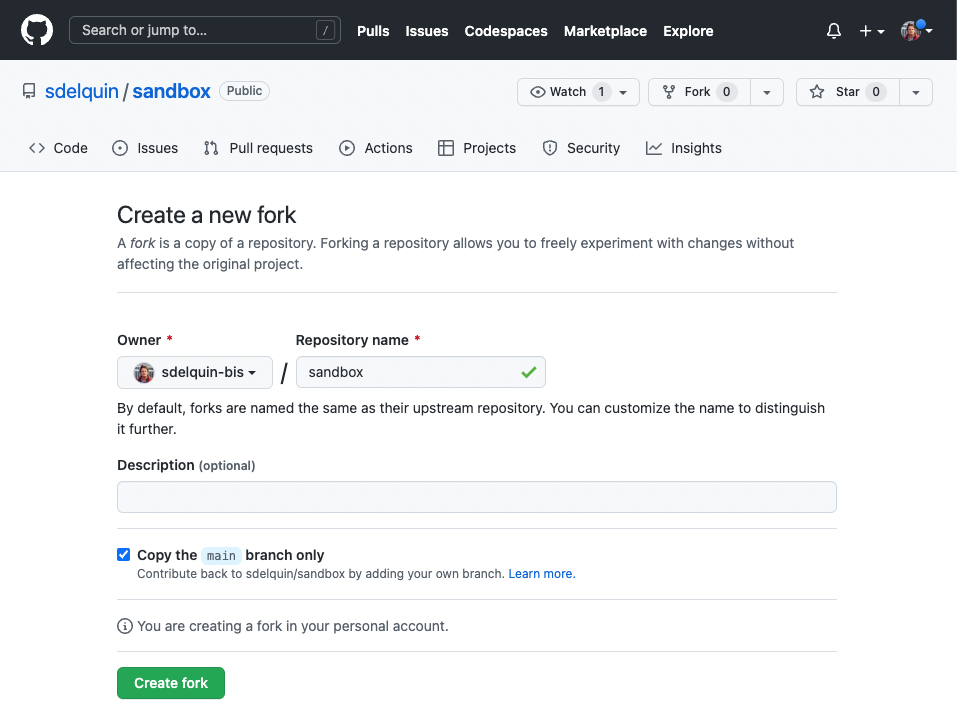

Podemos comprobar que se ha creado esta bifurcación a partir del proyecto original:

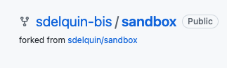

#### Clonar la bifurcación

Lo primero que debe hacer `sdelquin-bis` es clonar su propio repositorio:

```console
sdelquin-bis@orange:~$ git clone git@github.com:sdelquin-bis/sandbox.git
Clonando en 'sandbox'...
remote: Enumerating objects: 20, done.
remote: Counting objects: 100% (20/20), done.
remote: Compressing objects: 100% (9/9), done.
remote: Total 20 (delta 5), reused 17 (delta 3), pack-reused 0
Recibiendo objetos: 100% (20/20), listo.
Resolviendo deltas: 100% (5/5), listo.
```

A la hora de colaborar es razonable crear una rama de trabajo:

```console
sdelquin-bis@orange:~$ cd sandbox/
sdelquin-bis@orange:~/sandbox$ git switch -c colab
Cambiado a nueva rama 'colab'
sdelquin-bis@orange:~/sandbox$ vi README.md
sdelquin-bis@orange:~/sandbox$ cat -n README.md
     1	# sandbox
     2
     3	Proyecto base para hacer pruebas.
     4
     5	## Trabajando con git merge
     6
     7	Editar lo mismo en ramas distintas es peligroso.
     8
     9	## Usando git pull
    10
    11	Colaborando en modo "open-source"
sdelquin-bis@orange:~/sandbox$ git commit -am "Add brief notes about colab"
[colab 2ca00f8] Add brief notes about colab
 1 file changed, 2 insertions(+)
```

#### Preparando un "pull request"

Ahora vamos a hacer un `git push` para subir los cambios al repositorio de `sdelquin-bis`:

```console
sdelquin-bis@orange:~/sandbox$ git push origin colab
Enumerando objetos: 5, listo.
Contando objetos: 100% (5/5), listo.
Compresión delta usando hasta 2 hilos
Comprimiendo objetos: 100% (2/2), listo.
Escribiendo objetos: 100% (3/3), 321 bytes | 321.00 KiB/s, listo.
Total 3 (delta 1), reusado 0 (delta 0), pack-reusado 0
remote: Resolving deltas: 100% (1/1), completed with 1 local object.
remote:
remote: Create a pull request for 'colab' on GitHub by visiting:
remote:      https://github.com/sdelquin-bis/sandbox/pull/new/colab
remote:
To github.com:sdelquin-bis/sandbox.git
 * [new branch]      colab -> colab
```

Nos indica la posibilidad de crear un "pull request" en la url https://github.com/sdelquin-bis/sandbox/pull/new/colab. Veamos cómo funciona:

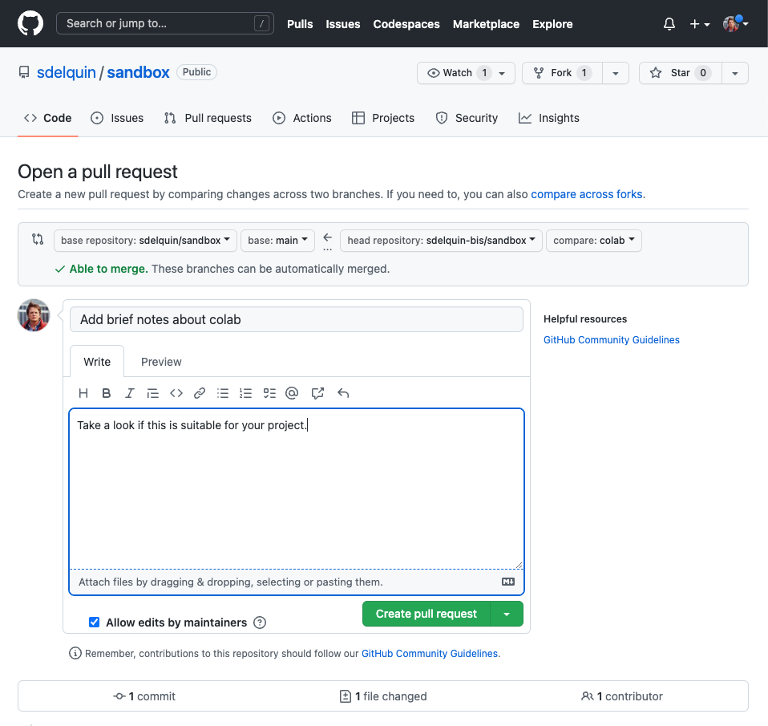

Ahora pulsamos en "Create pull request":

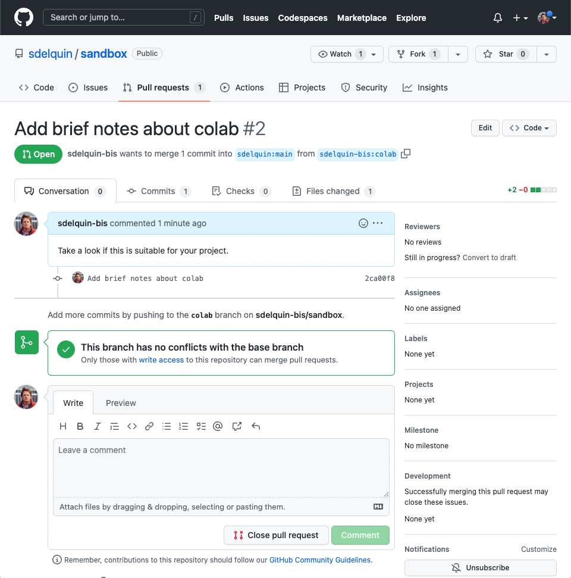

En este momento, habrá llegado una notificación a `sdelquin` informándole de que existe un "pull request" para `sandbox` pendiente de revisión.

#### Revisión del "pull request"

Ahora ya desde la cuenta de `sdelquin` vemos la situación del repositorio:

```console
sdelquin@lemon:~$ cd sandbox/
sdelquin@lemon:~/sandbox$ git status
En la rama main
Tu rama está actualizada con 'origin/main'.

nada para hacer commit, el árbol de trabajo está limpio
sdelquin@lemon:~/sandbox$ git branch -avv
  dev                 2491a6d [origin/dev] Add new section for git pull
* main                61dcd19 [origin/main] Merge pull request #1 from sdelquin/dev
  remotes/origin/dev  2491a6d Add new section for git pull
  remotes/origin/main 61dcd19 Merge pull request #1 from sdelquin/dev
sdelquin@lemon:~/sandbox$ git remote -v
origin	git@github.com:sdelquin/sandbox.git (fetch)
origin	git@github.com:sdelquin/sandbox.git (push)
```

Lo primero será añadir un nuevo remoto apuntando a `sdelquin-bis`. Para ello:

```console
sdelquin@lemon:~/sandbox$ git remote add sdelquin-bis https://github.com/sdelquin-bis/sandbox.git
sdelquin@lemon:~/sandbox$ git remote -v
origin	git@github.com:sdelquin/sandbox.git (fetch)
origin	git@github.com:sdelquin/sandbox.git (push)
sdelquin-bis	https://github.com/sdelquin-bis/sandbox.git (fetch)
sdelquin-bis	https://github.com/sdelquin-bis/sandbox.git (push)
```

Ahora utilizaremos `git fetch` para "traernos" la rama de trabajo `colab` desde `sdelquin-bis`:

```console
sdelquin@lemon:~/sandbox$ git fetch sdelquin-bis colab
remote: Enumerating objects: 5, done.
remote: Counting objects: 100% (5/5), done.
remote: Compressing objects: 100% (1/1), done.
remote: Total 3 (delta 1), reused 3 (delta 1), pack-reused 0
Desempaquetando objetos: 100% (3/3), 301 bytes | 100.00 KiB/s, listo.
Desde https://github.com/sdelquin-bis/sandbox
 * branch            colab      -> FETCH_HEAD
 * [nueva rama]      colab      -> sdelquin-bis/colab
```

> 💡 `git pull = git fetch + git merge`

Podemos comprobar que tenemos una nueva rama remota:

```console
sdelquin@lemon:~/sandbox$ git branch -avv
  dev                        2491a6d [origin/dev] Add new section for git pull
* main                       61dcd19 [origin/main] Merge pull request #1 from sdelquin/dev
  remotes/origin/dev         2491a6d Add new section for git pull
  remotes/origin/main        61dcd19 Merge pull request #1 from sdelquin/dev
  remotes/sdelquin-bis/colab 2ca00f8 Add brief notes about colab
```

Ahora cambiamos a la nueva rama de trabajo `colab`:

```console
sdelquin@lemon:~/sandbox$ git switch colab
Rama 'colab' configurada para hacer seguimiento a la rama remota 'colab' de 'sdelquin-bis'.
Cambiado a nueva rama 'colab'
sdelquin@lemon:~/sandbox$ git branch -avv
* colab                      2ca00f8 [sdelquin-bis/colab] Add brief notes about colab
  dev                        2491a6d [origin/dev] Add new section for git pull
  main                       61dcd19 [origin/main] Merge pull request #1 from sdelquin/dev
  remotes/origin/dev         2491a6d Add new section for git pull
  remotes/origin/main        61dcd19 Merge pull request #1 from sdelquin/dev
  remotes/sdelquin-bis/colab 2ca00f8 Add brief notes about colab
```

Podemos comprobar que el fichero `README.md` contiene la nueva línea aportada (L11) por `sdelquin-bis` en su PR (Pull Request) desde su "fork" del proyecto:

```console
sdelquin@lemon:~/sandbox$ cat -n README.md
     1	# sandbox
     2
     3	Proyecto base para hacer pruebas.
     4
     5	## Trabajando con git merge
     6
     7	Editar lo mismo en ramas distintas es peligroso.
     8
     9	## Usando git pull
    10
    11	Colaborando en modo "open-source"
```

Supongamos que queremos modificar algo de la propuesta, y cambiamos una parte de esa última línea:

```console
sdelquin@lemon:~/sandbox$ vi README.md
sdelquin@lemon:~/sandbox$ cat -n README.md
     1	# sandbox
     2
     3	Proyecto base para hacer pruebas.
     4
     5	## Trabajando con git merge
     6
     7	Editar lo mismo en ramas distintas es peligroso.
     8
     9	## Usando git pull
    10
    11	Colaborando en modo código abierto.
```

Ahora ya podemos confirmar los cambios y subirlos, siempre y cuando `sdelquin-bis` [lo haya permitido](https://docs.github.com/en/pull-requests/collaborating-with-pull-requests/working-with-forks/allowing-changes-to-a-pull-request-branch-created-from-a-fork), ya que se trata de una rama de su repositorio:

```console
sdelquin@lemon:~/sandbox$ git status
En la rama colab
Tu rama está actualizada con 'sdelquin-bis/colab'.

Cambios no rastreados para el commit:
  (usa "git add <archivo>..." para actualizar lo que será confirmado)
  (usa "git restore <archivo>..." para descartar los cambios en el directorio de trabajo)
	modificado:     README.md

sin cambios agregados al commit (usa "git add" y/o "git commit -a")
sdelquin@lemon:~/sandbox$ git commit -am "Add minor fixes"
[colab e45229a] Add minor fixes
 1 file changed, 1 insertion(+), 1 deletion(-)
sdelquin@lemon:~/sandbox$ git push sdelquin-bis colab
Username for 'https://github.com': sdelquin
Password for 'https://sdelquin@github.com':
Enumerando objetos: 5, listo.
Contando objetos: 100% (5/5), listo.
Compresión delta usando hasta 2 hilos
Comprimiendo objetos: 100% (2/2), listo.
Escribiendo objetos: 100% (3/3), 305 bytes | 305.00 KiB/s, listo.
Total 3 (delta 1), reusado 0 (delta 0), pack-reusado 0
remote: Resolving deltas: 100% (1/1), completed with 1 local object.
To https://github.com/sdelquin-bis/sandbox.git
   2ca00f8..e45229a  colab -> colab
```

> 💡 Dado que el remoto `sdelquin-bis` está configurado usando protocolo `https` debemos tener a mano el token de acceso personal o bien haber configurado la herramienta `gh auth login` para ello.

Podemos comprobar que el nuevo "commit" se ha incluido en el historial del "pull request":

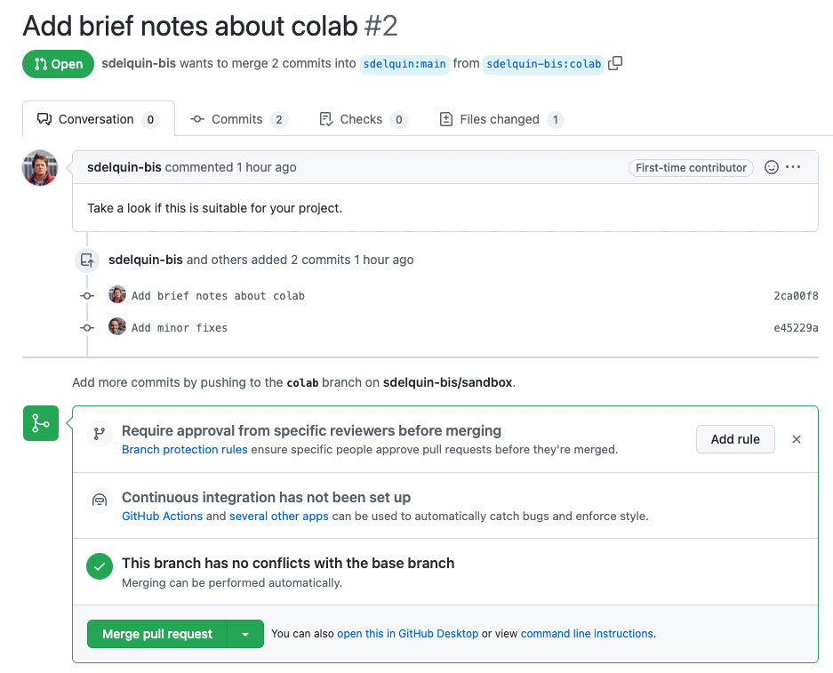

Esta página admite una cierta "conversación" hasta que el objetivo buscado se cumple y ambas partes están de acuerdo en lo que se ha hecho.

Finalmente ya estamos en disposición de mezclar los cambios pulsando el botón de "Merge pull request":

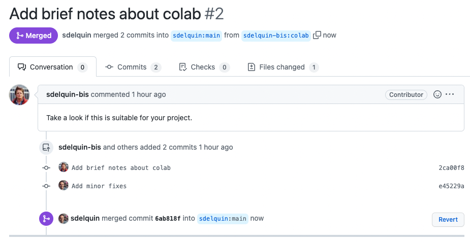

#### Actualizando los cambios

Ambos colaboradores tienen que incorporar los cambios a sus ramas locales:

Para el caso de `sdelquin`:

```console
sdelquin@lemon:~/sandbox$ git status
En la rama colab
Tu rama está actualizada con 'sdelquin-bis/colab'.

nada para hacer commit, el árbol de trabajo está limpio
sdelquin@lemon:~/sandbox$ git switch main
Cambiado a rama 'main'
Tu rama está actualizada con 'origin/main'.
sdelquin@lemon:~/sandbox$ git pull
remote: Enumerating objects: 1, done.
remote: Counting objects: 100% (1/1), done.
remote: Total 1 (delta 0), reused 0 (delta 0), pack-reused 0
Desempaquetando objetos: 100% (1/1), 635 bytes | 635.00 KiB/s, listo.
Desde github.com:sdelquin/sandbox
   61dcd19..6ab818f  main       -> origin/main
Actualizando 61dcd19..6ab818f
Fast-forward
 README.md | 2 ++
 1 file changed, 2 insertions(+)
```

Para el caso de `sdelquin-bis`:

```console
sdelquin-bis@orange:~/sandbox$ git status
En la rama colab
nada para hacer commit, el árbol de trabajo está limpio
sdelquin-bis@orange:~/sandbox$ git switch main
Cambiado a rama 'main'
Tu rama está actualizada con 'origin/main'.
sdelquin-bis@orange:~/sandbox$ git remote add upstream https://github.com/sdelquin/sandbox.git
sdelquin-bis@orange:~/sandbox$ git remote -v
origin	git@github.com:sdelquin-bis/sandbox.git (fetch)
origin	git@github.com:sdelquin-bis/sandbox.git (push)
upstream	https://github.com/sdelquin/sandbox.git (fetch)
upstream	https://github.com/sdelquin/sandbox.git (push)
sdelquin-bis@orange:~/sandbox$ git pull upstream main
remote: Enumerating objects: 1, done.
remote: Counting objects: 100% (1/1), done.
remote: Total 1 (delta 0), reused 0 (delta 0), pack-reused 0
Desempaquetando objetos: 100% (1/1), 635 bytes | 635.00 KiB/s, listo.
Desde https://github.com/sdelquin/sandbox
 * branch            main       -> FETCH_HEAD
 * [nueva rama]      main       -> upstream/main
Actualizando 61dcd19..6ab818f
Fast-forward
 README.md | 2 ++
 1 file changed, 2 insertions(+)
sdelquin-bis@orange:~/sandbox$ git branch -avv
  colab                 2ca00f8 Add brief notes about colab
* main                  6ab818f [origin/main: adelante 3] Merge pull request #2 from sdelquin-bis/colab
  remotes/origin/HEAD   -> origin/main
  remotes/origin/colab  e45229a Add minor fixes
  remotes/origin/main   61dcd19 Merge pull request #1 from sdelquin/dev
  remotes/upstream/main 6ab818f Merge pull request #2 from sdelquin-bis/colab
sdelquin-bis@orange:~/sandbox$ git push origin main
Total 0 (delta 0), reusado 0 (delta 0), pack-reusado 0
To github.com:sdelquin-bis/sandbox.git
   61dcd19..6ab818f  main -> main
sdelquin-bis@orange:~/sandbox$ git branch -avv
  colab                 2ca00f8 Add brief notes about colab
* main                  6ab818f [origin/main] Merge pull request #2 from sdelquin-bis/colab
  remotes/origin/HEAD   -> origin/main
  remotes/origin/colab  e45229a Add minor fixes
  remotes/origin/main   6ab818f Merge pull request #2 from sdelquin-bis/colab
  remotes/upstream/main 6ab818f Merge pull request #2 from sdelquin-bis/colab
```

Podemos comprobar que el fichero `README.md` tiene los cambios propuestos y confirmados en el "pull request":

```console
sdelquin-bis@orange:~/sandbox$ cat -n README.md
     1	# sandbox
     2
     3	Proyecto base para hacer pruebas.
     4
     5	## Trabajando con git merge
     6
     7	Editar lo mismo en ramas distintas es peligroso.
     8
     9	## Usando git pull
    10
    11	Colaborando en modo código abierto.
```

### `git stash`

Sirve para almacenar temporalmente los cambios que hemos hecho.

Veamos su funcionamiento:

```console
sdelquin@lemon:~/sandbox$ git status
En la rama main
Tu rama está actualizada con 'origin/main'.

nada para hacer commit, el árbol de trabajo está limpio
sdelquin@lemon:~/sandbox$ vi README.md
sdelquin@lemon:~/sandbox$ vi stash.md
sdelquin@lemon:~/sandbox$ git status
En la rama main
Tu rama está actualizada con 'origin/main'.

Cambios no rastreados para el commit:
  (usa "git add <archivo>..." para actualizar lo que será confirmado)
  (usa "git restore <archivo>..." para descartar los cambios en el directorio de trabajo)
	modificado:     README.md

Archivos sin seguimiento:
  (usa "git add <archivo>..." para incluirlo a lo que se será confirmado)
	stash.md

sin cambios agregados al commit (usa "git add" y/o "git commit -a")
sdelquin@lemon:~/sandbox$ git stash -u
Directorio de trabajo guardado y estado de índice WIP on main: 6ab818f Merge pull request #2 from sdelquin-bis/colab
sdelquin@lemon:~/sandbox$ git status
En la rama main
Tu rama está actualizada con 'origin/main'.

nada para hacer commit, el árbol de trabajo está limpio
```

> 💡 El parámetro `-u` incluye aquellos archivos sin seguimiento.

Ahora mismo tenemos almacenados los cambios en una "pila". Podemos almacenar tantos cambios como queramos, incluso dándoles un nombre.

A continuación vamos a aplicar los cambios en otra rama:

```console
sdelquin@lemon:~/sandbox$ git switch dev
Cambiado a rama 'dev'
Tu rama está adelantada a 'origin/dev' por 1 commit.
  (usa "git push" para publicar tus commits locales)
sdelquin@lemon:~/sandbox$ git stash pop
En la rama dev
Tu rama está adelantada a 'origin/dev' por 1 commit.
  (usa "git push" para publicar tus commits locales)

Cambios no rastreados para el commit:
  (usa "git add <archivo>..." para actualizar lo que será confirmado)
  (usa "git restore <archivo>..." para descartar los cambios en el directorio de trabajo)
	modificado:     README.md

Archivos sin seguimiento:
  (usa "git add <archivo>..." para incluirlo a lo que se será confirmado)
	stash.md

sin cambios agregados al commit (usa "git add" y/o "git commit -a")
Botado refs/stash@{0} (8aa5e7512edb24a5bd2f47d2784c7e3fe842a1f0)
```

### `git log`

Sirve para visualizar el historial de modificaciones que hemos realizado en nuestro repositorio.

Veamos algunos ejemplos.

#### Log estándar

```console
sdelquin@lemon:~/sandbox$ git log
commit c873d309e43e5293daaf0d9acfc00011532934da (HEAD -> main, origin/main, origin/dev, dev)
Author: Sergio Delgado Quintero <sdelquin@gmail.com>
Date:   Tue Feb 21 13:52:23 2023 +0000

    Remove stuff

commit 42ff3a22f77694bbee236ea891796f755e3f9472
Author: Sergio Delgado Quintero <sdelquin@gmail.com>
Date:   Tue Feb 21 13:50:19 2023 +0000

    Fix conflict

commit 1e28a766350068436874a8908b5d0ac447fe050c
Merge: 64e6e35 6ab818f
Author: Sergio Delgado Quintero <sdelquin@gmail.com>
Date:   Tue Feb 21 13:47:53 2023 +0000

    Fix conflict

commit 64e6e354fec799ab497e29279d777dc7a5ecd913
Author: Sergio Delgado Quintero <sdelquin@gmail.com>
Date:   Tue Feb 21 13:45:23 2023 +0000

    Fix conflict

commit 6ab818f8a353b861e53605382758ab513fba4c28
Merge: 61dcd19 e45229a
Author: Sergio Delgado Quintero <sdelquin@gmail.com>
Date:   Tue Feb 21 12:38:27 2023 +0000

    Merge pull request #2 from sdelquin-bis/colab

    Add brief notes about colab

commit e45229a27f34d430901dbf249a72082eae10f816 (sdelquin-bis/colab, colab)
Author: Sergio Delgado Quintero <sdelquin@gmail.com>
Date:   Tue Feb 21 11:37:52 2023 +0000

    Add minor fixes
```

#### Log en una línea

```console
sdelquin@lemon:~/sandbox$ git log --oneline
c873d30 (HEAD -> main, origin/main, origin/dev, dev) Remove stuff
42ff3a2 Fix conflict
1e28a76 Fix conflict
64e6e35 Fix conflict
6ab818f Merge pull request #2 from sdelquin-bis/colab
e45229a (sdelquin-bis/colab, colab) Add minor fixes
2ca00f8 Add brief notes about colab
61dcd19 Merge pull request #1 from sdelquin/dev
2491a6d Add new section for git pull
bc5156e Fix conflict
6edb8ea Add new info about merge conflicts
c010d6e Add info about merge conflicts
f2c4ec0 Add new section
1fd8137 Add brief description
643dfa8 Add project heading
```

#### Log acortado

```console
sdelquin@lemon:~/sandbox$ git shortlog
SDQ (1):
      Add brief notes about colab

Sergio Delgado Quintero (14):
      Add project heading
      Add brief description
      Add new section
      Add info about merge conflicts
      Add new info about merge conflicts
      Fix conflict
      Add new section for git pull
      Merge pull request #1 from sdelquin/dev
      Add minor fixes
      Merge pull request #2 from sdelquin-bis/colab
      Fix conflict
      Fix conflict
      Fix conflict
      Remove stuff
```

### `git diff`

Sirve para encontrar diferencias entre archivos del espacio de trabajo.

Supongamos que modificamos el archivo `README.md`:

Fichero original:

```
     1	# sandbox
     2
     3	Proyecto base para hacer pruebas.
     4
     5	## Trabajando con git merge
     6
     7	Editar lo mismo en ramas distintas es peligroso.
     8
     9	## Usando git pull
    10
    11	Colaborando en modo código abierto.
    12
    13	## Revisando git stash
    14
    15	Permite almacenar temporalmente los cambios.
```

Fichero modificado:

```
     1	# sandbox
     2
     3	Proyecto base para hacer pruebas.
     4
     5	## Trabajando con git merge
     6
     7	Editar lo mismo en ramas diferentes es peligroso.
     8
     9	## Usando git pull
    10
    11	Colaborando en modo código abierto.
    12
    13	## Revisando git stash
    14
    15	Permite almacenar temporalmente los cambios.
```

Sólo hemos modificado una palabra en la línea 7. Veamos qué nos indica `git diff`:

```console
diff --git a/README.md b/README.md
index 71a64bf..9500501 100644
--- a/README.md
+++ b/README.md
@@ -4,7 +4,7 @@ Proyecto base para hacer pruebas.

 ## Trabajando con git merge

-Editar lo mismo en ramas distintas es peligroso.
+Editar lo mismo en ramas diferentes es peligroso.

 ## Usando git pull

```

- [Cómo leer la salida de git diff](https://levelup.gitconnected.com/what-is-git-diff-and-how-do-we-read-the-output-69f5b2036186).
- [Explicación de los permisos 100644](https://unix.stackexchange.com/a/450488).

También es posible encontrar diferencias entre versiones de un mismo fichero:

```console
sdelquin@lemon:~/sandbox$ git log --oneline
c873d30 (HEAD -> main, origin/main, origin/dev, dev) Remove stuff
42ff3a2 Fix conflict
1e28a76 Fix conflict
64e6e35 Fix conflict
6ab818f Merge pull request #2 from sdelquin-bis/colab
e45229a (sdelquin-bis/colab, colab) Add minor fixes
2ca00f8 Add brief notes about colab
61dcd19 Merge pull request #1 from sdelquin/dev
2491a6d Add new section for git pull
bc5156e Fix conflict
6edb8ea Add new info about merge conflicts
c010d6e Add info about merge conflicts
f2c4ec0 Add new section
1fd8137 Add brief description
643dfa8 Add project heading

sdelquin@lemon:~/sandbox$ git diff f2c4ec0 2ca00f8
diff --git a/README.md b/README.md
index 377ad5f..8c4a28a 100644
--- a/README.md
+++ b/README.md
@@ -3,3 +3,9 @@
 Proyecto base para hacer pruebas.

 ## Trabajando con git merge
+
+Editar lo mismo en ramas distintas es peligroso.
+
+## Usando git pull
+
+Colaborando en modo "open-source"

```

### `git checkout`

Sirve para recuperar determinadas versiones anteriores de los ficheros del repositorio.

Supongamos el siguiente historial, basado en los ejemplos que hemos estado haciendo:

```console
sdelquin@lemon:~/sandbox$ git log --oneline | tail -3
f2c4ec0 Add new section
1fd8137 Add brief description
643dfa8 Add project heading
```

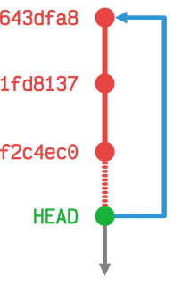

Si queremos ir a la primera versión `643dfa8` ejecutamos lo siguiente:

```console
sdelquin@lemon:~/sandbox$ git checkout 643dfa8
Nota: cambiando a '643dfa8'.

Te encuentras en estado 'detached HEAD'. Puedes revisar por aquí, hacer
cambios experimentales y hacer commits, y puedes descartar cualquier
commit que hayas hecho en este estado sin impactar a tu rama realizando
otro checkout.

Si quieres crear una nueva rama para mantener los commits que has creado,
puedes hacerlo (ahora o después) usando -c con el comando checkout. Ejemplo:

  git switch -c <nombre-de-nueva-rama>

O deshacer la operación con:

  git switch -

Desactiva este aviso poniendo la variable de config advice.detachedHead en false

HEAD está ahora en 643dfa8 Add project heading
```

Comprobamos el contenido del fichero `README.md` y vemos que sólo tiene la cabecera inicial:

```console
sdelquin@lemon:~/sandbox$ cat README.md
# sandbox
```

Asimismo podemos volver al estado actual ejecutando lo siguiente:

```console
sdelquin@lemon:~/sandbox$ git checkout -
La posición previa de HEAD era 643dfa8 Add project heading
Cambiado a rama 'main'
Tu rama está actualizada con 'origin/main'.
sdelquin@lemon:~/sandbox$ git status
En la rama main
Tu rama está actualizada con 'origin/main'.

nada para hacer commit, el árbol de trabajo está limpio
sdelquin@lemon:~/sandbox$ cat README.md
# sandbox

Proyecto base para hacer pruebas.

## Trabajando con git merge

Editar lo mismo en ramas distintas es peligroso.

## Usando git pull

Colaborando en modo código abierto.

## Revisando git stash

Permite almacenar temporalmente los cambios.
```

> 💡 Cuidado con reescribir la historia, puede llevar a resultados colaterales indeseados.

### `git tag`

Sirve para etiquetar versiones.

Supongamos que el punto actual de nuestro desarrollo queremos añadir una etiqueta con la versión `0.0.1` de nuestro proyecto. Para ello haremos lo siguiente:

```console
sdelquin@lemon:~/sandbox$ git status
En la rama main
Tu rama está actualizada con 'origin/main'.

nada para hacer commit, el árbol de trabajo está limpio
sdelquin@lemon:~/sandbox$ git tag
sdelquin@lemon:~/sandbox$ git tag -a 0.0.1 -m "Release version 0.0.1"
sdelquin@lemon:~/sandbox$ git tag
0.0.1
```

Existe un estándar en el etiquetado del software denominado [versionado semántico](https://semver.org/lang/es/).

Hay que tener en cuenta que **para consolidar las etiquetas en la rama remota**, debemos usar el parámetro `--follow-tags` de la siguiente manera:

```console
sdelquin@lemon:~/sandbox$ git push --follow-tags
Enumerando objetos: 1, listo.
Contando objetos: 100% (1/1), listo.
Escribiendo objetos: 100% (1/1), 179 bytes | 179.00 KiB/s, listo.
Total 1 (delta 0), reusado 0 (delta 0), pack-reusado 0
To github.com:sdelquin/sandbox.git
 * [new tag]         0.0.1 -> 0.0.1
```

De hecho podemos comprobar en https://github.com/sdelquin/sandbox/tags que la etiqueta se ha subido correctamente:

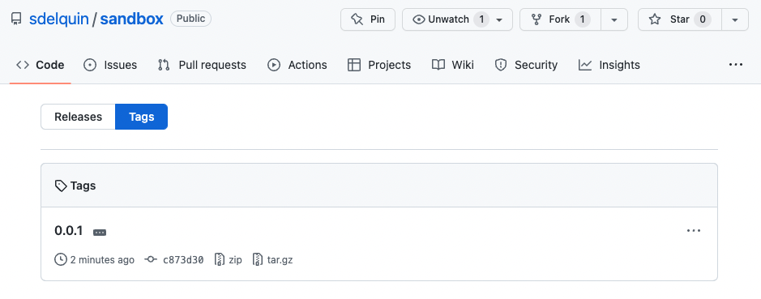

Si queremos generar un lanzamiento ("release") en GitHub disponemos de [una guía dedicada a la administración](https://docs.github.com/es/repositories/releasing-projects-on-github/managing-releases-in-a-repository).

### Otros comandos de interés

| Comando         | Descripción                                                       |
| --------------- | ----------------------------------------------------------------- |
| git blame       | Permite buscar responsables de cada cambio                        |
| git cherry-pick | Permite aplicar un commit específico                              |
| git clean       | Permite borrar archivos sin seguimiento                           |
| git gc          | Permite optimizar el espacio del repositorio local                |
| git reset       | Permite deshacer commits anteriores (reescribiendo el historial)  |
| git revert      | Permite deshacer commits anteriores (sin reescribir el historial) |

Y una lista [enorme](https://git-scm.com/docs/git#_git_commands) de comandos...

### Buenas prácticas

#### Estructura mínima de un repo

Los ficheros que deberían componer la estructura mínima de un repositorio son:

- `README.md` → [Buenas prácticas](https://github.com/jehna/readme-best-practices)
- `LICENSE` → [Choose a license](https://choosealicense.com)
- `.gitignore` → [Tutorial de gitignore](https://www.atlassian.com/es/git/tutorials/saving-changes/gitignore)

Recomendable tener un fichero `CHANGELOG` con formato:

```markdown
# Changelog

All notable changes to this project will be documented in this file.

## [Unreleased]

## [1.0.0] - 2017-06-20

### Added

- New visual identity by [@tylerfortune8](https://github.com/tylerfortune8).
- Links to latest released version in previous versions.
- Version navigation. [#141](https://github.com/foo/bar/issues/141)

### Changed

- Start using "changelog" over "change log" since it's the common usage.
- Rewrite "What makes unicorns cry?" section.

### Removed

- Section about "changelog" vs "CHANGELOG".
```

→ [Keep a changelog](https://keepachangelog.com)

#### `.gitignore`

Permite especificar aquellos ficheros y/o carpetas que no queremos que estén dentro del sistema de control de versiones.

Se trata de un fichero de texto plano donde se indican rutas o patrones a excluir:

```
supersecret.dat
*.log
**/output/*.obj
/env
cache
cache/
!cache/important.txt
```

> 💡 La exclamación `!` hace que la ruta indica **sea incluida** en el control de versiones.

| Lo que no debería estar en un repo | Ejemplos                                                                                                                  |
| ---------------------------------- | ------------------------------------------------------------------------------------------------------------------------- |
| Contraseñas o credenciales         | `.env`                                                                                                                    |
| Archivos generados                 | `/node_modules`<br>`/packages`<br>`*.pyc`<br>`*.class`<br>`/bin`<br>`/out`<br>`/target`<br>`*.log`<br>`*.lock`<br>`*.tmp` |
| Archivos multimedia                | `.DS_Store`<br>`Thumbs.db`<br>`.artwork`                                                                                  |
| Archivos configuración IDE         | `.idea`<br>`.vscode`                                                                                                      |

#### Indicaciones en commits

- [Mensajes semánticos](https://gist.github.com/joshbuchea/6f47e86d2510bce28f8e7f42ae84c716).
- Mantener el estado funcional del proyecto tras cada commit.
- Commits ~~atómicos~~ pequeños.
- Separar los _commits de formato_ de los _commits de funcionalidad_.
- Tomar una decisión sobre el uso de inglés o español.
- Usar etiquetado de versiones.

#### Indicaciones en codigo

- Tomar una decisión sobre el uso de inglés o español. Preferible inglés.
- Hacer uso de `#TODO` en el código para indicar desarrollos pendientes.
- No usar rutas absolutas.
- Refactorizar el código transversal en paquetes/librerías.
- Nunca "hardcodear" valores → Hacer uso de ficheros de configuración.

### Referencias

- [Manual de referencia Git](https://git-scm.com/docs)
- [Pro Git Book](https://git-scm.com/book/en/v2)
- [Git Command Explorer](https://gitexplorer.com/)
- [Aprende Git Branching](https://learngitbranching.js.org/)
- [Major.Minor.Patch](https://medium.com/fiverr-engineering/major-minor-patch-a5298e2e1798)
- [Visualizing Git Concepts with D3](https://onlywei.github.io/explain-git-with-d3/)
- [Una referencia vistual de Git](https://marklodato.github.io/visual-git-guide/index-es.html)
- [gitm😜ji](https://gitmoji.dev/)
