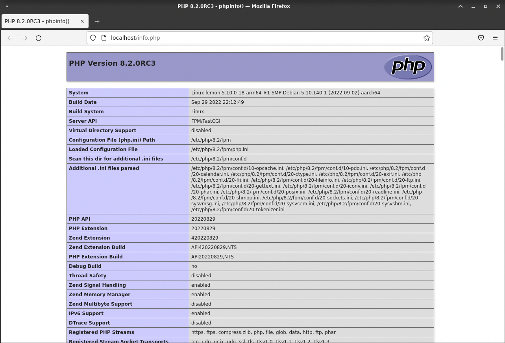

# UT2: Implantación de arquitecturas web

[La arquitectura web y algunos modelos](#la-arquitectura-web-y-algunos-modelos)  
[Servidores web](#servidores-web)  
[Instalación y configuración básica de un servidor web](#instalación-y-configuración-básica-de-un-servidor-web)  
[Servidores de aplicaciones](#servidores-de-aplicaciones)

## La arquitectura web y algunos modelos

Una aplicación web necesita de una estructura que permita su acceso desde diferentes lugares (máquinas). Esta estructura es lo que se denomina **Arquitectura Web** (realmente este nombre se da también al diseño de toda la estructura).


La gran mayoría de las arquitecturas web en la actualidad se basan en un modelo **cliente/servidor**: una comunicación asimétrica en la que uno de los extremos ofrece uno o más servicios y el otro hace uso de él. Éste es el modelo sobre el que centraremos el curso, pero no es el único que existe.

El término **servicio** es muy amplio y muchas veces confuso. Por ejemplo se puede considerar una web a la que acudimos a comprar productos un servicio en si misma, pero a la vez dicho servicio está compuesto de servicios de seguridad, de sesión, de transacciones, etcétera.

La estructura de una Arquitectura Web actual sigue el siguiente **modelo**:

| Capa                          | Cometido                                                                                                                                                                                                                                                                                                                                                                                                                                |
| ----------------------------- | --------------------------------------------------------------------------------------------------------------------------------------------------------------------------------------------------------------------------------------------------------------------------------------------------------------------------------------------------------------------------------------------------------------------------------------- |
| **Capa cliente**              | Es generalmente el navegador Web ejecutándose en el ordenador del usuario final. Existen otras opciones más básicas pero en la actualidad la potencia y diversidad de los navegadores existentes (así como su gratuidad) han relegado las demás opciones a la práctica desaparición.                                                                                                                                                    |
| **Capa de presentación**      | Se encarga de componer las páginas integrando la parte dinámica en la estática. Además también procesa las páginas que envía el cliente (por ejemplo datos en formularios)                                                                                                                                                                                                                                                              |
| **Capa de lógica de negocio** | Lleva a cabo operaciones más complejas. Se corresponde con la implantación de un servidor de aplicaciones. Realiza muchos tipos de operaciones entre los que destacan: a) Realizar todas las operaciones y validaciones. b) Gestionar el flujo de trabajo (workflow) incluyendo el control y gestión de las sesiones y los datos que se necesitan. c) Gestionar todas las operaciones de accesos a datos desde la capa de presentación. |
| **Capa de datos**             | Se compone de un sistema de almacenamiento y acceso a datos que se utilizan para confeccionar la página Web. Generalmente es un gestor de bases de datos relacionales (SGDB) pero pueden ser ficheros de texto plano                                                                                                                                                                                                                    |


Algunos ejemplos de tecnologías asociadas a las capas en la arquitectura web:

| Capa              | Lenguajes                           | Manejadores                   |
| ----------------- | ----------------------------------- | ----------------------------- |
| Cliente           | http/https                          | Chrome, Firefox, Edge         |
| Presentación      | html                                | Nginx, Apache                 |
| Lógica de negocio | php, python, ruby, java, javascript | php-fpm, gunicorn, proxy_pass |
| Capa de datos     | sql                                 | PostgreSQL, MySQL             |

En el caso de estar usando **páginas web estáticas** (no cambian en función de diversas variables) no existiría la capa de datos ya que estos van incorporados en los propios archivos de marcas que serán los que conforman las páginas web.

### Un modelo simple para el despliegue de aplicaciones web

En la actualidad la mayor parte de la información y lógica de un negocio debe ser accesible desde diferentes lugares. Aquí entran en juego las aplicaciones web.

Se puede imaginar inmediatamente que la **seguridad** es un aspecto clave en este tipo de aplicaciones, pero no el único. Muchas veces la **velocidad** y **estabilidad** de la comunicación y del servicio en sí pueden ser tanto o más críticas.

Cuando se va a desarrollar e implantar una aplicación web se deben tener en cuenta varios factores. Lo primero es hacerse una **idea general de la aplicación** y de las **diferentes soluciones** que podemos utilizar. Se deben tener en cuenta las tres capas. Un error muy común es el uso permanente de un único conjunto de tecnologías. Por supuesto conocer una tecnología es un punto a favor, pero muchas veces vamos a llevar a cabo una solución manifiestamente peor únicamente por no haber considerado usar otras tecnologías y afrontar su aprendizaje.

El siguiente aspecto a considerar sería el **coste**. Cuánto nos va a costar y qué presupuesto tenemos. Como derivado de ello debemos estimar una **duración** del proyecto.

Estos factores hay que considerarlos **antes de firmar** ningún contrato e incluso antes de dar un presupuesto aunque sea orientativo.

Por ejemplo una compañía de venta de vehículos industriales quiere una aplicación web para publicar sus datos de ventas y que los comerciales puedan acceder a ella remotamente. Necesitaremos una base de datos en la que se almacenen los diferentes vehículos y sus ventas. También hará falta una lógica que mantenga todo el sistema actualizado y permita modificaciones. Además necesitaremos una capa de cliente con autenticación para que los diferentes vendedores puedan acceder al sistema, consultar y actualizar los datos.

Después de la evaluación se puede decidir no afrontar el proyecto por muchos motivos. Además de los costes ya mencionados podría darse el caso de que no tengamos los conocimientos o la infraestructura para llevar a cabo el proyecto.

### ¿Qué es una aplicación web?

Una **aplicación web** es una aplicación que se va a ejecutar a través de internet.

Constará, al menos, de dos partes:

| Lado     | Rol      | Instrumento   |
| -------- | -------- | ------------- |
| Cliente  | Frontend | Navegador web |
| Servidor | Backend  | Servidor web  |

Las aplicaciones web se engloban en el concepto superior de _aplicaciones distribuidas_. El servidor pone a disposición del cliente diferentes recursos. Ejemplos de aplicaciones web son el correo electrónico web, las tiendas online, las redes sociales, etc.

### Fases de un proyecto de aplicación web

Se pueden considerar cuatro fases en el proyecto:

| Fase                       | Descripción                                                                                                                                                                                                                                                                                                                                                                                                                                                                                                                                                                                                               |
| -------------------------- | ------------------------------------------------------------------------------------------------------------------------------------------------------------------------------------------------------------------------------------------------------------------------------------------------------------------------------------------------------------------------------------------------------------------------------------------------------------------------------------------------------------------------------------------------------------------------------------------------------------------------- |
| **Concepto**               | Durante esta fase se debe obtener una **idea clara y concreta de qué quiere el cliente**. Además hay que obtener una idea general de cómo se llevará a cabo y de si es viable o no. Hay que determinar las **limitaciones reales** con que nos podemos encontrar. Por ejemplo la conexión a internet existente en la zona puede no ser suficiente para obtener los resultados previstos. Otro ejemplo de problema puede ser que la tecnología necesaria sea demasiado cara. Es vital que al terminar esta fase se tenga una documentación que defina claramente los límites y objetivos del proyecto.                     |
| **Diseño**                 | Esta fase se centra en responder a **cómo haremos la aplicación**. Hay que concretar las **tecnologías** (tanto software como hardware) que usaremos y cómo se van a comunicar entre ellas. También hay que determinar los distintos **módulos** que usaremos y sus interfaces. Es muy importante realizar un **plan de proyecto realista** en el que se dividan las tareas y responsabilidades y se calculen los tiempos para cada elemento así como su secuencia y dependencias. También hay que obtener una **especificación funcional** en la que se detallen tanto el funcionamiento como el flujo de la aplicación. |
| **Desarrollo**             | En esta fase se debe desarrollar el proyecto en sí. Es muy importante llevar a cabo **pruebas** tanto unitarias como de integración así como gestionar una **documentación** del desarrollo y un **control de versiones**.                                                                                                                                                                                                                                                                                                                                                                                                |
| **Pruebas e implantación** | Cuando el proyecto está totalmente terminado es necesario **probarlo intensivamente** antes de ponerlo en producción. Es necesario tener en cuenta tanto nuestra aplicación como su comunicación con otros sistemas informáticos. Cuanto más se parezca el sistema de pruebas al real mejor. El último paso es la **instalación y puesta en marcha** del sistema. Es un momento crítico.                                                                                                                                                                                                                                  |

Una fase común a todos los proyectos informáticos y que no se incluye aquí es el **mantenimiento**. Este concepto incluye dos partes:

- El mantenimiento del servicio y corrección de errores: consiste en asegurarse de que todo sigue funcionando correctamente y en solucionar los posibles errores y "caídas" del servicio
- Las posibles mejoras funcionales: consiste en ampliar el proyecto incorporando nuevas funcionalidades.

Ambos casos suelen considerarse contratos aparte y por ello no se incluyen en el ciclo ordinario de desarrollo.

El orden correcto para el desarrollo es empezar de abajo a arriba (**enfoque bottom-up**). Es decir, primero la capa de datos, luego la de negocio y por último la presentación al cliente. Muchas veces se tiene la tentación de hacerlo al revés. Esto es debido a que no se han identificado bien las necesidades y objetivos de proyecto o no se ha realizado un correcto diseño. Es un error que nos conducirá a muchas más modificaciones y errores en nuestra aplicación.


## Servidores web

Un **servidor web** es un programa o conjunto de ellos que proporciona un servicio a través de una red. La comunicación con un servidor web suele hacerse mediante el protocolo _http (hypertext transfer protocol)_ que está englobado en la **capa de aplicación** del [modelo OSI](https://es.wikipedia.org/wiki/Modelo_OSI).

Una brevísima descripción de las distintas capas del **modelo OSI**:

| Número | Nombre          | Responsabilidad                                                                                   |
| ------ | --------------- | ------------------------------------------------------------------------------------------------- |
| Capa 7 | **Aplicación**  | Responsable de los servicios de red para las aplicaciones                                         |
| Capa 6 | Presentación    | Transforma el formato de los datos y proporciona una interfaz estándar para la capa de aplicación |
| Capa 5 | Sesión          | Establece, administra y finaliza las conexiones entre las aplicaciones locales y las remotas      |
| Capa 4 | Transporte      | Proporciona transporte confiable y control del flujo a través de la red                           |
| Capa 3 | Red             | Responsable del direccionamiento lógico y el dominio del enrutamiento                             |
| Capa 2 | Enlace de datos | Proporciona direccionamiento físico y procedimientos de acceso a medios                           |
| Capa 1 | Física          | Define todas las especificaciones eléctricas y físicas de los dispositivos                        |

Muchas veces el concepto "servidor web" también se usa como referencia al **hardware** que lo aloja, pero esto técnicamente es inexacto ya que el mismo hardware puede albergar muchas otras funcionalidades o puede darse el caso de que un mismo hardware contenga varios servidores web (a veces simulados).

El objetivo de un servidor web es **proporcionar los medios para permitir la comunicación entre dos o más programas o artefactos de software** sin importar la tecnología usada para operar en cada uno de ellos.

En la actualidad el [servidor web más extendido](https://w3techs.com/technologies/overview/web_server) es **Nginx**. Por ello nos centraremos en él durante este curso. Existen otros servidores web. Una forma fácil de consultar la lista y ver una [comparativa muy general](https://en.wikipedia.org/wiki/Comparison_of_web_server_software) es visitando la Wikipedia.

Los servidores web se engloban en un conjunto de sistemas más generales fundamentados en el **modelo distribuido**. En este modelo el sistema no es unitario, sino que está repartido entre diferentes máquinas o conjuntos de hardware. Esta arquitectura tiene que afrontar algunos problemas que se deben tener en cuenta:

1. La latencia y poca fiabilidad del transporte (por ejemplo la red).
2. La falta de memoria compartida entre las partes.
3. Los problemas derivados de fallos parciales.
4. La gestión del acceso concurrente a recursos remotos.
5. Problemas derivados de actualizaciones de alguna/s de las partes.

### Servicios web

Un **servicio web** es un concepto abstracto que debe implementarse mediante un **agente**: en definitiva un artefacto software que envía, recibe y procesa mensajes (mientras que el servicio es el concepto de qué hace). El agente solo debe ajustarse a la definición de una interfaz (dos realmente, una hacia dentro - pila OSI - y otra hacia fuera) y puede modificarse o incluso rehacerse en otro lenguaje de programación sin ningún problema. El diseño se realiza siguiendo normas de modularidad para permitir estas modificaciones.

Es de vital importancia que el servicio web esté bien definido para posibilitar la comunicación entre ambos extremos. Por ello hay muchos estándares sobre servicios web que permiten la comunicación de un cliente genérico (por ejemplo un navegador web) con diversos servicios.

Generalmente la definición de un servicio se realiza mediante una [API](https://es.wikipedia.org/wiki/Interfaz_de_programaci%C3%B3n_de_aplicaciones) (Application Programming Interface) que especifica cómo comunicarse con dicho servicio.

El proceso para usar un servicio es el siguiente:

1. El cliente y el servidor deben ser conscientes de la existencia del otro. En el caso más habitual es el cliente el que informa al servidor de su intención de usar el servicio pero también puede ser el servidor el que inicie el contacto. Si es el cliente el que comienza, puede hacerlo o bien conociendo previamente cómo localizar el servidor o usando alguna herramienta para descubrir servicios (Web Service Discovery).
2. Ambas partes deben ponerse de acuerdo sobre los parámetros que regirán la comunicación. Esto no significa que discutan, solo que las normas y protocolos deben ser las mismas en ambas partes.
3. Los agentes de ambos lados empiezan a intercambiar mensajes. El servidor web necesita componer las páginas en caso de que lleven elementos multimedia e incluso necesitará realizar otras acciones si la página se crea dinámicamente.

### Alternativas

Antes de decidirnos a instalar nuestro propio servidor web, debemos tener en cuenta que no siempre es la mejor opción. Lo primero que debemos saber es qué quiere el cliente. Dependiendo del tamaño del servicio que vayamos a proporcionar y de la importancia de poder controlar todos los aspectos del servidor, podemos decidir usar otras aproximaciones.

Por otro lado la máquina que necesitamos podría requerir mucha RAM y capacidad de almacenamiento además de soportar grandes cargas de trabajo. La conexión a internet también deberá ser potente y necesitaremos contratar una dirección IP estática.

#### Hosting

Lo primero que se debe tener en cuenta es si nos interesa tener **nuestro propio servidor** o contratar un **servicio de hosting**. Realmente el término "Web Hosting" incluye el tener un servidor propio, pero en la actualidad se utiliza para denominar el alquilar espacio y recursos en un servidor de otra compañía. Generalmente esta compañía está dedicada a ello específicamente. Las ventajas de este caso son las obvias: no tenemos que preocuparnos de adquirir ni mantener ni el hardware ni el software necesario. Además la fiabilidad del servicio de una empresa especializada suele ser muy alta.

Los términos que se suelen manejar en este contexto son:

- **On-premise** para infraestructuras montadas en la propia organización.
- **Cloud** para infraestructuras alojadas en empresas de terceros.

#### Wordpress

Existen casos en los que incluso hay tecnologías más específicas que puede satisfacer nuestras necesidades. Es más habitual la existencia de sitios web en los que la apariencia no cambia pero el contenido es actualizado constantemente. Para estos casos se puede usar un **gestor de contenidos** (CMS). Con ellos se permite al usuario actualizar la información del sitio sin necesidad de que tenga conocimientos web concretos. Existen muchos gestores web, algunos comerciales y otros gratuitos y de código abierto. En este último apartado destaca por encima de todos [Wordpress](https://es.wordpress.org/), que empezó siendo una plataforma para alojar blogs pero hoy en día ya es un servicio de propósito general (webs, blogs, aplicaciones, etc.).

### ¿Qué necesito para montar un servidor web?

Lo primero que necesitas es una **máquina** (on-premise o cloud) con una potencia suficiente para atender las peticiones que se vayan a procesar. Los servidores web tipo Nginx son capaces de manejar una gran cantidad de peticiones por segundo (hasta cientos de miles).

Este punto de dimensionar los recursos necesarios es crítico y difícil de gestionar porque no sabemos cuál será la demanda y muchas veces es complejo estimar la carga de trabajo que se soportará. Es muy recomendable que sea una máquina dedicada o que cumpla otras funciones relacionadas con intercambio de información en internet.

También es vital que el **sistema operativo** que elijamos sea estable. No tiene ningún sentido elegir un sistema operativo que deje de estar funcional rápidamente. Es conveniente que lleve cierta seguridad y control de permisos integrado. Los sistemas operativos más habituales para este tipo de tareas son **Linux** (en sus distintas distribuciones) ya que proporcionan robustez, disponibilidad y alto nivel de personalización.

> Se estima que alrededor de un [80% de los servidores que hay funcionando en Internet corren sobre Linux/Unix](https://w3techs.com/technologies/overview/operating_system).

Obviamente se debe disponer de una **conexión a internet** con suficiente ancho de banda de subida y bajada. Lo siguiente que tendrás que conseguir es una **dirección IP estática**. Por supuesto debe ser una dirección de internet a no ser que tu objetivo sea montar una intranet. Nuestra máquina debe ser accesible desde redes remotas.

Los nombres y direcciones de internet que conocemos se basan en un sistema llamado **DNS** que convierte esas direcciones legibles para nosotros en direcciones IP y viceversa. Si nuestra dirección IP cambia frecuentemente cuando alguien accede a nuestra página esta le aparecería como no disponible a pesar de que todo el resto del sistema estuviera trabajando.

Existe la posibilidad de funcionar con una **dirección IP dinámica** mediante sistemas como DDNS (Dynamic DNS) que mantienen siempre actualizada nuestra dirección. Un servicio gratuito de DDNS es [Duck DNS](https://www.duckdns.org/).

## Instalación y configuración básica de un servidor web


**Nginx** se define como un **servidor web** / **proxy inverso** ligero y de alto rendimiento.


Vamos a optar por instalar **Nginx** sobre un sistema operativo **Linux**, una de las opciones más extendidas en la actualidad (con la posibilidad de obtener todo el software de manera gratuita). Nginx destaca sobre otros servidores porque:

- Tiene un diseño modular y altamente configurable.
- Ofrece un alto rendimiento.
- Es de [código abierto](https://hg.nginx.org/nginx/file/tip) por lo que existen muchas extensiones y herramientas de terceros.
- Forma parte de muchos "stacks" tecnológicos modernos.
- Existen versiones para muchos sistemas operativos incluyendo Windows, Linux y MacOS.

Lo más "habitual" sería instalar Nginx en un sistema operativo de tipo servidor pero por motivos didácticos, vamos a instalarlo en una versión estándar con interfaz gráfica. Es menos seguro por lo que en un sistema en producción deberíamos optar por la otra opción. A pesar de usar un Linux con interfaz gráfica vamos a instalar todo desde la ventana de terminal, por lo que los pasos se podrán aplicar a un servidor.

### Instalación nativa

Aunque existen versiones de Nginx en la paquetería de casi todas las distribuciones Linux, vamos a optar por instalar la versión que se ofrece en los **repositorios oficiales** de Nginx. El principal motivo es que se trata de versiones mucho más actualizadas y que siguen el estándar de estructura de carpetas y ficheros más extendida.

Lo primero será actualizar el listado de paquetes:

```console
sdelquin@lemon:~$ sudo apt update
Des:1 http://security.debian.org/debian-security bullseye-security InRelease [48,4 kB]
Obj:2 http://deb.debian.org/debian bullseye InRelease
Des:3 http://deb.debian.org/debian bullseye-updates InRelease [44,1 kB]
Des:4 http://security.debian.org/debian-security bullseye-security/main Sources [152 kB]
Des:5 http://packages.microsoft.com/repos/code stable InRelease [10,4 kB]
Des:6 http://security.debian.org/debian-security bullseye-security/main arm64 Packages [181 kB]
Des:7 http://security.debian.org/debian-security bullseye-security/main Translation-en [115 kB]
Des:8 http://packages.microsoft.com/repos/code stable/main arm64 Packages [109 kB]
Des:9 http://packages.microsoft.com/repos/code stable/main armhf Packages [109 kB]
Des:10 http://packages.microsoft.com/repos/code stable/main amd64 Packages [108 kB]
Descargados 878 kB en 1s (1.324 kB/s)
Leyendo lista de paquetes... Hecho
Creando árbol de dependencias... Hecho
Leyendo la información de estado... Hecho
Todos los paquetes están actualizados.
```

A continuación instalaremos algunos **paquetes de soporte**:

```console
sdelquin@lemon:~$ sudo apt install -y curl gnupg2 ca-certificates lsb-release debian-archive-keyring
```

Ahora descargamos, desarmamos y guardamos la **clave de firma** Nginx:

```console
sdelquin@lemon:~$ curl -fsSL https://nginx.org/keys/nginx_signing.key \
| sudo gpg --dearmor -o /etc/apt/trusted.gpg.d/nginx.gpg
```

A continuación añadimos las **fuentes del repositorio oficial** de Nginx para `apt`:

```console
sdelquin@lemon:~$ echo 'deb http://nginx.org/packages/debian bullseye nginx' \
| sudo tee /etc/apt/sources.list.d/nginx.list > /dev/null
```

Actualizamos el índice de paquetes:

```console
sdelquin@lemon:~$ sudo apt update
Obj:1 http://security.debian.org/debian-security bullseye-security InRelease
Obj:2 http://deb.debian.org/debian bullseye InRelease
Obj:3 http://deb.debian.org/debian bullseye-updates InRelease
Obj:4 https://packages.sury.org/php bullseye InRelease
Obj:5 http://nginx.org/packages/debian bullseye InRelease
Obj:6 https://download.docker.com/linux/debian bullseye InRelease
Obj:7 http://packages.microsoft.com/repos/code stable InRelease
Leyendo lista de paquetes... Hecho
Creando árbol de dependencias... Hecho
Leyendo la información de estado... Hecho
```

Con el nuevo repositorio añadido, ya podemos **instalar Nginx**:

```console
sdelquin@lemon:~$ sudo apt install -y nginx
```

Con esto, en principio, ya debería estar instalado el servidor web **Nginx**. Para obtener las características de la versión instalada, podemos ejecutar:

```console
sdelquin@lemon:~$ sudo nginx -V
nginx version: nginx/1.22.0
built by gcc 10.2.1 20210110 (Debian 10.2.1-6)
built with OpenSSL 1.1.1k  25 Mar 2021 (running with OpenSSL 1.1.1n  15 Mar 2022)
TLS SNI support enabled
configure arguments: --prefix=/etc/nginx --sbin-path=/usr/sbin/nginx --modules-path=/usr/lib/nginx/modules --conf-path=/etc/nginx/nginx.conf --error-log-path=/var/log/nginx/error.log --http-log-path=/var/log/nginx/access.log --pid-path=/var/run/nginx.pid --lock-path=/var/run/nginx.lock --http-client-body-temp-path=/var/cache/nginx/client_temp --http-proxy-temp-path=/var/cache/nginx/proxy_temp --http-fastcgi-temp-path=/var/cache/nginx/fastcgi_temp --http-uwsgi-temp-path=/var/cache/nginx/uwsgi_temp --http-scgi-temp-path=/var/cache/nginx/scgi_temp --user=nginx --group=nginx --with-compat --with-file-aio --with-threads --with-http_addition_module --with-http_auth_request_module --with-http_dav_module --with-http_flv_module --with-http_gunzip_module --with-http_gzip_static_module --with-http_mp4_module --with-http_random_index_module --with-http_realip_module --with-http_secure_link_module --with-http_slice_module --with-http_ssl_module --with-http_stub_status_module --with-http_sub_module --with-http_v2_module --with-mail --with-mail_ssl_module --with-stream --with-stream_realip_module --with-stream_ssl_module --with-stream_ssl_preread_module --with-cc-opt='-g -O2 -ffile-prefix-map=/data/builder/debuild/nginx-1.22.0/debian/debuild-base/nginx-1.22.0=. -fstack-protector-strong -Wformat -Werror=format-security -Wp,-D_FORTIFY_SOURCE=2 -fPIC' --with-ld-opt='-Wl,-z,relro -Wl,-z,now -Wl,--as-needed -pie'
```

Igualmente podemos comprobar el estado del servicio mediante el comando adecuado de [systemd](https://wiki.debian.org/systemd):

```console
sdelquin@lemon:~$ sudo systemctl status nginx
● nginx.service - nginx - high performance web server
     Loaded: loaded (/lib/systemd/system/nginx.service; enabled; vendor preset: enabled)
     Active: inactive (dead)
       Docs: https://nginx.org/en/docs/

sep 26 20:02:24 lemon systemd[1]: Reloading A high performance web server and a reverse proxy serve>
sep 26 20:02:24 lemon systemd[1]: Reloaded A high performance web server and a reverse proxy server.
sep 29 16:16:26 lemon systemd[1]: Stopping A high performance web server and a reverse proxy server>
sep 29 16:16:26 lemon systemd[1]: nginx.service: Succeeded.
sep 29 16:16:26 lemon systemd[1]: Stopped A high performance web server and a reverse proxy server.
sep 29 16:17:16 lemon systemd[1]: Starting nginx - high performance web server...
sep 29 16:17:16 lemon systemd[1]: Started nginx - high performance web server.
sep 29 16:18:22 lemon systemd[1]: Stopping nginx - high performance web server...
sep 29 16:18:22 lemon systemd[1]: nginx.service: Succeeded.
sep 29 16:18:22 lemon systemd[1]: Stopped nginx - high performance web server.
```

Vemos que está "inactive (dead)". Así que podemos levantarlo usando sintaxis de servicios:

```console
sdelquin@lemon:~$ sudo systemctl start nginx
```

Y ahora sí deberíamos tener el servicio corriendo:

```console
sdelquin@lemon:~$ sudo systemctl status nginx
● nginx.service - nginx - high performance web server
     Loaded: loaded (/lib/systemd/system/nginx.service; enabled; vendor preset: enabled)
     Active: active (running) since Thu 2022-09-29 17:11:54 WEST; 39s ago
       Docs: https://nginx.org/en/docs/
    Process: 192384 ExecStart=/usr/sbin/nginx -c /etc/nginx/nginx.conf (code=exited, status=0/SUCCE>
   Main PID: 192385 (nginx)
      Tasks: 3 (limit: 2251)
     Memory: 2.4M
        CPU: 9ms
     CGroup: /system.slice/nginx.service
             ├─192385 nginx: master process /usr/sbin/nginx -c /etc/nginx/nginx.conf
             ├─192386 nginx: worker process
             └─192387 nginx: worker process

sep 29 17:11:54 lemon systemd[1]: Starting nginx - high performance web server...
sep 29 17:11:54 lemon systemd[1]: Started nginx - high performance web server.
```

Para comprobar nuestra instalación de **Nginx**, accedemos a http://localhost:

```console
sdelquin@lemon:~$ firefox localhost
```


Del mismo modo podremos acceder a http://127.0.0.1 (ip para localhost):

```console
sdelquin@lemon:~$ firefox 127.0.0.1
```


> Dado que Nginx se instala como servicio, ya queda configurado para autoarrancarse. Eso significa que si reiniciamos el equipo el servidor web volverá a levantarse tras cada arranque.

### Instalación dockerizada

[Docker](https://www.docker.com/) es un proyecto de código abierto que **automatiza el despliegue de aplicaciones dentro de contenedores de software**, proporcionando una capa adicional de abstracción y automatización de virtualización de aplicaciones en múltiples sistemas operativos.​

🐳 [Iniciación a Docker](./docker.md)

Existen multitud de imágenes para contenedores ya preparadas en [Docker Hub](https://hub.docker.com/search). Una de ellas es [Nginx](https://hub.docker.com/_/nginx). Lanzar este contenedor es bastante sencillo:

```console
sdelquin@lemon:~$ docker run -p 80:80 nginx
Unable to find image 'nginx:latest' locally
latest: Pulling from library/nginx
3d898485473e: Pull complete
3f45c0a5377f: Pull complete
f1cdcf23708a: Pull complete
a73e5a7988e9: Pull complete
43509f6ae4b3: Pull complete
8460b172ee88: Pull complete
Digest: sha256:0b970013351304af46f322da1263516b188318682b2ab1091862497591189ff1
Status: Downloaded newer image for nginx:latest
/docker-entrypoint.sh: /docker-entrypoint.d/ is not empty, will attempt to perform configuration
/docker-entrypoint.sh: Looking for shell scripts in /docker-entrypoint.d/
/docker-entrypoint.sh: Launching /docker-entrypoint.d/10-listen-on-ipv6-by-default.sh
10-listen-on-ipv6-by-default.sh: info: Getting the checksum of /etc/nginx/conf.d/default.conf
10-listen-on-ipv6-by-default.sh: info: Enabled listen on IPv6 in /etc/nginx/conf.d/default.conf
/docker-entrypoint.sh: Launching /docker-entrypoint.d/20-envsubst-on-templates.sh
/docker-entrypoint.sh: Launching /docker-entrypoint.d/30-tune-worker-processes.sh
/docker-entrypoint.sh: Configuration complete; ready for start up
2022/09/19 08:16:45 [notice] 1#1: using the "epoll" event method
2022/09/19 08:16:45 [notice] 1#1: nginx/1.23.1
2022/09/19 08:16:45 [notice] 1#1: built by gcc 10.2.1 20210110 (Debian 10.2.1-6)
2022/09/19 08:16:45 [notice] 1#1: OS: Linux 5.10.0-18-arm64
2022/09/19 08:16:45 [notice] 1#1: getrlimit(RLIMIT_NOFILE): 1048576:1048576
2022/09/19 08:16:45 [notice] 1#1: start worker processes
2022/09/19 08:16:45 [notice] 1#1: start worker process 31
2022/09/19 08:16:45 [notice] 1#1: start worker process 32
2022/09/19 08:18:39 [notice] 1#1: signal 28 (SIGWINCH) received
```

> Con `-p 80:80` estamos mapeando el puerto 80 de la máquina anfitriona ("host") al puerto 80 del contenedor Docker.

> ⭐ `-p <puerto-máquina-anfitriona>:<puerto-contenedor-Docker>`

Si dejamos este proceso corriendo y abrimos una nueva pestaña, podemos lanzar un navegador web en http://localhost y comprobar que el servidor web está instalado y funcionando:

```console
sdelquin@lemon:~$ firefox localhost
```


> Podemos parar el contenedor simplemente pulsando <kbd>Ctrl-C</kbd>.

Correr un contenedor implica descargar su imagen (si es que no existía). Este proceso denominado "pull" hace que dispongamos de la imagen del contenedor de manera permanente (hasta que se elimine) en nuestro disco.

Podemos ver las imágenes descargadas de la siguiente manera:

```console
sdelquin@lemon:~$ docker images
REPOSITORY    TAG       IMAGE ID       CREATED        SIZE
nginx         latest    0c404972e130   5 days ago     135MB
hello-world   latest    46331d942d63   6 months ago   9.14kB
```

## Servidores de aplicaciones

Un servidor de aplicaciones es un paquete software que proporciona servicios a las aplicaciones tales como seguridad, servicios de datos, soporte para transacciones, balanceo de carga y gestión de sistemas distribuidos.

El funcionamiento de un servidor de aplicaciones necesita de un servidor web. Muchas veces vienen en el mismo paquete, pero realmente son dos partes diferenciadas.

Cuando un cliente hace una petición al servidor web, este trata de gestionarla, pero hay muchos elementos con los que no sabe qué hacer. Aquí entra en juego el servidor de aplicaciones, que descarga al servidor web de la gestión de determinados tipos de archivos.

A continuación veremos el despliegue de una aplicación PHP como ejemplo de servidor de aplicaciones.

### PHP nativo

[PHP](https://www.php.net/) es un lenguaje de "scripting" muy enfocado a la programación web (aunque no únicamente) y permite desarrollar aplicaciones integradas en el propio código HTML.

El servidor de aplicación (o manejador de procesos) que se utiliza para PHP es [PHP-FPM](https://www.php.net/manual/es/install.fpm.php). Se encarga de manejar los procesos [FastCGI](https://es.wikipedia.org/wiki/FastCGI), un protocolo para interconectar programas interactivos con un servidor web.

Para **instalar PHP-FPM** seguiremos los pasos indicados a continuación.

En primer lugar debemos instalar algunos **prerrequisitos**:

```console
sdelquin@lemon:~$ sudo apt update

sdelquin@lemon:~$ sudo apt install -y lsb-release ca-certificates \
apt-transport-https software-properties-common gnupg2
```

Añadimos el **repositorio externo** desde donde descargarnos la última versión de PHP-FPM:

```console
sdelquin@lemon:~$ echo "deb https://packages.sury.org/php/ $(lsb_release -sc) main" \
| sudo tee /etc/apt/sources.list.d/sury-php.list
```

**Importamos la clave** [GPG](https://es.wikipedia.org/wiki/GNU_Privacy_Guard) del repositorio:

```console
sdelquin@lemon:~$ curl -fsSL  https://packages.sury.org/php/apt.gpg \
| sudo gpg --dearmor -o /etc/apt/trusted.gpg.d/sury.gpg
```

Confirmamos que el **repositorio está disponible** tras actualizar las fuentes:

```console
sdelquin@lemon:~$ sudo apt update
Obj:1 http://deb.debian.org/debian bullseye InRelease
Obj:2 http://security.debian.org/debian-security bullseye-security InRelease
Obj:3 http://deb.debian.org/debian bullseye-updates InRelease
Obj:4 http://packages.microsoft.com/repos/code stable InRelease
Obj:5 https://packages.sury.org/php bullseye InRelease
Leyendo lista de paquetes... Hecho
Creando árbol de dependencias... Hecho
Leyendo la información de estado... Hecho
Todos los paquetes están actualizados.
```

Es posible encontrarnos con varias versiones del paquete. Veamos primero cómo enfocar la búsqueda a los nombres de paquete que nos interesan:

```console
sdelquin@lemon:~$ apt-cache search --names-only 'php*-fpm'
php7.4-fpm - server-side, HTML-embedded scripting language (FPM-CGI binary)
php-fpm - server-side, HTML-embedded scripting language (FPM-CGI binary) (default)
php5.6-fpm - server-side, HTML-embedded scripting language (FPM-CGI binary)
php7.0-fpm - server-side, HTML-embedded scripting language (FPM-CGI binary)
php7.1-fpm - server-side, HTML-embedded scripting language (FPM-CGI binary)
php7.2-fpm - server-side, HTML-embedded scripting language (FPM-CGI binary)
php7.3-fpm - server-side, HTML-embedded scripting language (FPM-CGI binary)
php8.0-fpm - server-side, HTML-embedded scripting language (FPM-CGI binary)
php8.1-fpm - server-side, HTML-embedded scripting language (FPM-CGI binary)
php8.2-fpm - server-side, HTML-embedded scripting language (FPM-CGI binary)
```

Revisando la salida, nos damos cuenta que la versión más reciente es la `v8.2`. Instalamos dicha versión:

```console
sdelquin@lemon:~$ sudo apt install -y php8.2-fpm
```

Dado que PHP-FPM se instala en el sistema como un **servicio**, podemos comprobar su estado utilizando systemd:

```console
sdelquin@lemon:~$ sudo systemctl status php8.2-fpm
● php8.2-fpm.service - The PHP 8.2 FastCGI Process Manager
     Loaded: loaded (/lib/systemd/system/php8.2-fpm.service; enabled; vendor preset: enabled)
     Active: active (running) since Thu 2022-10-13 16:08:16 WEST; 26s ago
       Docs: man:php-fpm8.2(8)
    Process: 598830 ExecStartPost=/usr/lib/php/php-fpm-socket-helper install /run/php/php-fpm.sock >
   Main PID: 598827 (php-fpm8.2)
     Status: "Processes active: 0, idle: 2, Requests: 0, slow: 0, Traffic: 0req/sec"
      Tasks: 3 (limit: 2251)
     Memory: 9.1M
        CPU: 19ms
     CGroup: /system.slice/php8.2-fpm.service
             ├─598827 php-fpm: master process (/etc/php/8.2/fpm/php-fpm.conf)
             ├─598828 php-fpm: pool www
             └─598829 php-fpm: pool www

oct 13 16:08:16 lemon systemd[1]: Starting The PHP 8.2 FastCGI Process Manager...
oct 13 16:08:16 lemon systemd[1]: Started The PHP 8.2 FastCGI Process Manager.
```

Con esta instalación, también hemos instalado el propio **intéprete PHP** para ejecutar programas:

```console
sdelquin@lemon:~$ php --version
PHP 8.2.0RC3 (cli) (built: Sep 29 2022 22:12:49) (NTS)
Copyright (c) The PHP Group
Zend Engine v4.2.0RC3, Copyright (c) Zend Technologies
    with Zend OPcache v8.2.0RC3, Copyright (c), by Zend Technologies
```

Podemos comprobar que funciona ejecutando, por ejemplo, una instrucción en PHP que devuelve el nombre de nuestra máquina:

```console
sdelquin@lemon:~$ php -r "echo gethostname();"
lemon
```

#### Habilitando PHP en Nginx

Nginx es un servidor web que sirve ficheros pero "no sabe" manejar código escrito en PHP (u otros lenguajes). Es por ello que necesitamos un procesador (servidor de aplicación) como PHP-FPM.

Lo primero que hay que hacer es permitir que el usuario `nginx` tenga acceso al [socket unix](https://es.wikipedia.org/wiki/Socket_Unix) que abre PHP-FPM. Para ello debemos editar la configuración de PHP-FPM:

```console
sdelquin@lemon:~$ sudo vi /etc/php/8.2/fpm/pool.d/www.conf
```

```ini
23| user = nginx
24| group = nginx
...
51| listen.owner = nginx
52| listen.group = nginx
```

Guardamos y **recargamos la configuración** de PHP-FPM:

```console
sdelquin@lemon:~$ sudo systemctl reload php8.2-fpm
```

Para **habilitar la comunicación entre Nginx y PHP-FPM** vamos a editar el siguiente fichero de configuración:

```console
sdelquin@lemon:~$ sudo vi /etc/nginx/conf.d/default.conf
```

Buscar el bloque `location ~ \.php` y dejarlo así:

```nginx
location ~ \.php$ {
    root           /usr/share/nginx/html;
    fastcgi_pass   unix:/var/run/php/php8.2-fpm.sock;
    index          index.php;
    include        fastcgi_params;
    fastcgi_param  SCRIPT_FILENAME   $document_root$fastcgi_script_name;
}
```

Podemos comprobar que la **sintaxis del fichero de configuración** es correcta utilizando Nginx:

```console
sdelquin@lemon:~$ sudo nginx -t
nginx: the configuration file /etc/nginx/nginx.conf syntax is ok
nginx: configuration file /etc/nginx/nginx.conf test is successful
```

Ahora **recargamos la configuración** que hemos modificado:

```console
sdelquin@lemon:~$ sudo systemctl reload nginx
```

#### Primera aplicación web en PHP

Creamos un fichero PHP que contendrá un sencillo código mostrando la información de la instalación:

```console
sdelquin@lemon:~$ cd
sdelquin@lemon:~$ mkdir dev
sdelquin@lemon:~$ echo "<?php phpinfo(); ?>" > ~/dev/info.php
```

Ahora enlazamos este fichero desde la carpeta "root" del servidor web Nginx:

```console
sdelquin@lemon:~$ sudo ln -s ~/dev/info.php /usr/share/nginx/html/

sdelquin@lemon:~$ ls -l /usr/share/nginx/html/
total 8
-rw-r--r-- 1 root root 497 may 24 00:59 50x.html
-rw-r--r-- 1 root root 615 may 24 00:59 index.html
lrwxrwxrwx 1 root root  27 oct 13 16:15 info.php -> /home/sdelquin/dev/info.php
```

Abrimos un navegador en la ruta especificada y vemos el resultado:

```console
sdelquin@lemon:~$ firefox localhost/info.php
```



### PHP dockerizado

Para este escenario es necesario "componer" dos servicios:

- Nginx (`web`)
- PHP-FPM (`php-fpm`)

La estructura del "proyecto" quedaría así:

```console
sdelquin@lemon:~/dev/app$ tree
.
├── default.conf
├── docker-compose.yml
└── src
    └── index.php

1 directory, 4 files
```

La composición de servicios en Docker se lleva a cabo mediante la herramienta [docker compose](https://docs.docker.com/compose/) usando un fichero de configuración en formato [yaml](https://es.wikipedia.org/wiki/YAML):

```yaml
version: "3.3"

services:
  web:
    image: nginx
    volumes:
      - ./src:/etc/nginx/html # "root" por defecto en Nginx
      - ./default.conf:/etc/nginx/conf.d/default.conf
    ports:
      - 80:80

  php-fpm:
    image: php:8-fpm
    volumes:
      - ./src:/etc/nginx/html
```

Fichero de configuración del sitio web por defecto:

**`default.conf`**

```nginx
server {
  server_name _;
  index index.php index.html;

  location ~ \.php$ {
    fastcgi_pass php-fpm:9000;
    include fastcgi_params;  # fichero incluido en la instalación
    fastcgi_param SCRIPT_FILENAME $document_root$fastcgi_script_name;
  }
}
```

Y finalmente, nuestro programa PHP de prueba que mostrará por pantalla la configuración misma de PHP:

**`src/index.php`**

```nginx
<?php
  echo phpinfo();
?>
```

Con todo esto ya podemos levantar los servicios:

```console
sdelquin@lemon:~/dev/app$ docker compose up
[+] Running 3/0
 ⠿ Network app_default      Created                                                                                 0.0s
 ⠿ Container app-php-fpm-1  Created                                                                                 0.0s
 ⠿ Container app-web-1      Created                                                                                 0.0s
Attaching to app-php-fpm-1, app-web-1
app-php-fpm-1  | [21-Sep-2022 10:22:20] NOTICE: fpm is running, pid 1
app-php-fpm-1  | [21-Sep-2022 10:22:20] NOTICE: ready to handle connections
app-web-1      | /docker-entrypoint.sh: /docker-entrypoint.d/ is not empty, will attempt to perform configuration
app-web-1      | /docker-entrypoint.sh: Looking for shell scripts in /docker-entrypoint.d/
app-web-1      | /docker-entrypoint.sh: Launching /docker-entrypoint.d/10-listen-on-ipv6-by-default.sh
app-web-1      | 10-listen-on-ipv6-by-default.sh: info: Getting the checksum of /etc/nginx/conf.d/default.conf
app-web-1      | 10-listen-on-ipv6-by-default.sh: info: /etc/nginx/conf.d/default.conf differs from the packaged version
app-web-1      | /docker-entrypoint.sh: Launching /docker-entrypoint.d/20-envsubst-on-templates.sh
app-web-1      | /docker-entrypoint.sh: Launching /docker-entrypoint.d/30-tune-worker-processes.sh
app-web-1      | /docker-entrypoint.sh: Configuration complete; ready for start up
app-web-1      | 2022/09/21 10:22:20 [notice] 1#1: using the "epoll" event method
app-web-1      | 2022/09/21 10:22:20 [notice] 1#1: nginx/1.23.1
app-web-1      | 2022/09/21 10:22:20 [notice] 1#1: built by gcc 10.2.1 20210110 (Debian 10.2.1-6)
app-web-1      | 2022/09/21 10:22:20 [notice] 1#1: OS: Linux 5.10.0-18-arm64
app-web-1      | 2022/09/21 10:22:20 [notice] 1#1: getrlimit(RLIMIT_NOFILE): 1048576:1048576
app-web-1      | 2022/09/21 10:22:20 [notice] 1#1: start worker processes
app-web-1      | 2022/09/21 10:22:20 [notice] 1#1: start worker process 29
app-web-1      | 2022/09/21 10:22:20 [notice] 1#1: start worker process 30
```

Si dejamos este proceso corriendo y abrimos otra pestaña de la terminal, podemos comprobar que la aplicación PHP está funcionando correctamente:

```console
sdelquin@lemon:~/dev/app$ firefox localhost
```


De hecho podemos también visualizar los servicios que están corriendo dentro de esta "composición", utilizando el siguiente comando:

```console
sdelquin@lemon:~/dev/app$ docker compose ps
NAME                COMMAND                  SERVICE             STATUS              PORTS
app-php-fpm-1       "docker-php-entrypoi…"   php-fpm             running             9000/tcp
app-web-1           "/docker-entrypoint.…"   web                 running             0.0.0.0:80->80/tcp, :::80->80/tcp
```
