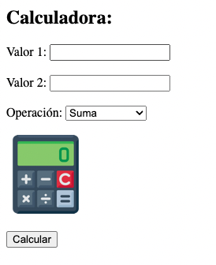

# UT2-TE1: Implantación de arquitecturas web

### TAREA EVALUABLE

1. Implantar una aplicación PHP que funcione como una calculadora usando Nginx + php-fpm.
2. Utilizar una interfaz similar a la siguiente:

3. Realizar las siguientes implementaciones:

| Entorno | URL local                |
| ------- | ------------------------ |
| Nativo  | http://calculator.native |
| Docker  | http://calculator.docker |

## Aclaraciones

1. Incluir [esta imagen de la calculadora](./images/calculadora.png).
2. Incluir un fichero `.css` con unos estilos básicos.

## Entregable

Informe explicando los pasos seguidos para resolver la tarea.

> Subir únicamente la URL al commit del repositorio:  
> `https://github.com/<user>/dpl/blob/ffaabb62206fa0c0f350dfe0a4ba370ed00b9218/ut<X>/te<X>/README.md`
