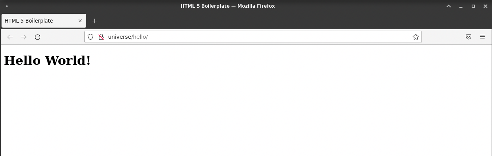
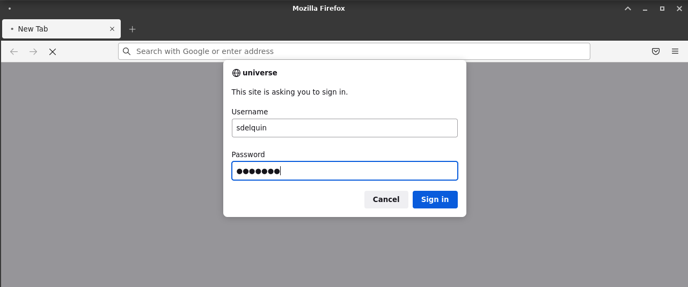
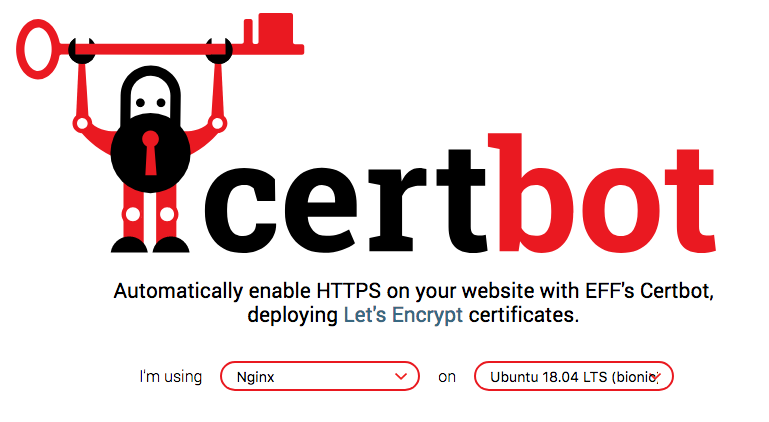
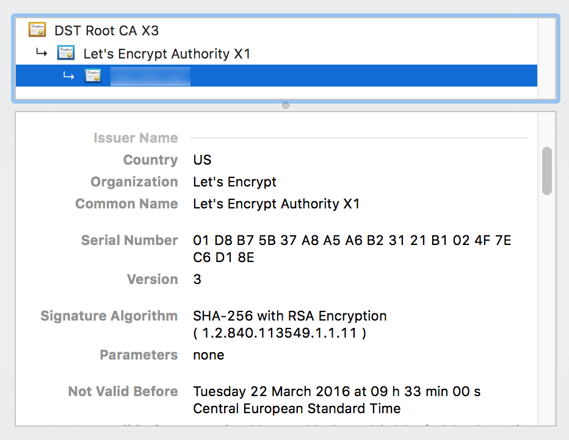

# UT3: Administración de servidores web

Ya hemos visto la instalación de Nginx. En esta unidad de trabajo nos vamos a dedicar a explorar todas sus opciones de configuración y administración.

[Configuración del servidor web](#configuración-del-servidor-web)  
[Hosts virtuales](#hosts-virtuales)  
[Directivas](#directivas)  
[Módulos](#módulos)  
[Sitios seguros](#sitios-seguros)

## Configuración del servidor web

En Nginx, la configuración del servicio está en el archivo `/etc/nginx/nginx.conf` con el siguiente contenido:

```nginx
user  nginx;
worker_processes  auto;

error_log  /var/log/nginx/error.log notice;
pid        /var/run/nginx.pid;


events {
    worker_connections  1024;
}


http {
    include       /etc/nginx/mime.types;
    default_type  application/octet-stream;

    log_format  main  '$remote_addr - $remote_user [$time_local] "$request" '
                      '$status $body_bytes_sent "$http_referer" '
                      '"$http_user_agent" "$http_x_forwarded_for"';

    access_log  /var/log/nginx/access.log  main;

    sendfile        on;
    #tcp_nopush     on;

    keepalive_timeout  65;

    #gzip  on;

    include /etc/nginx/conf.d/*.conf;
}
```

### Número de conexiones

- [worker_processes](https://nginx.org/en/docs/ngx_core_module.html#worker_processes) establece el número de procesos que atienden peticiones. El valor por defecto "auto" indica que se usarán todos los _cores_ disponibles.
- [worker_connections](https://nginx.org/en/docs/ngx_core_module.html#worker_connections) establece el número simultáneo de conexiones que puede atender un _worker_. El valor por defecto es 1024.

Por lo tanto, el número máximo de clientes (inicial) viene dado por:

```
max_clients = worker_processes * worker_connections
```

Vamos a comprobar el estado de los _workers_ de Nginx:

```console
sdelquin@lemon:~$ sudo systemctl status nginx | grep nginx:
             ├─176437 nginx: master process /usr/sbin/nginx -g daemon on; master_process on;
             ├─176438 nginx: worker process
             └─176439 nginx: worker process
```

Se puede ver que hay **1 proceso _master_ y 2 _workers_**. Esto se visualiza aún mejor mostrando un árbol de procesos:

```console
sdelquin@lemon:~$ pstree -p 176437
nginx(176437)─┬─nginx(176438)
              └─nginx(176439)
```

El hecho de que hayan 2 _workers_ es debido a que la máquina dispone de 2 _cores_ tal y como se indica a continuación:

```console
sdelquin@lemon:~$ nproc
2
```

¿Cuál es el valor máximo que puedo establecer en Nginx para el número de conexiones del _worker_? Para responder a esta pregunta basta con ejecutar el comando siguiente:

```console
sdelquin@lemon:~$ ulimit -n
1024
```

Desde la ayuda de la shell (`man bash`) podemos extraer información sobre el comando `ulimit` y sus parámetros:

```console
-n: The maximum number of open file descriptors (most systems do not allow this value to be set)
```

### Usuario de trabajo

El **usuario** con el que Nginx accede al sistema es `nginx`, tal y como se puede comprobar al listar los procesos:

```console
sdelquin@lemon:~$ ps aux | grep nginx | grep worker
nginx     192386  0.0  0.1   9904  3760 ?        S    01:33   0:00 nginx: worker process
nginx     192387  0.0  0.1   9904  3760 ?        S    01:33   0:00 nginx: worker process
```

> Es importante tenerlo en cuenta de cara a los permisos que asignemos a ficheros y carpetas, o incluso a la interacción con otros servicios.

### Carpeta raíz

Un concepto fundamental en los servidores web es el de `root` que indica la **carpeta raíz** desde la que se sirven los archivos.

El valor por defecto que tiene `root` en Nginx es `/etc/nginx/html` y eso viene dado por el parámetro `--prefix` (junto a `html`) durante la fase de compilación:

```console
sdelquin@lemon:~$ sudo nginx -V
nginx version: nginx/1.22.0
built by gcc 10.2.1 20210110 (Debian 10.2.1-6)
built with OpenSSL 1.1.1k  25 Mar 2021 (running with OpenSSL 1.1.1n  15 Mar 2022)
TLS SNI support enabled
configure arguments: (...) --prefix=/etc/nginx (...)
```

Sin embargo, este comportamiento se puede modificar si establecemos un valor distinto para `root` en el _virtual host_.

## Hosts virtuales

Nginx se configura a través de bloques de servidor denominados _**virtual hosts**_. Cada uno de ellos nos permite montar un servicio diferente.

La definición de los _virtual host_ se lleva a cabo mediante un fichero `*.conf` presente en la ruta `/etc/nginx/conf.d/`

> Esta ruta viene definida mediante un `include` en el fichero de configuración `nginx.conf`

### Sitio por defecto

La propia instalación de Nginx ya configura un _virtual host_ **por defecto**. Destacamos algunas líneas de este fichero `/etc/nginx/conf.d/default.conf`:

```nginx
server {
    listen       80;
    server_name  localhost;

    #access_log  /var/log/nginx/host.access.log  main;

    location / {
        root   /usr/share/nginx/html;
        index  index.html index.htm;
    }
```

Por lo tanto, podemos concluir que colocando un fichero índice en la ruta raíz (de hecho siempre existe uno por defecto), deberíamos poder acceder a nuestro servidor web en el puerto 80 de la máquina.

Veamos el contenido del fichero de índice que está creado por defecto:

→ `/usr/share/nginx/html/index.html`

```html
<!DOCTYPE html>
<html>
  <head>
    <title>Welcome to nginx!</title>
    <style>
      html {
        color-scheme: light dark;
      }
      body {
        width: 35em;
        margin: 0 auto;
        font-family: Tahoma, Verdana, Arial, sans-serif;
      }
    </style>
  </head>
  <body>
    <h1>Welcome to nginx!</h1>
    <p>
      If you see this page, the nginx web server is successfully installed and
      working. Further configuration is required.
    </p>

    <p>
      For online documentation and support please refer to
      <a href="http://nginx.org/">nginx.org</a>.<br />
      Commercial support is available at
      <a href="http://nginx.com/">nginx.com</a>.
    </p>

    <p><em>Thank you for using nginx.</em></p>
  </body>
</html>
```

Es por esto que cuando accedemos a http://localhost obtenemos esta página:


> 💡 &nbsp;Tras cualquier modificación de la configuración de Nginx debemos recargar el servicio para que los cambios tengan efecto.

### Creación de un host virtual

Para crear un _virtual host_ debemos preparar un fichero de configuración:

```console
sdelquin@lemon:~$ sudo vi /etc/nginx/conf.d/helloworld.conf
```

> Contenido:

```nginx
server {
	server_name helloworld;
	root /home/sdelquin/www/helloworld;
}
```

Podemos comprobar que la sintaxis es correcta:

```console
sdelquin@lemon:~$ sudo nginx -t
nginx: the configuration file /etc/nginx/nginx.conf syntax is ok
nginx: configuration file /etc/nginx/nginx.conf test is successful
```

A continuación tenemos que crear un fichero de índice en la carpeta raíz:

```console
sdelquin@lemon:~$ mkdir -p ~/www/helloworld
sdelquin@lemon:~$ vi ~/www/helloworld/index.html
```

> Contenido:

```html
<!DOCTYPE html>
<html lang="en">
  <head>
    <meta charset="UTF-8" />
    <meta name="viewport" content="width=device-width, initial-scale=1.0" />
    <meta http-equiv="X-UA-Compatible" content="ie=edge" />
    <title>HTML 5 Boilerplate</title>
    <link rel="stylesheet" href="style.css" />
  </head>
  <body>
    <h1>Hello World!</h1>
    <script src="index.js"></script>
  </body>
</html>
```

Ahora recargamos la configuración en Nginx para que el nuevo _virtual host_ sea detectado:

```console
delquin@lemon:~$ sudo systemctl reload nginx
```

Lo único que faltaría es simular un nombre de dominio a través de la configuración local:

```console
sdelquin@lemon:~$ sudo vi /etc/hosts
```

Añadimos la línea:

```
127.0.0.1	helloworld
```

Esto hará que las peticiones a `hellworld` sean resueltas a la IP local `127.0.0.1`. Dado que el _virtual host_ está configurado para atender peticiones en ese dominio, todo debería funcionar correctamente:

```console
sdelquin@lemon:~$ firefox helloworld
```


## Directivas

Existen [multitud de directivas](https://nginx.org/en/docs/dirindex.html) para Nginx. En esta sección veremos las que se consideran más relevantes para la puesta en funcionamiento de un servicio web.

### Ubicaciones

Los _virtual hosts_ permiten definir ubicaciones (**locations**) en su interior que serán gestionadas de forma independiente en función de su configuración.

A su vez, cada _location_ puede incluir las directivas correspondientes.

Supongamos que nuestro "Hello World" lo queremos montar sobre la URL http://universe/helloworld. Procedemos de la siguiente manera:

```console
sdelquin@lemon:~$ sudo vi /etc/nginx/conf.d/universe.conf
```

> 💡 &nbsp;Es recomendable crear un fichero `*.conf` por cada nombre de dominio que vamos a utilizar.

```nginx
server {
    server_name universe;

    location /helloworld {
        root /home/sdelquin/www;  # /home/sdelquin/www/helloworld
    }
}
```

> 💡 &nbsp;Tener en cuenta que lo que pongamos en `location` se añade a `root` para determinar la ruta raíz del servicio.

Recordar siempre recargar el servicio Nginx cuando hagamos cambios en la configuración:

```console
sdelquin@lemon:~$ sudo systemctl reload nginx
```

Ahora si accedemos a http://localhost/helloworld podremos visualizar la página correctamente:

```console
sdelquin@lemon:~$ firefox universe/helloworld
```


> 💡 &nbsp;Recordar que hay que incluir la entrada correspondiente en `/etc/hosts` para que el nombre de dominio se resuelva localmente.

### Puerto de escucha

Lo habitual es configurar el _virtual host_ para escuchar en el puerto 80 (http) mediante la directiva:

```nginx
listen 80;
```

Pero nada impide que cambiemos este puerto a cualquier otro (ej. 8000, 8080, 8081, etc.). En el caso concreto de **https** tendremos que escuchar en el puerto **443** indicando Secure Sockets Layer (**ssl**):

```nginx
listen 443 ssl;
```

> 💡 Si quitamos `ssl` de la directiva tendríamos que usar http://hostname:443 para conectar (especifica que queremos conectar al puerto 443 usando http, en vez del puerto por defecto 80). Es extraño pero se podría hacer.

### Alias

Los "alias" son directivas que funcionan junto a los _locations_ y permiten evitar que se añada la ruta de la url al _root_.

Siguiendo con nuestro "Hello World" vamos a configurar un _location_ (mediante alias) para acceder al recurso en la url http://universe/hello:

```console
sdelquin@lemon:~$ sudo vi /etc/nginx/conf.d/universe.conf
```

```nginx
server {
    server_name universe;

    # ...

    location /hello {
        alias /home/sdelquin/www/helloworld;
    }
}
```

Recargamos la configuración y accedemos en el navegador:



> 💡 &nbsp;Un alias también se puede hacer "apuntar" a un fichero, no únicamente a un directorio/carpeta.

### Listado de directorios

La directiva `autoindex` nos permite listar el contenido del directorio indicado, pudiendo implementar una especie de FTP (lectura) a través del navegador.

Vamos a ejemplificar este escenario listando el contenido de la carpeta `/etc/nginx` cuando accedamos a http://universe/files.

Editamos el _virtual host_ con el que venimos trabajando:

```console
sdelquin@lemon:~$ sudo vi /etc/nginx/conf.d/universe.conf
```

```nginx
server {
    server_name universe;

    # ...

    location /files {
        alias /etc/nginx;
        autoindex on;
    }
}
```

Después de recargar, podemos acceder a la URL y ver que se muestra el listado de ficheros que hay en la ruta especificada:

```console
sdelquin@lemon:~$ firefox universe/files
```


> 💡 El ejemplo anterior hubiera sido muy difícil de hacer con `root` ya que `/files` se añadiría a `/etc/nginx`.

### Acceso protegido

En ciertos escenarios es posible que queramos añadir una validación de credenciales para acceder a un recurso web. En este caso podemos hacer uso de las **directivas de autenticación**.

Lo primero es crear un fichero de credenciales `.htpasswd` con formato `<usuario>:<contraseña>`. En este caso vamos a usar:

- Usuario: `sdelquin`
- Contraseña: `systemd`

El usuario lo podemos escribir "tal cual" en el fichero de autenticación:

```console
sdelquin@lemon:~$ echo -n 'sdelquin:' \
| sudo tee -a /etc/nginx/.htpasswd > /dev/null
```

Para la contraseña, primero debemos generar un _hash_ antes de guardarla. Para ello usamos la herramienta **openssl** con el [subcomando passwd](https://www.openssl.org/docs/man1.1.1/man1/openssl-passwd.html):

```console
sdelquin@lemon:~$ openssl passwd -apr1 systemd \
| sudo tee -a /etc/nginx/.htpasswd > /dev/null
```

> 💡 [Diferencia entre codificación, cifrado y hashing](https://hackwise.mx/cual-es-la-diferencia-entre-codificacion-cifrado-y-hashing/).

Vamos a comprobar que el fichero se ha creado correctamente y que la contraseña no está en claro 😅:

```console
sdelquin@lemon:~$ sudo cat /etc/nginx/.htpasswd
sdelquin:$apr1$A.UE2T7J$qgt0pRnZ99ePuDukgi/oh/
```

> 💡 Si nos fijamos en el _hash_ de la contraseña aparece una "cabecera" indicando el tipo de algoritmo utilizado `$apr1$` en este caso, lo que permite luego comprobar la contraseña introducida.

Ahora debemos hacer una pequeña modificación a nuestro _virtual host_ para añadir la autenticación:

```console
sdelquin@lemon:~$ sudo vi /etc/nginx/conf.d/universe.conf
```

```nginx
server {
    server_name universe;

    # ...

    location /files {
        alias /etc/nginx;
        autoindex on;
        auth_basic "Restricted area";
        auth_basic_user_file /etc/nginx/.htpasswd;
    }
}
```

Hemos añadido las directivas `auth_basic` y `auth_basic_user_file`.

Tras recargar la configuración y acceder a http://localhost/files vemos que nos aparece el diálogo para autenticarnos:



Tras introducir nuestras credenciales ya podemos ver el listado de ficheros:


### Ficheros de log

La ubicación por defecto de los _logfiles_ en Nginx es:

- `/var/log/nginx/access.log`
- `/var/log/nginx/error.log`

#### `access.log`

```console
sdelquin@lemon:~$ sudo tail -5 /var/log/nginx/access.log
127.0.0.1 - - [08/Oct/2022:10:33:54 +0100] "GET /files/ HTTP/1.1" 200 966 "-" "Mozilla/5.0 (X11; Linux aarch64; rv:91.0) Gecko/20100101 Firefox/91.0" "-"
127.0.0.1 - - [08/Oct/2022:10:33:54 +0100] "GET /favicon.ico HTTP/1.1" 404 153 "http://universe/files/" "Mozilla/5.0 (X11; Linux aarch64; rv:91.0) Gecko/20100101 Firefox/91.0" "-"
127.0.0.1 - - [08/Oct/2022:10:34:53 +0100] "GET /files HTTP/1.1" 301 169 "-" "Mozilla/5.0 (X11; Linux aarch64; rv:91.0) Gecko/20100101 Firefox/91.0" "-"
127.0.0.1 - - [08/Oct/2022:10:34:53 +0100] "GET /files/ HTTP/1.1" 200 2369 "-" "Mozilla/5.0 (X11; Linux aarch64; rv:91.0) Gecko/20100101 Firefox/91.0" "-"
127.0.0.1 - - [08/Oct/2022:10:34:53 +0100] "GET /favicon.ico HTTP/1.1" 404 153 "http://universe/files/" "Mozilla/5.0 (X11; Linux aarch64; rv:91.0) Gecko/20100101 Firefox/91.0" "-"
```

#### `error.log`

```console
sdelquin@lemon:~$ sudo tail -5 /var/log/nginx/error.log
2022/10/08 10:34:47 [notice] 362884#362884: signal 17 (SIGCHLD) received from 362885
2022/10/08 10:34:47 [notice] 362884#362884: worker process 362885 exited with code 0
2022/10/08 10:34:47 [notice] 362884#362884: worker process 362886 exited with code 0
2022/10/08 10:34:47 [notice] 362884#362884: signal 29 (SIGIO) received
2022/10/08 10:34:53 [error] 362964#362964: *2 open() "/etc/nginx/html/favicon.ico" failed (2: No such file or directory), client: 127.0.0.1, server: universe, request: "GET /favicon.ico HTTP/1.1", host: "universe", referrer: "http://universe/files/"
```

Además, para cada _virtual host_ y/o para cada _location_, podemos definir logfiles propios. Para hacer esto habría que añadir las siguientes líneas a las secciones correspondientes:

```nginx
server {
    ...
    access_log /path/to/your/access.log;
    error_log /path/to/your/error.log;
    ...
}
```

### Ficheros de índice

En ausencia de un fichero en la ruta de una URL, Nginx buscará de forma ordenada, aquellos **ficheros de índice** especificados en la directiva `index`. Lo habitual es tener algo como:

```nginx
location / {
    index index.html index.php;
}
```

Pero es sólo una convención. Se podría sustituir por lo que nos interesase en cada momento.

### Valores de retorno

Al igual que podría pasar con una función en cualquier lenguaje de programación, Nginx también permite devolver un valor como resultado de una petición.

Para ello hay que utilizar la directiva `return` indicando el [código de estado HTTP](https://es.wikipedia.org/wiki/Anexo:C%C3%B3digos_de_estado_HTTP).

Para el caso de **errores de cliente** (4xx) bastante con indicar el código de retorno:

```nginx
return 403;
```

Para el caso de **redirecciones** (3xx) además del código hay que indicar la URL a la que redirigimos:

```nginx
return 301 https://example.com;
```

### Redirecciones

Como hemos visto, las [redirecciones](https://www.nginx.com/blog/creating-nginx-rewrite-rules/) son un caso especial de valores de retorno en Nginx, pero dada su importancia, las vamos a tratar por separado.

Supogamos un primer **ejemplo de redirección**:

```nginx
server {
    listen 80;
    listen 443 ssl;

    server_name www.old-name.com;

    return 301 $scheme://www.new-name.com$request_uri;
}
```

En este ejemplo estamos redirigiendo todo el tráfico del dominio `www.old-name.com` al dominio `www.new-name.com`. Es importante destacar el uso de [variables Nginx](https://nginx.org/en/docs/varindex.html) en las directivas. En este caso concreto se manejan dos de ellas:

| Variable       | Significado                      |
| -------------- | -------------------------------- |
| `$scheme`      | Esquema usado (http, https, ...) |
| `$request_uri` | Resto de la url                  |

> 💡 Aunque no es exactamente lo mismo, podemos simplificar diciendo que [URI y URL](https://danielmiessler.com/study/difference-between-uri-url/), a los efectos que manejamos, son equivalentes.

### Expresiones regulares

Nginx nos permite usar **expresiones regulares** en ubicaciones (y otras directivas similares). Para ello usamos el operador `~` indicando el fragmento que debe coincidir.

En **un primer ejemplo**, supongamos que el usuario puede acceder a una carpeta de imágenes `img/` pero queremos denegar el acceso a las fotos de perfil:

```nginx
server {
  location /img {
    root /usr/share/app/;
  }

  location ~ ^/img/.*-profile.(png|jpg)$ {
    return 403;
  }
}
```

En **un segundo ejemplo** vamos a utilizar los **grupos de captura** de las expresiones regulares. En este caso vamos a redirigir una búsqueda en URL a su [query string](https://es.wikipedia.org/wiki/Query_string) correspondiente:

```nginx
location ~ ^/query/(.*)$ {
  return 301 /?search=$1;
}
```

> 💡 Si usamos el operador `=` en vez de `~` estaremos forzando a que la URL sea exactamente la que indicamos.

Una herramienta interesante para probar nuestros patrones es [Nginx location match tester](<[https://](https://nginx.viraptor.info/)>).

### Orden de búsqueda

A través de la directiva [try_files](https://nginx.org/en/docs/http/ngx_http_core_module.html#try_files) de Nginx podemos probar distintas opciones mediante un orden de búsqueda.

Supongamos un escenario en el que se **queremos implementar el siguiente orden de búsqueda** sobre una carpeta de imágenes `/images`:

1. Tratar la petición como fichero.
2. Tratar la petición como carpeta.
3. En otro caso, devolver `/images/default.gif`

```nginx
location /images/ {
    try_files $uri $uri/ /images/default.gif;
}
```

## Módulos

Cuando Nginx se compila se hace incluyendo una serie de **módulos estáticos** que le otorgan ciertas funcionalidades extra:

```console
sdelquin@lemon:~$ sudo nginx -V 2>&1 | tr ' ' '\n' | grep module
--modules-path=/usr/lib/nginx/modules
--with-http_addition_module
--with-http_auth_request_module
--with-http_dav_module
--with-http_flv_module
--with-http_gunzip_module
--with-http_gzip_static_module
--with-http_mp4_module
--with-http_random_index_module
--with-http_realip_module
--with-http_secure_link_module
--with-http_slice_module
--with-http_ssl_module
--with-http_stub_status_module
--with-http_sub_module
--with-http_v2_module
--with-mail_ssl_module
--with-stream_realip_module
--with-stream_ssl_module
--with-stream_ssl_preread_module
```

Podemos inferir de la salida del comando anterior cuáles son los módulos incluidos en el proceso de compilación. La documentación de cada uno de ellos se puede consultar en https://nginx.org/en/docs/

Un módulo (a modo de ejemplo) que viene por defecto es [ngx_http_mp4_module](https://nginx.org/en/docs/http/ngx_http_mp4_module.html) activado desde la compilación mediante el flag `--with-http_mp4_module`.

Desde la versión 1.11.5 de Nginx se pueden incorporar **módulos dinámicos**. Estos módulos permiten la carga "a posteriori" de la compilación inicial desde la carpeta `/etc/nginx/modules`.

> [Librerías estáticas (`*.a`) vs Librerías dinámicas (`*.so`)](https://medium.com/swlh/linux-basics-static-libraries-vs-dynamic-libraries-a7bcf8157779)

Nginx se puede extender haciendo uso de **módulos propios** o **módulos de la comunidad**:

| Módulos CORE               | Módulos de terceros                           |
| -------------------------- | --------------------------------------------- |
| https://nginx.org/en/docs/ | https://www.nginx.com/resources/wiki/modules/ |

### Instalación de un módulo

Vamos a **instalar un módulo de terceros para Nginx y cargarlo dinámicamente**. En este caso hemos escogido [Fancy Index](https://www.nginx.com/resources/wiki/modules/fancy_index/) que permite visualizar de manera más "bonita" un listado de ficheros. Es un `autoindex` con brillos.

Los módulos pueden requerir ciertos **paquetes de soporte** de cara a su compilación. En el caso de este módulo necesitamos las librerías de desarrollo de [pcre](https://www.pcre.org/):

```console
sdelquin@lemon:~$  sudo apt install libpcre3-dev
```

Posteriormente tenemos que **descargar el código fuente de Nginx con la misma versión que tenemos instalada en el sistema**. Para ello:

```console
sdelquin@lemon:~$ curl -sL https://nginx.org/download/nginx-$(/sbin/nginx -v \
|& cut -d '/' -f2).tar.gz | tar xvz -C /tmp
```

Ahora pasamos a **descargar el código fuente del módulo** en cuestión. En este caso el de Fancy Index:

```console
sdelquin@lemon:~$ git clone https://github.com/aperezdc/ngx-fancyindex.git /tmp/ngx-fancyindex
Clonando en '/tmp/ngx-fancyindex'...
remote: Enumerating objects: 944, done.
remote: Counting objects: 100% (156/156), done.
remote: Compressing objects: 100% (77/77), done.
remote: Total 944 (delta 81), reused 128 (delta 73), pack-reused 788
Recibiendo objetos: 100% (944/944), 274.95 KiB | 1.52 MiB/s, listo.
Resolviendo deltas: 100% (534/534), listo.
```

Nos movemos a la carpeta donde hemos descargado el código fuente de Nginx y realizamos la **configuración de la compilación**:

```console
sdelquin@lemon:~$ cd /tmp/nginx-1.22.0

sdelquin@lemon:/tmp/nginx-1.22.0$ ./configure --add-dynamic-module=../ngx-fancyindex --with-compat
...
```

A continuación **generamos la librería dinámica**:

```console
sdelquin@lemon:/tmp/nginx-1.22.0$ make modules
...
```

Este proceso habrá creado un fichero `.so` dentro de la carpeta `objs`. Lo copiaremos a la carpeta desde la que se cargan los módulos dinámicos de Nginx:

```console
sdelquin@lemon:/tmp/nginx-1.22.0$ sudo cp objs/ngx_http_fancyindex_module.so /etc/nginx/modules
```

Para que este módulo se cargue correctamente, hay que especificarlo en el fichero de configuración de Nginx:

```console
sdelquin@lemon:~$ sudo vi /etc/nginx/nginx.conf
```

```nginx
user  nginx;
worker_processes  auto;

error_log  /var/log/nginx/error.log notice;
pid        /var/run/nginx.pid;

# Añadir aquí ↓
load_module /etc/nginx/modules/ngx_http_fancyindex_module.so;
# Añadir aquí ↑

events {
    worker_connections  1024;
}

# ...
```

Ahora ya podemos añadir las directivas del módulo a la configuración del _virtual host_. Modificamos el archivo `/etc/nginx/conf.d/universe.conf` de la siguiente manera:

```nginx
server {
	server_name universe;
    # ...

    location /files {
        alias /etc/nginx;
        fancyindex on;              # Enable fancy indexes.
        fancyindex_exact_size off;  # Output human-readable file sizes.
    }
}
```

Por supuesto hemos de recargar la configuración de Nginx para que estos cambios surtan efecto:

```console
sdelquin@lemon:~$ sudo systemctl reload nginx
```

Ahora, si accedemos a http://universe/files veremos algo similar a lo siguiente:


## Sitios seguros

Hoy en día es fundamental que los sitios web utilicen protocolo **https** y cifren el tráfico a través de un **certificado de seguridad TLS (_Transport Layer Security_)**.

El primer motivo y más importante es por la seguridad de las comunicaciones. Pero también porque [desde julio de 2018 Google marca todas las webs que no usen https como inseguras](https://es.gizmodo.com/se-acabo-a-partir-de-julio-google-chrome-marcara-toda-1822842221).

### Certificados SSL

[SSL es el acrónimo de Secure Sockets Layer](https://www.websecurity.digicert.com/es/es/security-topics/what-is-ssl-tls-https) (capa de sockets seguros), la tecnología estándar para mantener segura una conexión a Internet.

Hay tres tipos de versiones **SSL 1.0, 2.0 y 3.0**. La primera ni siquiera llegó a usarse realmente; las otras dos sí hasta 2011 y 2015, respectivamente. Desde ese año ya empezó a considerarse como un protocolo desaparecido.

En cuanto a los certificados TLS, hay también diferentes versiones: **TLS 1.0, 1.1, 1.2 y 1.3**. Las dos últimas son las que siguen vigentes a día de hoy. Ambas se consideran seguras y perfectamente funcionales.

**Por tanto, si vas a instalar un certificado SSL/TLS en tu sitio web, es imprescindible que instales la versión del protocolo 1.2 o 1.3 de TLS**.

### Let's Encrypt

Los certificados de seguridad _TLS_ son emitidos por **entidades certificadoras de autoridad**. La gran mayoría de las certificadoras cobran por los certificados, pero [Let's Encrypt](https://letsencrypt.org/) es un proyecto que surge con el objetivo de democratizar el acceso a los certificados de seguridad, emitiéndolos de forma gratuita y ofreciendo gran variedad de herramientas para trabajar con ellos.

> 💡 Let's Encrypt proporciona certificados X.509 para TLS.

### Certbot

#### Instalación

Existen [múltiples clientes](https://letsencrypt.org/docs/client-options/) de _Let's Encrypt_ que permiten validar nuestros dominios, pero la herramienta más extendida es [Certbot](https://certbot.eff.org/) por su [facilidad de uso](https://eff-certbot.readthedocs.io/en/stable/).

La página de Certbot nos permite elegir incluso el servidor web que estamos utilizando y sobre qué sistema operativo corre.



Lo primero que haremos (tras actualizar paquetería) será instalar el **cliente de certbot**:

```console
sdelquin@lemon:~$ sudo apt install -y certbot
```

Podemos comprobar que el programa está correctamente instalado:

```console
sdelquin@lemon:~$ certbot --version
certbot 1.12.0
```

A continuación debemos instalar el **plugin de Nginx para certbot**:

```console
sdelquin@lemon:~$ sudo apt install -y python3-certbot-nginx
```

#### Configuración

Ahora ya podemos lanzar el cliente que nos permitirá obtener los certificados TLS y configurar el sitio web que queramos para que utilice protocolo **https**.

Vamos a configurar un host virtual para el dominio **`http://arkania.es`**:

```console
sdelquin@lemon:~$ sudo certbot --nginx
Saving debug log to /var/log/letsencrypt/letsencrypt.log
Plugins selected: Authenticator nginx, Installer nginx
Enter email address (used for urgent renewal and security notices)
 (Enter 'c' to cancel): sdelqui@gobiernodecanarias.org

- - - - - - - - - - - - - - - - - - - - - - - - - - - - - - - - - - - - - - - -
Please read the Terms of Service at
https://letsencrypt.org/documents/LE-SA-v1.3-September-21-2022.pdf. You must
agree in order to register with the ACME server. Do you agree?
- - - - - - - - - - - - - - - - - - - - - - - - - - - - - - - - - - - - - - - -
(Y)es/(N)o: Y

- - - - - - - - - - - - - - - - - - - - - - - - - - - - - - - - - - - - - - - -
Would you be willing, once your first certificate is successfully issued, to
share your email address with the Electronic Frontier Foundation, a founding
partner of the Let's Encrypt project and the non-profit organization that
develops Certbot? We'd like to send you email about our work encrypting the web,
EFF news, campaigns, and ways to support digital freedom.
- - - - - - - - - - - - - - - - - - - - - - - - - - - - - - - - - - - - - - - -
(Y)es/(N)o: N
Account registered.

Which names would you like to activate HTTPS for?
- - - - - - - - - - - - - - - - - - - - - - - - - - - - - - - - - - - - - - - -
1: arkania.es
- - - - - - - - - - - - - - - - - - - - - - - - - - - - - - - - - - - - - - - -
Select the appropriate numbers separated by commas and/or spaces, or leave input
blank to select all options shown (Enter 'c' to cancel): 1
Obtaining a new certificate
Performing the following challenges:
http-01 challenge for arkania.es
Waiting for verification...
Cleaning up challenges
Deploying Certificate to VirtualHost /etc/nginx/conf.d/arkania.conf

Please choose whether or not to redirect HTTP traffic to HTTPS, removing HTTP access.
- - - - - - - - - - - - - - - - - - - - - - - - - - - - - - - - - - - - - - - -
1: No redirect - Make no further changes to the webserver configuration.
2: Redirect - Make all requests redirect to secure HTTPS access. Choose this for
new sites, or if you're confident your site works on HTTPS. You can undo this
change by editing your web server's configuration.
- - - - - - - - - - - - - - - - - - - - - - - - - - - - - - - - - - - - - - - -
Select the appropriate number [1-2] then [enter] (press 'c' to cancel): 2
Redirecting all traffic on port 80 to ssl in /etc/nginx/conf.d/arkania.conf

- - - - - - - - - - - - - - - - - - - - - - - - - - - - - - - - - - - - - - - -
Congratulations! You have successfully enabled https://arkania.es

You should test your configuration at:
https://www.ssllabs.com/ssltest/analyze.html?d=arkania.es
- - - - - - - - - - - - - - - - - - - - - - - - - - - - - - - - - - - - - - - -

IMPORTANT NOTES:
 - Congratulations! Your certificate and chain have been saved at:
   /etc/letsencrypt/live/arkania.es/fullchain.pem
   Your key file has been saved at:
   /etc/letsencrypt/live/arkania.es/privkey.pem
   Your cert will expire on 2022-12-25. To obtain a new or tweaked
   version of this certificate in the future, simply run certbot again
   with the "certonly" option. To non-interactively renew *all* of
   your certificates, run "certbot renew"
 - Your account credentials have been saved in your Certbot
   configuration directory at /etc/letsencrypt. You should make a
   secure backup of this folder now. This configuration directory will
   also contain certificates and private keys obtained by Certbot so
   making regular backups of this folder is ideal.
 - If you like Certbot, please consider supporting our work by:

   Donating to ISRG / Let's Encrypt:   https://letsencrypt.org/donate
   Donating to EFF:                    https://eff.org/donate-le

sdelquin@lemon:~$
```

> 💡 Las preguntas sobre email de contacto, términos de servicio y campaña EFF sólo saldrán la primera vez que ejecutamos el comando.

El cliente `certbot` ha llevado a cabo el [desafío http-01](https://letsencrypt.org/docs/challenge-types/#http-01-challenge) para **comprobar la veracidad del dominio**. Este desafío consiste en poner un fichero en el servidor con un token y luego comprobar que se puede acceder desde la URL establecida por el dominio, verificando que el token es el esperado.

Ahora vamos a echar un vistazo a los **cambios que ha sufrido el archivo de configuración del host virtual**:

```console
sdelquin@lemon:~$ cat /etc/nginx/conf.d/arkania.conf
```

> Contenido:

```nginx
server {
    server_name arkania.es;
    root /home/sdelquin/arkania;


    listen 443 ssl; # managed by Certbot
    ssl_certificate /etc/letsencrypt/live/arkania.es/fullchain.pem; # managed by Certbot
    ssl_certificate_key /etc/letsencrypt/live/arkania.es/privkey.pem; # managed by Certbot
    include /etc/letsencrypt/options-ssl-nginx.conf; # managed by Certbot
    ssl_dhparam /etc/letsencrypt/ssl-dhparams.pem; # managed by Certbot

}

server {
    if ($host = arkania.es) {
        return 301 https://$host$request_uri;
    } # managed by Certbot


    server_name arkania.es;
    listen 80;
    return 404; # managed by Certbot
}
```

#### Renovación automática del certificado

Los certificados de _Let's Encrypt_ tienen una validez de **90 días**, pero afortunadamente, `certbot` instala una tarea en el cron del sistema de manera que renueva los certificados antes de que expiren:

```console
sdelquin@lemon:~$ cat /etc/cron.d/certbot
# /etc/cron.d/certbot: crontab entries for the certbot package
#
# Upstream recommends attempting renewal twice a day
#
# Eventually, this will be an opportunity to validate certificates
# haven't been revoked, etc.  Renewal will only occur if expiration
# is within 30 days.
#
# Important Note!  This cronjob will NOT be executed if you are
# running systemd as your init system.  If you are running systemd,
# the cronjob.timer function takes precedence over this cronjob.  For
# more details, see the systemd.timer manpage, or use systemctl show
# certbot.timer.
SHELL=/bin/sh
PATH=/usr/local/sbin:/usr/local/bin:/sbin:/bin:/usr/sbin:/usr/bin

0 */12 * * * root test -x /usr/bin/certbot -a \! -d /run/systemd/system && perl -e 'sleep int(rand(43200))' && certbot -q renew
```

El **intento de renovación** del certificado se lleva a cabo **2 veces al día** de manera automatizada, ejecutando el comando `certbot renew -q` desde el cron.

El certificado **sólo se renovará cuando queden menos de 30 días** para su vencimiento. En otras palabras, como los certificados tienen una validez de 90 días, a efectos prácticos, **se renuevan cada 60 días**.

### Probando el acceso seguro

Antes de probar el acceso desde nuestro dominio, debemos reiniciar el servidor web para que las nuevas configuraciones surtan efecto:

```console
sdelquin@lemon:~$ sudo systemctl restart nginx
```

🔒 Ahora ya podemos acceder a http://arkania.es (incluso sin _https_) y la conexión será segura.



### Redirección www

Es muy habitual que la gente use el prefijo `www` al acceder a un sitio web. Es por ello que puede resultar útil configurar una redirección desde `www.arkania.es` a `arkania.es`.

Lo primero sería lanzar `certbot` para el dominio `www.arkania.es`:

```console
sdelquin@lemon:~$ sudo certbot --nginx -d www.arkania.es
```

A continuación debemos configurar la redirección de www:

```nginx
server {
    listen 80;
    server_name www.arkania.es;
    return 301 https://arkania.es$request_uri;
}
```
