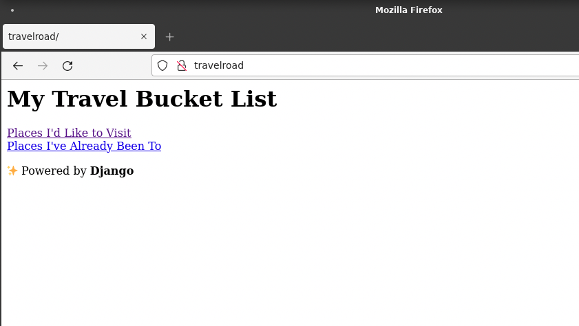
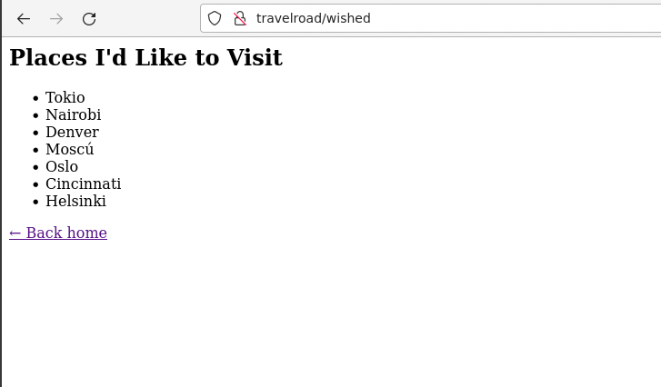
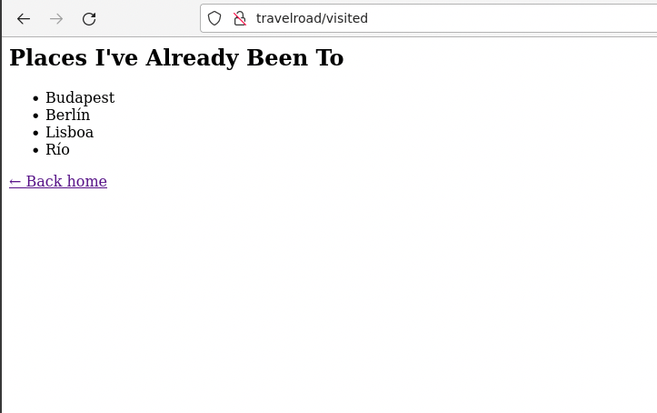

# UT4-TE2: Administración de servidores web

### TAREA EVALUABLE

El objetivo de esta tarea es **desplegar aplicaciones web** con distintas _frameworks_ y lenguajes de programación.

Sobre la aplicación **TravelRoad** (vista en clase) se pide desplegar en las siguientes tecnologías:

| Framework     | URL de despliegue                             |
| ------------- | --------------------------------------------- |
| Laravel       | https://laravel.travelroad.aluXXXX.arkania.es |
| Express       | https://express.travelroad.aluXXXX.arkania.es |
| Spring        | https://spring.travelroad.aluXXXX.arkania.es  |
| Ruby on Rails | https://ror.travelroad.aluXXXX.arkania.es     |
| Django        | https://django.travelroad.aluXXXX.arkania.es  |

## Personalización de la aplicación

Se pide **modificar ligeramente la aplicación original TravelRoad** ajustándola a las siguientes pantallas:

### Pantalla de inicio

### Sitios deseados

### Sitios visitados

## Aspectos comunes a todos los despliegues

- Identificar cada framework en la página de inicio (_"Powered by"_).
- Ignorar información sensible del control de versiones.
- Utilizar un script de despliegue ajustado a cada caso.
- Incluir certificado de seguridad.
- Incluir al final de cada sección del informe un enlace a la url de la aplicación desplegada.

## Entregable

- Informe explicando los pasos seguidos para resolver la tarea.

⚡ Revise las [instrucciones sobre entrega de tareas](../../ut0/assignment-deliveries.md).
