# UT5: Servicios de red implicados en el despliegue de una aplicación web

En el despliegue de una aplicación web pueden aparecer distintos servicios de red. El conocimiento de su naturaleza y comportamiento pueden ayudarnos a mejorar nuestros flujos de trabajo.

[FTP](#ftp)  
[SSH](#ssh)  
[DNS](#dns)  
[LDAP](#ldap)

## FTP

El protocolo clásico para la transferencia de archivos en Internet se denomina **FTP (File Transfer Protocol)**. Con el estado actual de Internet y las múltiples opciones de trasferencia de archivos en la web puede parecer algo innecesario pero sigue siendo una opción sencilla y específica por lo que aún se sigue utilizando en algunos ámbitos.

FTP se ajusta a una arquitectura cliente/servidor como todo lo que hemos visto hasta ahora. En Linux existen muchos servidores FTP diferentes. La elección puede ser bastante subjetiva pero nos vamos a decantar por **vsFTPd (Very Secure FTP Daemon)** ya que es el servidor FTP por defecto en las principales distribuciones de Linux lo que lo hace más sencillo de instalar y además se considera más seguro.

### Instalación del servidor

Empezamos actualizando el listado de paquetes:

```console
sdelquin@lemon:~$ sudo apt update
Obj:1 http://security.debian.org/debian-security bullseye-security InRelease
Obj:2 http://deb.debian.org/debian bullseye InRelease
Obj:3 http://deb.debian.org/debian bullseye-updates InRelease
Obj:4 https://download.docker.com/linux/debian bullseye InRelease
Obj:5 https://packages.sury.org/php bullseye InRelease
Obj:6 http://apt.postgresql.org/pub/repos/apt bullseye-pgdg InRelease
Obj:7 http://packages.microsoft.com/repos/code stable InRelease
Obj:8 http://nginx.org/packages/debian bullseye InRelease
Obj:9 https://deb.nodesource.com/node_19.x bullseye InRelease
Leyendo lista de paquetes... Hecho
Creando árbol de dependencias... Hecho
Leyendo la información de estado... Hecho
Se pueden actualizar 130 paquetes. Ejecute «apt list --upgradable» para verlos.
```

Instalamos directamente el servidor vsFTPd:

```console
sdelquin@lemon:~$ sudo apt install -y vsftpd
Leyendo lista de paquetes... Hecho
Creando árbol de dependencias... Hecho
Leyendo la información de estado... Hecho
Se instalarán los siguientes paquetes NUEVOS:
  vsftpd
0 actualizados, 1 nuevos se instalarán, 0 para eliminar y 130 no actualizados.
Se necesita descargar 147 kB de archivos.
Se utilizarán 357 kB de espacio de disco adicional después de esta operación.
Des:1 http://deb.debian.org/debian bullseye/main arm64 vsftpd arm64 3.0.3-12 [147 kB]
Descargados 147 kB en 0s (783 kB/s)
Preconfigurando paquetes ...
Seleccionando el paquete vsftpd previamente no seleccionado.
(Leyendo la base de datos ... 236090 ficheros o directorios instalados actualmente.)
Preparando para desempaquetar .../vsftpd_3.0.3-12_arm64.deb ...
Desempaquetando vsftpd (3.0.3-12) ...
Configurando vsftpd (3.0.3-12) ...
Created symlink /etc/systemd/system/multi-user.target.wants/vsftpd.service → /lib/systemd/system/vsf
tpd.service.
Procesando disparadores para man-db (2.9.4-2) ...
```

Podemos comprobar que el servicio está instalado y corriendo:

```console
sdelquin@lemon:~$ sudo systemctl is-active vsftpd
active
```

El puerto por defecto en el que escucha un servidor FTP es el **puerto 21**. Podemos comprobarlo de la siguiente manera:

```console
sdelquin@lemon:~$ sudo netstat -napt | grep ftp
tcp6       0      0 :::21                   :::*                    LISTEN      116185/vsftpd
```

### Instalación del cliente

Existen multitud de clientes FTP (con y sin interfaz gráfica). Para el caso que nos ocupa vamos a instalar un cliente en modo consola muy sencillo:

```console
sdelquin@lemon:~$ sudo apt install -y ftp
Leyendo lista de paquetes... Hecho
Creando árbol de dependencias... Hecho
Leyendo la información de estado... Hecho
Se instalarán los siguientes paquetes NUEVOS:
  ftp
0 actualizados, 1 nuevos se instalarán, 0 para eliminar y 130 no actualizados.
Se necesita descargar 57,4 kB de archivos.
Se utilizarán 140 kB de espacio de disco adicional después de esta operación.
Des:1 http://deb.debian.org/debian bullseye/main arm64 ftp arm64 0.17-34.1.1 [57,4 kB]
Descargados 57,4 kB en 0s (319 kB/s)
Seleccionando el paquete ftp previamente no seleccionado.
(Leyendo la base de datos ... 236148 ficheros o directorios instalados actualmente.)
Preparando para desempaquetar .../ftp_0.17-34.1.1_arm64.deb ...
Desempaquetando ftp (0.17-34.1.1) ...
Configurando ftp (0.17-34.1.1) ...
update-alternatives: utilizando /usr/bin/netkit-ftp para proveer /usr/bin/ftp (ftp) en modo automático
Procesando disparadores para man-db (2.9.4-2) ...
```

Ahora podemos comprobar la conexión con el servidor desde la misma máquina (localhost):

```console
sdelquin@lemon:~$ ftp localhost
Connected to localhost.
220 (vsFTPd 3.0.3)
Name (localhost:sdelquin):
331 Please specify the password.
Password:
230 Login successful.
Remote system type is UNIX.
Using binary mode to transfer files.
```

> 💡 Accedemos con las credenciales del usuario Linux.

Si queremos acceder "desde fuera" nos basta con especificar el nombre de dominio:

```console
$ ftp dpl.arkania.es
```

### Comandos remotos

Una vez conectados a nuestro servidor FTP, existen una serie de comandos básicos que podemos ejecutar en remoto:

| Comando | Descripción                          |
| ------- | ------------------------------------ |
| `ls`    | Listar el contenido de la carpeta    |
| `cd`    | Cambiar a otra carpeta               |
| `mkdir` | Crear una nueva carpeta              |
| `pwd`   | Mostrar la carpeta de trabajo actual |
| `get`   | Descargar el fichero especificado    |
| `mget`  | Descargar los ficheros especificados |

### Comandos locales

Aunque estemos conectados a un servidor FTP, podemos ejecutar una serie de comandos básicos en nuestra máquina local (desde la que hicimos la conexión):

| Comando | Descripción                          |
| ------- | ------------------------------------ |
| `lcd`   | Cambiar a otra carpeta               |
| `!pwd`  | Mostrar la carpeta de trabajo actual |
| `put`   | Subir el fichero especificado        |
| `mput`  | Subir los ficheros especificados     |

> 💡 Para salir de la sesión FTP usamos el comando `quit`.

### Seguridad

Aunque es posible incorporar un certificado de seguridad a las conexiones que realizamos por FTP, es mucho más cómodo utilizar directamente el protocolo SSH que ya incorpora mecanismos propios de seguridad.

## SSH

SSH (o **S**ecure **SH**ell, en español: intérprete de órdenes seguro) es el nombre de un protocolo y del programa que lo implementa cuya principal función es el acceso remoto a un servidor por medio de un canal seguro en el que toda la información está cifrada.

SSH permite **copiar datos de forma segura** (tanto archivos sueltos como simular **sesiones FTP cifradas**), **gestionar claves RSA** para no escribir contraseñas al conectar a los dispositivos y pasar los datos de cualquier otra aplicación por un canal seguro tunelizado mediante SSH y también puede redirigir el tráfico del (Sistema de Ventanas X) para poder ejecutar programas gráficos remotamente. **El puerto TCP asignado es el 22**.

SSH también funciona sobre un **modelo cliente-servidor**. El servidor es el programa que está escuchando peticiones en el puerto asignado mientras que el cliente es el programa que hace uso de esos servicios conectándose de forma remota a la máquina en cuestión.

### Instalación

[OpenSSH](https://www.openssh.com/) es una de las herramientas más usadas para trabajar con protocolo SSH y ofrece tanto el programa servidor como el programa cliente.

#### Servidor

Es bastante común que los sistemas base Linux ya vengan con el servidor SSH preinstalado. En cualquier caso su implantación es muy sencilla:

```console
sdelquin@lemon:~$ sudo apt install -y openssh-server
Leyendo lista de paquetes... Hecho
Creando árbol de dependencias... Hecho
Leyendo la información de estado... Hecho
openssh-server ya está en su versión más reciente (1:8.4p1-5+deb11u1).
fijado openssh-server como instalado manualmente.
0 actualizados, 0 nuevos se instalarán, 0 para eliminar y 130 no actualizados.
```

Es importante tener en cuenta que, aunque el paquete se llama **openssh**, el servicio que queda corriendo es **ssh**. Podemos comprobarlo así:

```console
sdelquin@lemon:~$ sudo systemctl status ssh
● ssh.service - OpenBSD Secure Shell server
     Loaded: loaded (/lib/systemd/system/ssh.service; enabled; vendor preset: enabled)
     Active: active (running) since Thu 2022-12-29 10:59:22 WET; 1 weeks 3 days ago
       Docs: man:sshd(8)
             man:sshd_config(5)
    Process: 543 ExecStartPre=/usr/sbin/sshd -t (code=exited, status=0/SUCCESS)
   Main PID: 858 (sshd)
      Tasks: 1 (limit: 2251)
     Memory: 3.2M
        CPU: 11ms
     CGroup: /system.slice/ssh.service
             └─858 sshd: /usr/sbin/sshd -D [listener] 0 of 10-100 startups

dic 29 10:59:21 lemon systemd[1]: Starting OpenBSD Secure Shell server...
dic 29 10:59:22 lemon sshd[858]: Server listening on 0.0.0.0 port 22.
dic 29 10:59:22 lemon sshd[858]: Server listening on :: port 22.
dic 29 10:59:22 lemon systemd[1]: Started OpenBSD Secure Shell server.
```

Como se ha comentado previamente, el puerto (por defecto) en el que trabaja el servidor SSH es el **puerto 22**. Esto se puede ver de la siguiente manera:

```console
sdelquin@lemon:~$ sudo netstat -napt | grep ssh | grep -v tcp6
tcp        0      0 0.0.0.0:22              0.0.0.0:*               LISTEN      858/sshd: /usr/sbin
```

#### Cliente

El cliente SSH se puede instalar igualmente de manera muy simple (y también forma parte del ecosistema OpenSSH):

```console
sdelquin@lemon:~$ sudo apt install -y openssh-client
Leyendo lista de paquetes... Hecho
Creando árbol de dependencias... Hecho
Leyendo la información de estado... Hecho
openssh-client ya está en su versión más reciente (1:8.4p1-5+deb11u1).
0 actualizados, 0 nuevos se instalarán, 0 para eliminar y 130 no actualizados.
```

Este paquete no sólo proporciona el cliente "habitual" de ssh sino otra serie de herramientas muy interesantes. Podemos identificarlas tal que así:

```console
sdelquin@lemon:~$ dpkg -L openssh-client | grep '/usr/bin/'
/usr/bin/scp
/usr/bin/sftp
/usr/bin/ssh
/usr/bin/ssh-add
/usr/bin/ssh-agent
/usr/bin/ssh-argv0
/usr/bin/ssh-copy-id
/usr/bin/ssh-keygen
/usr/bin/ssh-keyscan
/usr/bin/slogin
```

### Configuración del servidor SSH

La configuración del servidor SSH se encuentra en el fichero (privilegiado) `/etc/ssh/sshd_config` (nótese la "d" que viene de "daemon").

Algunos de los [parámetros más relevantes](https://man7.org/linux/man-pages/man5/sshd_config.5.html):

| Parámetro              | Explicación                          | Valor por defecto |
| ---------------------- | ------------------------------------ | ----------------- |
| Port                   | Puerto de escucha                    | 22                |
| PermitRootLogin        | Permite login de root\*              | prohibit-password |
| PubkeyAuthentication   | Permite validación con clave pública | yes               |
| PasswordAuthentication | Permite validación con contraseña    | yes               |
| X11Forwarding          | Permite abrir aplicaciones gráficas  | yes               |
| Banner                 | Ruta a un fichero de banner          | none              |

\*Opciones para `PermitRootLogin`:

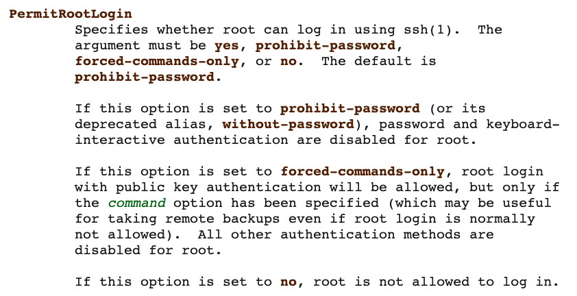

> 💡 Tras modificar la configuración habrá que recargar el servicio para que los cambios surtan efecto.

### Herramientas cliente SSH

#### `ssh`

Permite conectar a una máquina con servidor SSH o bien lanzar un comando remotamente:

Ejemplos:

```console
$ ssh sdelquin@dpl.arkania.es  # conexión como sdelquin
$ ssh dpl.arkania.es           # conexión con usuario logeado

$ ssh dpl.arkania.es df -h            # lanzar comando

$ # lanzar múltiples comandos ↓
$ ssh dpl.arkania.es "
  date
  free -m
  ip a
"
```

#### `scp`

Permite copiar desde/hacia una máquina con servidor SSH:

Ejemplos:

```console
$ # UPLOAD
$ scp image.jpg sdelquin@dpl.arkania.es:      # destino $HOME (remoto)
$ scp image.jpg dpl.arkania.es:               # usa usuario logeado
$ scp image.jpg dpl.arkania.es:~/images       # destino $HOME/images (remoto)

$ # DOWNLOAD
$ scp dpl.arkania.es:~/images/image.jpg .     # destino carpeta actual (local)
$ scp dpl.arkania.es:~/images/image.jpg /tmp  # destino /tmp (local)
$ scp -r dpl.arkania.es:~/images .            # copia de carpeta completa
```

#### `sftp`

Esta herramienta es análoga a `scp` pero permite un **manejo interactivo**:

```console
$ sftp dpl.arkania.es
Connected to arkania.
sftp>
```

Comandos disponibles **en remoto**:

| Comando | Descripción                                |
| ------- | ------------------------------------------ |
| `cd`    | Cambiar directorio                         |
| `chgrp` | Cambiar grupo a fichero                    |
| `chmod` | Cambiar permisos a fichero                 |
| `chown` | Cambiar propietario a fichero              |
| `df`    | Estadísticas de uso del disco              |
| `get`   | Descargar un fichero o una carpeta (`-r`)  |
| `ls`    | Listar el contenido de la carpeta actual   |
| `mkdir` | Crear una nueva carpeta                    |
| `pwd`   | Mostrar la carpeta de trabajo              |
| `rm`    | Borrar un fichero                          |
| `rmdir` | Borrar una carpeta (tiene que estar vacía) |

Comandos disponibles **en local**:

| Comando  | Descripción                              |
| -------- | ---------------------------------------- |
| `lcd`    | Cambiar directorio                       |
| `lls`    | Listar el contenido de la carpeta actual |
| `lmkdir` | Crear una nueva carpeta                  |
| `lpwd`   | Mostrar la carpeta de trabajo            |
| `!<cmd>` | Ejecutar cualquier comando (en local)    |

> 💡 Es una especie de FTP "vitaminado" y con comunicaciones cifradas.

#### `ssh-keygen`

Permite generar un par de claves pública/privada para el acceso a una máquina con servidor SSH.

Para su uso basta con ejecutarlo de la siguiente manera:

```console
sdelquin@lemon:~$ ssh-keygen -t rsa
Generating public/private rsa key pair.
Enter file in which to save the key (/home/sdelquin/.ssh/id_rsa):
Created directory '/home/sdelquin/.ssh'.
Enter passphrase (empty for no passphrase):
Enter same passphrase again:
Your identification has been saved in /home/sdelquin/.ssh/id_rsa
Your public key has been saved in /home/sdelquin/.ssh/id_rsa.pub
The key fingerprint is:
SHA256:1qlC4/7+tEcRKSZs9YYqzj9FIqLFwTITfjjsguemzUg sdelquin@lemon
The key's randomart image is:
+---[RSA 3072]----+
|  .o   . ..  .   |
| o+.o   + ooo    |
|  ==.. . o..o.   |
|.. o+ . .o.o.    |
|o oo .+.Soo  .   |
| +.  = + .. .    |
| Eo   = ....     |
|.*   . o.. ..    |
|o o   .o+oo.     |
+----[SHA256]-----+
```

> 💡 RSA es un tipo de algoritmo para generar claves, pero existen [otros algoritmos de generación de claves](https://goteleport.com/blog/comparing-ssh-keys/).

Con el comando anterior se habrá creado una carpeta `$HOME/.ssh` con las claves:

```console
sdelquin@lemon:~$ ls -l .ssh/
total 8
-rw------- 1 sdelquin sdelquin 2602 ene  9 12:18 id_rsa      # clave privada
-rw-r--r-- 1 sdelquin sdelquin  568 ene  9 12:18 id_rsa.pub  # clave pública
```

#### `ssh-copy-id`

**Permite copiar la clave pública** (generada con `ssh-keygen`) a la máquina con servidor SSH con el objetivo de poder "logearnos" sin necesidad de introducir contraseña.

```console
sdelquin@lemon:~$ ssh-copy-id dpl.arkania.es
/usr/bin/ssh-copy-id: INFO: Source of key(s) to be installed: "/home/sdelquin/.ssh/id_rsa.pub"
/usr/bin/ssh-copy-id: INFO: attempting to log in with the new key(s), to filter out any that are already installed
/usr/bin/ssh-copy-id: INFO: 1 key(s) remain to be installed -- if you are prompted now it is to install the new keys
sdelquin@dpl.arkania.es's password:

Number of key(s) added: 1

Now try logging into the machine, with:   "ssh 'dpl.arkania.es'"
and check to make sure that only the key(s) you wanted were added.
```

> 💡 El comando anterior añade la clave pública al fichero remoto `~/.ssh/authorized_keys`.

Ahora ya podemos acceder por ssh a la máquina remota sin necesidad de usar claves "en línea":

```console
sdelquin@lemon:~$ ssh dpl.arkania.es
Linux arkania 5.10.0-19-cloud-amd64 #1 SMP Debian 5.10.149-2 (2022-10-21) x86_64

The programs included with the Debian GNU/Linux system are free software;
the exact distribution terms for each program are described in the
individual files in /usr/share/doc/*/copyright.

Debian GNU/Linux comes with ABSOLUTELY NO WARRANTY, to the extent
permitted by applicable law.
Last login: Wed Nov  2 16:21:14 2022 from 193.146.93.24
sdelquin@arkania:~$
```

## DNS

El **sistema de nombres de dominio** (Domain Name System o **DNS**, por sus siglas en inglés)​ es un sistema de nomenclatura **jerárquico** y **distribuido** para dispositivos conectados a redes IP como Internet o una red privada.

Su función más importante es **"traducir" nombres entendibles para las personas en identificadores numéricos asociados a máquinas**, con el propósito de poder localizar y direccionar estos equipos mundialmente.

### Procedimiento de resolución

En el siguiente esquema se visualiza el procedimiento de resolución de nombres de dominio:

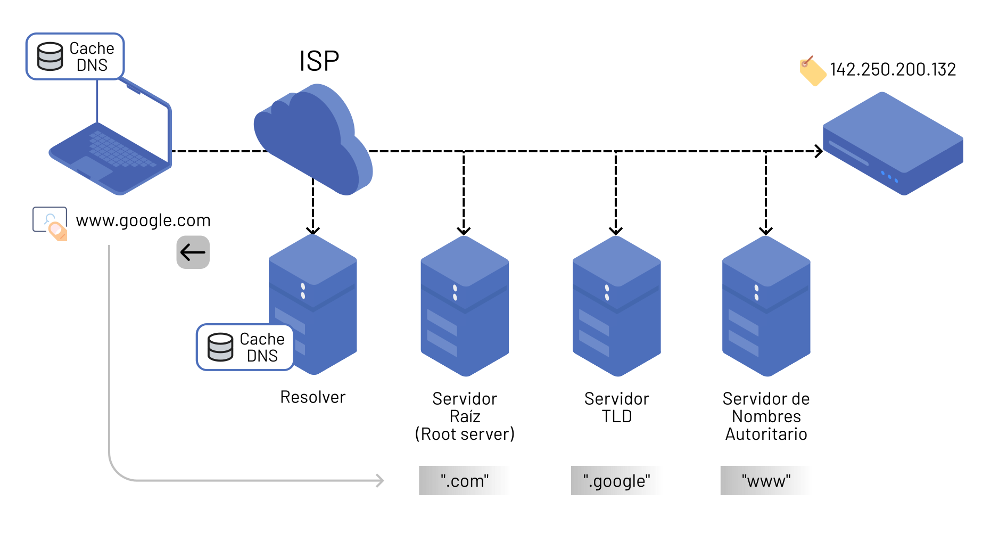

| Elemento                        | Descripción                                                      |
| ------------------------------- | ---------------------------------------------------------------- |
| ISP                             | Internet Service Provider                                        |
| Resolver                        | Servidor de resolución de nombres del ISP                        |
| Servidor Raíz                   | Servidor de resolución de nombres de nivel 0                     |
| Servidor TLD                    | Servidor de resolución de nombres de nivel 1 (Top Level Domains) |
| Servidor de nombres autoritario | Servidor de resolución de nombres de nivel 2                     |

Para saber la IP de una máquina podemos usar el comando `host`:

```console
$ host www.google.com
www.google.com has address 142.250.200.132
www.google.com has IPv6 address 2a00:1450:4003:80f::2004
```

> 💡 Este comando, al igual que otros relativos a DNS, se encuentran en el paquete **dnsutils**.

### Registros de recursos

Para que todo el sistema de resolución de nombres de dominio funcione correctamente, la información debe estar organizada en una base de datos mediante registros de recursos.

Estos registros pueden ser de distinto tipo. En la siguiente tabla se muestra algunos de los más relevantes:

| Tipo de registro | Significado                                                                                                                                                                |
| ---------------- | -------------------------------------------------------------------------------------------------------------------------------------------------------------------------- |
| A                | Dirección (_address_). Este registro se usa para traducir nombres de servidores de alojamiento a direcciones IPv4.                                                         |
| CNAME            | Nombre canónico (_canonical Name_). Se usa para crear nombres de servidores de alojamiento adicionales, o alias, para los servidores de alojamiento de un dominio.         |
| NS               | Servidor de nombres (_name server_). Define la asociación que existe entre un nombre de dominio y los servidores de nombres que almacenan la información de dicho dominio. |
| MX               | Intercambio de correo (_mail exchange_). Asocia un nombre de dominio a una lista de servidores de intercambio de correo para ese dominio.                                  |

Veamos algunos ejemplos con nombres de dominio reales:

**Registros A**:

```console
sdelquin@lemon:~$ host -t a bloomberg.com
bloomberg.com has address 3.33.146.110
bloomberg.com has address 15.197.146.156
```

> 💡 Cuando hay más de una dirección IP se van devolviendo en función de la carga y utilizando lo que se conoce como [DNS Round Robin](https://es.wikipedia.org/wiki/Dns_round_robin).

**Registros CNAME**:

```console
sdelquin@lemon:~$ host -t cname pages.github.com
pages.github.com is an alias for github.github.io.
```

**Registros NS**:

```console
sdelquin@lemon:~$ host -t ns google.com
google.com name server ns1.google.com.
google.com name server ns3.google.com.
google.com name server ns2.google.com.
google.com name server ns4.google.com.
```

**Registros MX**:

```console
sdelquin@lemon:~$ host -t mx linux.org
linux.org mail is handled by 10 mx1.improvmx.com.
linux.org mail is handled by 20 mx2.improvmx.com.
```

### Adquirir un nombre de dominio

De cara al **despliegue de una aplicación web** es casi imprescindible **adquirir un nombre de dominio**, salvo que queramos dar al cliente una IP en formato X.X.X.X 😅

Los nombres de dominio se pueden comprar en multitud de empresas que ofrecen estos servicios. Un ejemplo es [dondominio.com](https://dondominio.com).

Aunque los precios pueden variar, suele ser un servicio relativamente barato. Por ejemplo un dominio `.es` está en torno a 7€ anuales.

Una vez que hayamos comprado nuestro flamante nombre de dominio, debemos entrar a gestionar la **Zona DNS** y añadir, al menos, un **registro tipo A** donde hacer apuntar el nombre de dominio a la IP de la máquina que dispone de los servicios (servidor SSH, servidor WEB, base de datos, etc.)

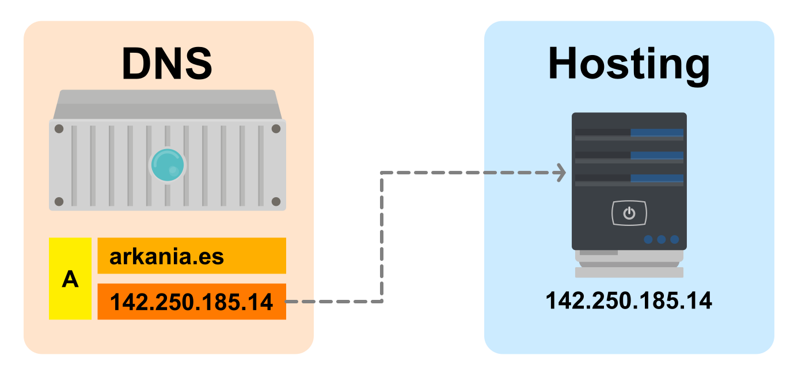

> 💡 Es posible usar "wildcards" en los registros DNS para asignar todos los subdominios de un dominio. Por ejemplo: `*.arkania.es`

## LDAP

El **protocolo ligero de acceso a directorios** (en inglés: **L**ightweight **D**irectory **A**ccess **P**rotocol, también conocido por sus siglas de LDAP) hace referencia a un _protocolo a nivel de aplicación_ que permite el acceso a un _servicio de directorio_ ordenado y distribuido para buscar diversa información en un entorno de red.

Un **directorio** es un conjunto de objetos con atributos organizados en una manera lógica y jerárquica. Habitualmente, almacena la **información de autenticación (usuario y contraseña)** y es utilizado para autenticarse aunque es posible almacenar otra información (datos de contacto del usuario, ubicación de diversos recursos de la red, permisos, certificados, etc). A manera de síntesis, **LDAP es un protocolo de acceso unificado a un conjunto de información sobre una red**.

Existen varias implementaciones para el protocolo LDAP. Aquí nos vamos a centrar en _OpenLDAP_. Pero también es relevante citar [Directorio Activo](https://es.wikipedia.org/wiki/Active_Directory) de Microsoft. Este servicio se utiliza, por ejemplo, en el [Sistema Centralizado de Autenticación (CAS)](https://www.gobiernodecanarias.org/sso/login) del Gobierno de Canarias.

### OpenLDAP

OpenLDAP es una **implementación libre y de código abierto** del protocolo Lightweight Directory Access Protocol (LDAP).

Muchas distribuciones GNU/Linux incluyen el software OpenLDAP para el soporte LDAP. Este software también corre en plataformas BSD, AIX, HP-UX, Mac OS X, Solaris y Microsoft Windows.

#### Instalación

Como siempre, lo primero que debemos hacer es actualizar el repositorio de paquetes Debian:

```console
sdelquin@arkania:~$ sudo apt update
[sudo] password for sdelquin:
Hit:1 http://deb.debian.org/debian bullseye InRelease
Get:2 http://deb.debian.org/debian bullseye-updates InRelease [44.1 kB]
Get:3 http://security.debian.org/debian-security bullseye-security InRelease [48.4 kB]
Hit:4 http://nginx.org/packages/debian bullseye InRelease
Get:5 http://deb.debian.org/debian bullseye-backports InRelease [49.0 kB]
Hit:6 http://apt.postgresql.org/pub/repos/apt bullseye-pgdg InRelease
Get:7 http://deb.debian.org/debian bullseye-backports/main Sources.diff/Index [63.3 kB]
Get:8 http://deb.debian.org/debian bullseye-backports/main amd64 Packages.diff/Index [63.3 kB]
Get:9 http://deb.debian.org/debian bullseye-backports/main Sources T-2023-02-04-0803.23-F-2023-02-03-0803.55.pdiff [1859 B]
Get:9 http://deb.debian.org/debian bullseye-backports/main Sources T-2023-02-04-0803.23-F-2023-02-03-0803.55.pdiff [1859 B]
Get:10 http://deb.debian.org/debian bullseye-backports/main amd64 Packages T-2023-02-03-2003.49-F-2023-02-03-0203.39.pdiff [18.0 kB]
Get:10 http://deb.debian.org/debian bullseye-backports/main amd64 Packages T-2023-02-03-2003.49-F-2023-02-03-0203.39.pdiff [18.0 kB]
Hit:11 https://ftp.postgresql.org/pub/pgadmin/pgadmin4/apt/bullseye pgadmin4 InRelease
Fetched 288 kB in 1s (286 kB/s)
Reading package lists... Done
Building dependency tree... Done
Reading state information... Done
All packages are up to date.
```

Ahora instalaremos los paquetes de OpenLDAP `slapd` y `ldap-utils`. El paquete `slapd` es el paquete principal de OpenLDAP, y `ldap-utils` proporciona utilidades de línea de comandos para gestionar el servidor OpenLDAP:

```console
sdelquin@arkania:~$ sudo apt install -y slapd ldap-utils
Reading package lists... Done
Building dependency tree... Done
Reading state information... Done
The following additional packages will be installed:
  libodbc1
Suggested packages:
  libsasl2-modules-gssapi-mit | libsasl2-modules-gssapi-heimdal libmyodbc odbc-postgresql tdsodbc unixodbc-bin
The following NEW packages will be installed:
  ldap-utils libodbc1 slapd
0 upgraded, 3 newly installed, 0 to remove and 0 not upgraded.
Need to get 1879 kB of archives.
After this operation, 5971 kB of additional disk space will be used.
Get:1 http://deb.debian.org/debian bullseye/main amd64 libodbc1 amd64 2.3.6-0.1+b1 [224 kB]
Get:2 http://deb.debian.org/debian bullseye/main amd64 slapd amd64 2.4.57+dfsg-3+deb11u1 [1448 kB]
Get:3 http://deb.debian.org/debian bullseye/main amd64 ldap-utils amd64 2.4.57+dfsg-3+deb11u1 [206 kB]
Fetched 1879 kB in 0s (10.0 MB/s)
Preconfiguring packages ...
```

Este comando lanzará un **asistente para la configuración** de `slapd`. Lo primero será introducir una contraseña del usuario administrador de OpenLDAP:

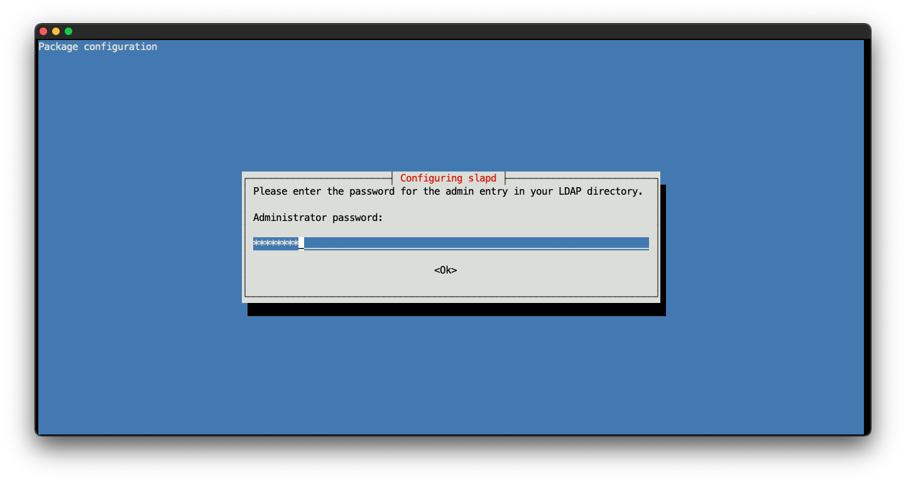

Y a continuación confirmarla:

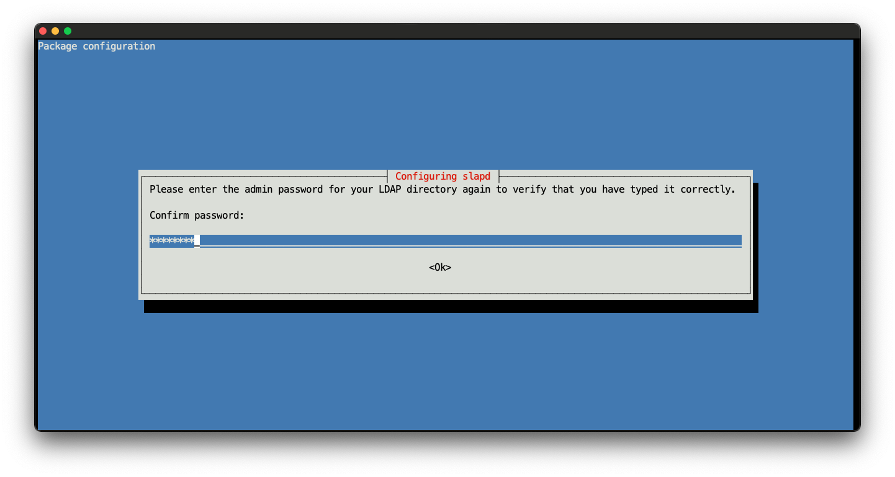

Una vez introducida la contraseña de administrador, pulsamos <kbd>ENTER</kbd> y la instalación terminará de configurar el resto de paquetes:

```console
Selecting previously unselected package libodbc1:amd64.
(Reading database ... 43268 files and directories currently installed.)
Preparing to unpack .../libodbc1_2.3.6-0.1+b1_amd64.deb ...
Unpacking libodbc1:amd64 (2.3.6-0.1+b1) ...
Selecting previously unselected package slapd.
Preparing to unpack .../slapd_2.4.57+dfsg-3+deb11u1_amd64.deb ...
Unpacking slapd (2.4.57+dfsg-3+deb11u1) ...
Selecting previously unselected package ldap-utils.
Preparing to unpack .../ldap-utils_2.4.57+dfsg-3+deb11u1_amd64.deb ...
Unpacking ldap-utils (2.4.57+dfsg-3+deb11u1) ...
Setting up ldap-utils (2.4.57+dfsg-3+deb11u1) ...
Setting up libodbc1:amd64 (2.3.6-0.1+b1) ...
Setting up slapd (2.4.57+dfsg-3+deb11u1) ...
  Creating new user openldap... done.
  Creating initial configuration... done.
  Creating LDAP directory... done.
Processing triggers for man-db (2.9.4-2) ...
Processing triggers for libc-bin (2.31-13+deb11u5) ...
sdelquin@arkania:~$
```

#### Configuración

Después de haber instalado los paquetes de OpenLDAP, ahora debemos configurar el servidor OpenLDAP:

```console
sdelquin@arkania:~$ sudo dpkg-reconfigure slapd
```

Seleccionamos "No" cuando se te pregunte si borrar/omitir la antigua configuración de OpenLDAP. Esto mantendrá la antigua configuración disponible:

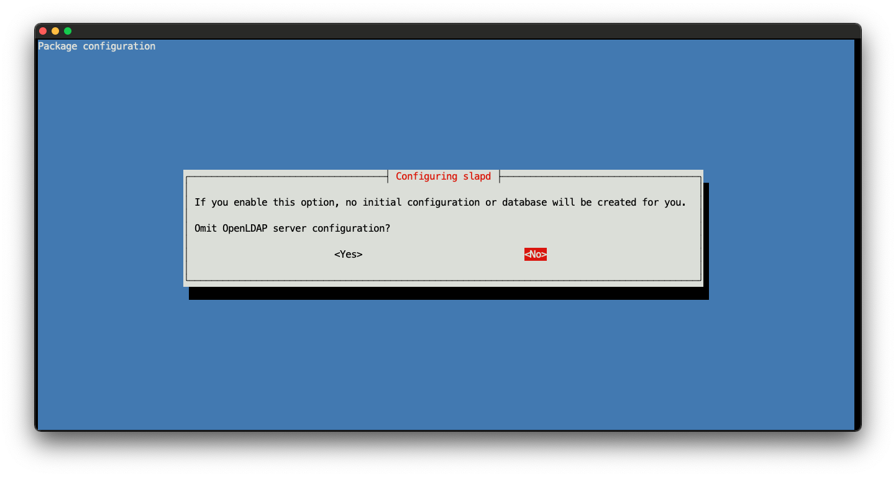

Ahora introducimos el nombre de dominio del servidor OpenLDAP:

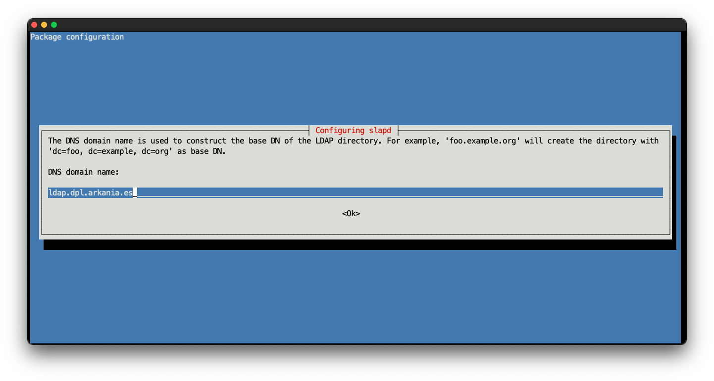

Introducimos el nombre de la organización:

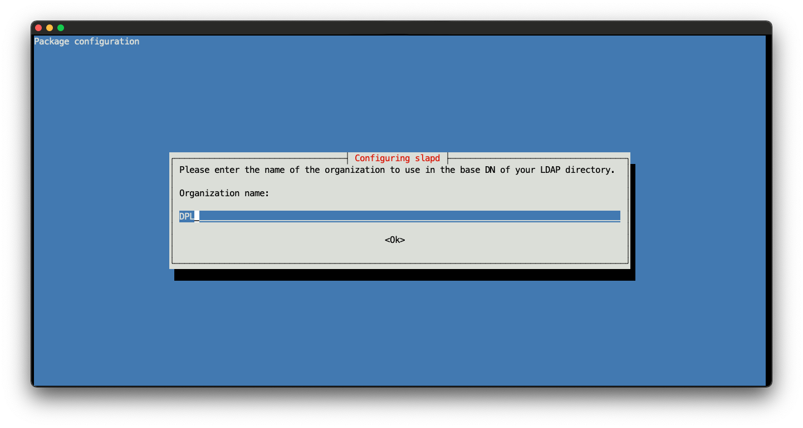

Ahora introducimos la contraseña de administrador de OpenLDAP:


Y confirmamos la contraseña de administrador de OpenLDAP:


En la siguiente pantalla indicamos que no queremos borrar la base de datos slapd en el caso de que eliminemos slapd:

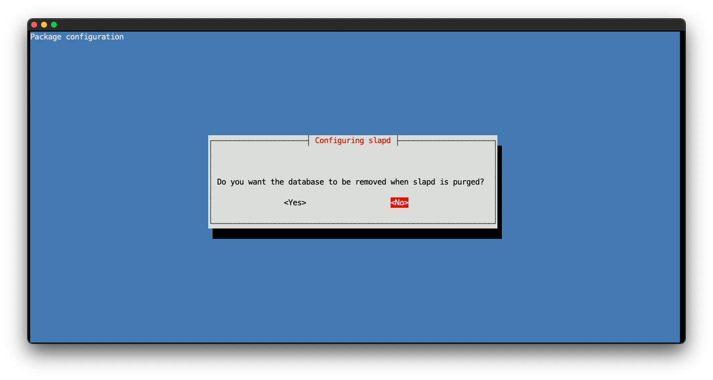

En la última pantalla seleccionamos que sí queremos borrar antiguas bases de datos:

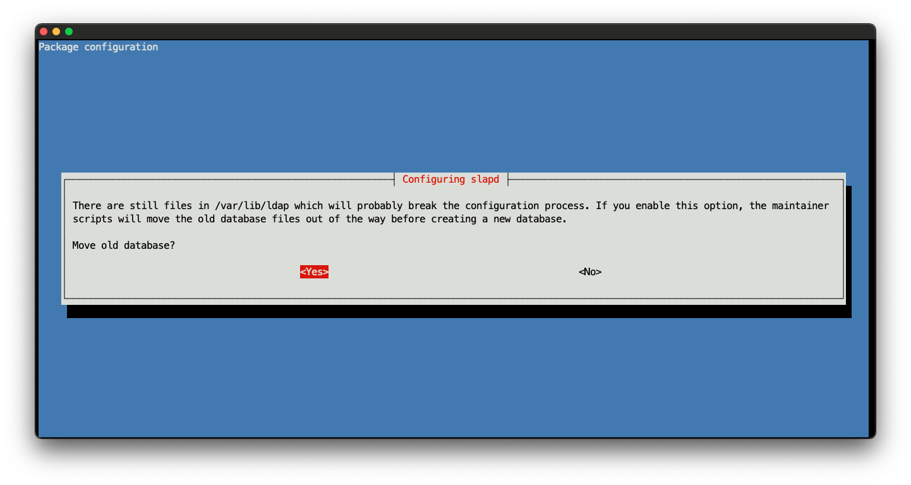

Con esto se termina la configuración de los paquetes OpenLDAP:

```console
  Backing up /etc/ldap/slapd.d in /var/backups/slapd-2.4.57+dfsg-3+deb11u1... done.
  Moving old database directory to /var/backups:
  - directory unknown... done.
  Creating initial configuration... done.
  Creating LDAP directory... done.
```

Para verificar la configuración de OpenLDAP, usamos el comando `slapcat`:

```console
sdelquin@arkania:~$ sudo slapcat
[sudo] password for sdelquin:
dn: dc=ldap,dc=dpl,dc=arkania,dc=es
objectClass: top
objectClass: dcObject
objectClass: organization
o: DPL
dc: ldap
structuralObjectClass: organization
entryUUID: f6037018-38c1-103d-8cda-5ba518d097c3
creatorsName: cn=admin,dc=ldap,dc=dpl,dc=arkania,dc=es
createTimestamp: 20230204102516Z
entryCSN: 20230204102516.161360Z#000000#000#000000
modifiersName: cn=admin,dc=ldap,dc=dpl,dc=arkania,dc=es
modifyTimestamp: 20230204102516Z
```

Para que los cambios se apliquen correctamente debemos reiniciar el servicio:

```console
sdelquin@arkania:~$ sudo systemctl restart slapd
```

Comprobamos el estado del servicio slapd:

```console
sdelquin@arkania:~$ sudo systemctl status slapd
● slapd.service - LSB: OpenLDAP standalone server (Lightweight Directory Access Protocol)
     Loaded: loaded (/etc/init.d/slapd; generated)
    Drop-In: /usr/lib/systemd/system/slapd.service.d
             └─slapd-remain-after-exit.conf
     Active: active (running) since Sat 2023-02-04 10:39:22 UTC; 31s ago
       Docs: man:systemd-sysv-generator(8)
    Process: 1278139 ExecStart=/etc/init.d/slapd start (code=exited, status=0/SUCCESS)
      Tasks: 3 (limit: 2302)
     Memory: 3.0M
        CPU: 25ms
     CGroup: /system.slice/slapd.service
             └─1278146 /usr/sbin/slapd -h ldap:/// ldapi:/// -g openldap -u openldap -F /etc/ldap/slapd.d

Feb 04 10:39:22 arkania systemd[1]: Starting LSB: OpenLDAP standalone server (Lightweight Directory Access Protocol)...
Feb 04 10:39:22 arkania slapd[1278145]: @(#) $OpenLDAP: slapd 2.4.57+dfsg-3+deb11u1 (May 14 2022 18:32:57) $
                                                     Debian OpenLDAP Maintainers <pkg-openldap-devel@lists.alioth.debian.org>
Feb 04 10:39:22 arkania slapd[1278146]: slapd starting
Feb 04 10:39:22 arkania slapd[1278139]: Starting OpenLDAP: slapd.
Feb 04 10:39:22 arkania systemd[1]: Started LSB: OpenLDAP standalone server (Lightweight Directory Access Protocol).
```

Podemos comprobar que el servicio OpenLDAP está escuchando en el puerto **389**:

```console
sdelquin@vps-fc1b46ec:~$ sudo netstat -tulpn | grep slapd
tcp        0      0 0.0.0.0:389             0.0.0.0:*               LISTEN      1278146/slapd
tcp6       0      0 :::389                  :::*                    LISTEN      1278146/slapd
```

#### Estructura OpenLDAP

Como ya se ha comentado previamente, la estructura de un servidor LDAP es jerárquica. Se construye a partir de elementos de distinta naturaleza. En nuestro caso vamos a montar un OpenLDAP siguiendo este modelo:

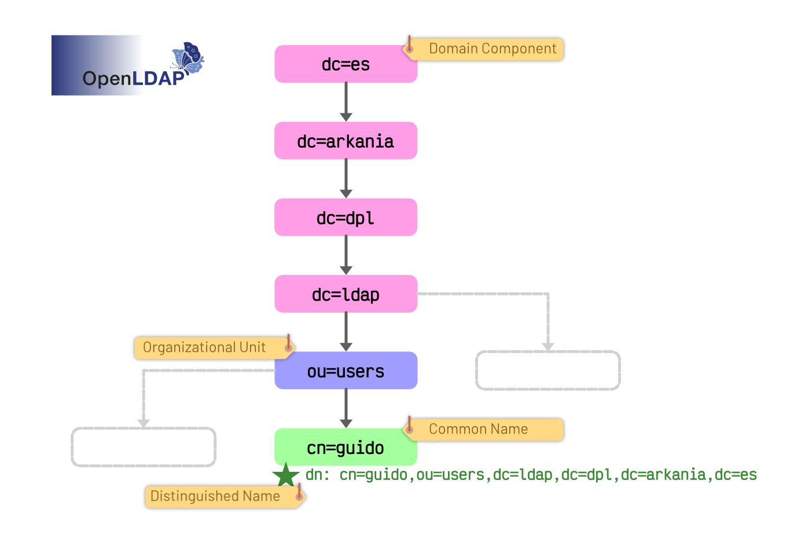

#### Añadir grupo de usuarios

El servidor OpenLDAP se suele utilizar para la autenticación en un grupo de ordenadores o servidores. Y en este paso, vamos a configurar un **grupo de usuarios** en el servidor OpenLDAP utilizando un archivo con formato [LDIF](https://en.wikipedia.org/wiki/LDAP_Data_Interchange_Format) (LDAP Data Interchange Format).

LDIF es un formato de archivo que contiene entradas LDAP y puede utilizarse para gestionar usuarios y grupos en el servidor OpenLDAP:

```console
sdelquin@arkania:~$ sudo vi /etc/ldap/users.ldif
```

> Contenido:

```ldif
dn: ou=users,dc=ldap,dc=dpl,dc=arkania,dc=es
objectClass: organizationalUnit
```

A continuación debemos añadir este grupo a través de las herramientas de utilidad que ofrece OpenLDAP:

```console
sdelquin@arkania:~$ sudo ldapadd -D "cn=admin,dc=ldap,dc=dpl,dc=arkania,dc=es" -W -H ldapi:/// -f /etc/ldap/users.ldif
Enter LDAP Password:
adding new entry "ou=People,dc=ldap,dc=dpl,dc=arkania,dc=es"
```

Para verificar que que el proceso se ha realizado correctamente podemos hacer una búsqueda en nuestro servidor OpenLDAP:

```console
sdelquin@arkania:~$ sudo ldapsearch -x -b "dc=ldap,dc=dpl,dc=arkania,dc=es" ou
# extended LDIF
#
# LDAPv3
# base <dc=ldap,dc=dpl,dc=arkania,dc=es> with scope subtree
# filter: (objectclass=*)
# requesting: ou
#

# ldap.dpl.arkania.es
dn: dc=ldap,dc=dpl,dc=arkania,dc=es

# users, ldap.dpl.arkania.es
dn: ou=users,dc=ldap,dc=dpl,dc=arkania,dc=es
ou: users

# search result
search: 2
result: 0 Success

# numResponses: 3
# numEntries: 2
```

Hay que tener en cuenta que en todos los pasos anteriores estamos usando el dominio `ldap.dpl.arkania.es` de ahí que el **nombre distinguido** `dn` venga definido por los componentes:

- `dc=ldap`
- `dc=dpl`
- `dc=arkania`
- `dc=es`

> 💡 Estos valores habría que adaptarlos según el dominio y el `dn` que se haya especificado en cada caso.

#### Configurar un nuevo usuario

Después de configurar un grupo en OpenLDAP, podemos añadir un nuevo usuario a dicho grupo. Esto también se puede hacer utilizando un archivo LDIF y la herramienta de línea de comandos `ldapadd`.

```console
sdelquin@arkania:~$ sudo vi /etc/ldap/guido.ldif
```

> Contenido:

```ldif
dn: cn=guido,ou=users,dc=ldap,dc=dpl,dc=arkania,dc=es
objectClass: inetOrgPerson
givenName: Guido
surname: Van Rossum
userPassword: pythoniscool
```

> 💡 Existen [múltiples atributos](https://docs.oracle.com/cd/E19225-01/820-6551/6nhsdeq75/index.html) que podemos establecer en función del `objectClass` que hayamos definido.

> 💡 Las contraseñas [pueden "hashearse"](https://serverfault.com/a/849528) al crear el fichero LDIF.

Ahora ya podemos añadir el usuario:

```console
sdelquin@arkania:~$ sudo ldapadd -D "cn=admin,dc=ldap,dc=dpl,dc=arkania,dc=es" -W -H ldapi:/// -f /etc/ldap/guido.ldif
Enter LDAP Password:
adding new entry "cn=guido,ou=users,dc=ldap,dc=dpl,dc=arkania,dc=es"
```

Si queremos asegurarnos de que todo ha ido bien podemos hacer una consulta al servidor OpenLDAP:

```console
sdelquin@vps-fc1b46ec:~$ sudo ldapsearch -x -b "ou=users,dc=ldap,dc=dpl,dc=arkania,dc=es"
# extended LDIF
#
# LDAPv3
# base <ou=users,dc=ldap,dc=dpl,dc=arkania,dc=es> with scope subtree
# filter: (objectclass=*)
# requesting: ALL
#

# users, ldap.dpl.arkania.es
dn: ou=users,dc=ldap,dc=dpl,dc=arkania,dc=es
objectClass: organizationalUnit
ou: users

# guido, users, ldap.dpl.arkania.es
dn: cn=guido,ou=users,dc=ldap,dc=dpl,dc=arkania,dc=es
objectClass: inetOrgPerson
givenName: Guido
sn: Van Rossum
cn: guido

# search result
search: 2
result: 0 Success

# numResponses: 3
# numEntries: 2
```

#### Probando la autenticación

Supongamos que hemos desarrollado una aplicación en Python y queremos valernos del servidor OpenLDAP para llevar a cabo la autenticación de usuarios.

Desde una máquina "cliente" creamos un entorno virtual en Python:

```console
sdelquin@lemon:~$ mkdir ldap_auth && cd ldap_auth
sdelquin@lemon:~/ldap_auth$ python -m venv --prompt ldap_auth .venv
sdelquin@lemon:~/ldap_auth$ source .venv/bin/activate
(ldap_auth) sdelquin@lemon:~/ldap_auth$
```

Instalamos la librería [ldap3](https://ldap3.readthedocs.io/en/latest/) que nos servirá para probar la autenticación LDAP:

```console
(ldap_auth) sdelquin@lemon:~/ldap_auth$ pip install ldap3
Collecting ldap3
  Using cached ldap3-2.9.1-py2.py3-none-any.whl (432 kB)
Requirement already satisfied: pyasn1>=0.4.6 in ./.venv/lib/python3.11/site-packages (from ldap3) (0.4.8)
Installing collected packages: ldap3
Successfully installed ldap3-2.9.1
```

Creamos un fichero `main.py` con el código necesario:

```console
(ldap_auth) sdelquin@lemon:~/ldap_auth$ vi main.py
```

> Contenido:

```python
import sys

from ldap3 import Connection
from ldap3.core.exceptions import LDAPException

LDAP_URI = 'ldap.dpl.arkania.es'
LDAP_DC = 'dc=ldap,dc=dpl,dc=arkania,dc=es'
ORG_UNIT = 'users'
USER_ATTRIBUTES = ['givenName', 'sn']

username = sys.argv[1]
password = sys.argv[2]

user_dn = f'cn={username},ou={ORG_UNIT},{LDAP_DC}'

try:
    conn = Connection(LDAP_URI, user=user_dn, password=password, auto_bind=True)
except LDAPException as err:
    print(f'⨯ {err}')
else:
    print(f'✔️ User "{username}" successfully authenticated!')
    user_cn = f'(cn={username})'
    conn.search(LDAP_DC, user_cn, attributes=USER_ATTRIBUTES)
    print(f'Name: {conn.entries[0].givenName}')
    print(f'Surname: {conn.entries[0].sn}')
```

Y ahora podemos probar la autenticación de usuario. Supongamos que pasamos:

- Usuario: `guido`
- Contraseña: `supersecret`

```console
(ldap_auth) sdelquin@lemon:~/ldap_auth$ python main.py guido supersecret
⨯ automatic bind not successful - invalidCredentials
```

El error nos indica que las credenciales son inválidas. Ahora supongamos que pasamos:

- Usuario: `guido`
- Contraseña: `pythoniscool`

```console
(ldap_auth) sdelquin@lemon:~/ldap_auth$ python main.py guido pythoniscool
✔️ User "guido" successfully authenticated!
Name: Guido
Surname: Van Rossum
```

#### Aspectos adicionales

Aunque no se vayan a cubrir en este documento, es importante tener en cuenta las siguientes cuestiones sobre gestión de OpenLDAP:

Cliente:

- [Acceso seguro](https://ldap3.readthedocs.io/en/latest/ssltls.html)
- [Carga masiva de objetos](https://ldap3.readthedocs.io/en/latest/add.html)

Servidor:

- [Configuración slapd](https://www.openldap.org/doc/admin24/slapdconf2.html)
- [Control de acceso](https://www.openldap.org/doc/admin24/access-control.html)
- [Certificados TLS](https://www.openldap.org/doc/admin24/tls.html)
- [Formas de enlace](https://ldap.com/the-ldap-bind-operation/)

> 💡 Todo esto y mucho más está documentado en la [Guía de administración de OpenLDAP](https://www.openldap.org/doc/admin24/guide.html).
